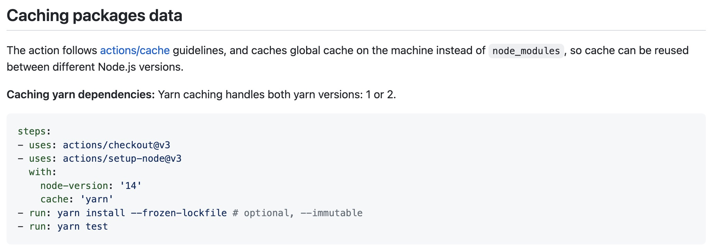
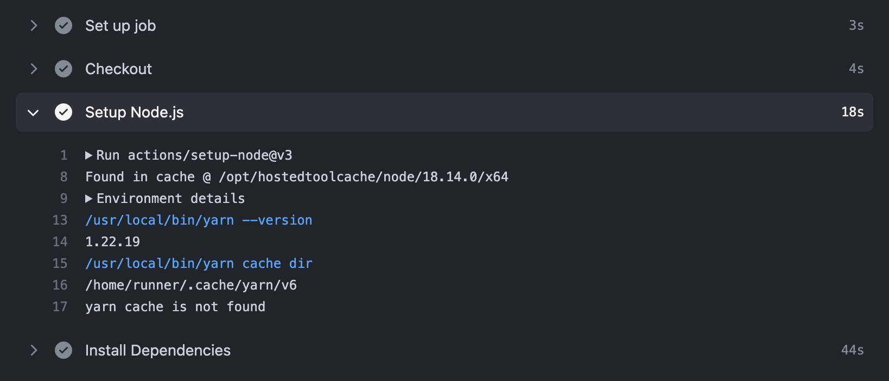
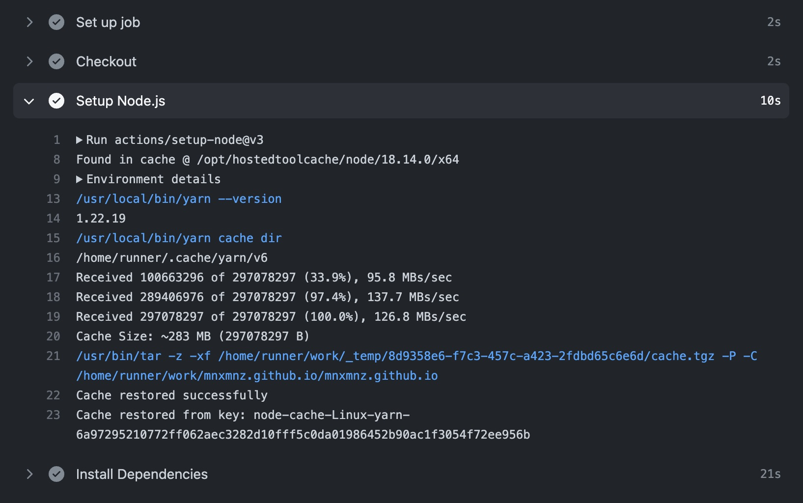
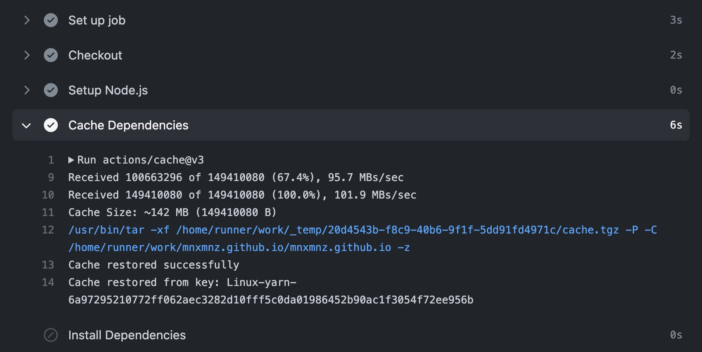

## 들어가며

현재 블로그는 main 브랜치에 변경 사항을 push 했을 때 자동으로 실행되는 Github Actions 워크플로우를 통해 배포하고 있습니다. 하지만 변경 사항에 비해 배포에 드는 시간이 길어 생산성이 떨어진다고 느끼고 이를 개선해봤습니다. GitHub에서 제공하는 캐시 액션으로 워크플로우 실행 시간을 단축한 경험을 공유합니다.

> YAML 파일에서 사용하는 액션은 2022년 11월의 최신 버전을 기준으로 작성했습니다.

## 1. 자동 배포 설정의 문제점

아래는 main 브랜치에 push 했을 때 자동으로 실행되는 블로그 배포 YAML 파일입니다. 

```yml
name: Deploy Gatsby Blog with GitHub Actions

on:
  push:
    branches:
      - main

jobs:
  deploy:
    runs-on: ubuntu-22.04
    permissions:
      contents: write
    concurrency:
      group: ${{ github.workflow }}-${{ github.ref }}
    steps:
      # 1. 현재의 commit HEAD에 위치하게 합니다.
      - name: Checkout
        uses: actions/checkout@v3

      # 2. Node.js 18버전을 사용합니다.
      - name: Setup Node.js
        uses: actions/setup-node@v3
        with:
          node-version: '18.x'

      # 3. production 환경에서 필요한 의존성만 설치합니다.
      - name: Install Dependencies
        run: yarn install --production

      # 4. 배포에 필요한 Build 파일을 생성합니다.
      - name: Run Build
        run: yarn build --prefix-paths
        env:
          NODE_ENV: production

      # 5. 배포합니다.
      - name: Deploy
        uses: peaceiris/actions-gh-pages@v3
        if: ${{ github.ref == 'refs/heads/main' }}
        with:
          github_token: ${{ secrets.ACCESS_TOKEN }}
          publish_branch: gh-pages
          publish_dir: ./public
```

블로그에 포스트를 추가할 때 새로운 markdown 파일을 생성합니다. markdown 파일만 생성하면 의존성에는 변경 사항이 생기지 않습니다. 하지만 이와 관계없이 main 브랜치에 push 하면 자동으로 워크플로우를 실행하므로 매번 yarn install을 통해 패키지를 다시 설치하게 됩니다.

이렇게 의존성에 변경 사항이 없을 때 이전에 설치한 패키지를 재사용할 수만 있다면 워크플로우 소요 시간을 많이 단축할 수 있지 않을까요?

GitHub가 제공하는 캐시 액션을 사용하면 워크플로우에서 필요한 파일 중 변경 사항이 자주 발생하지 않는 파일을 GitHub의 캐시에 올려놓고 CI 서버로 내려받아서 사용할 수 있습니다.

GitHub Actions에서 지원하는 캐싱으로 패키지 설치 시간을 단축해보겠습니다.

## 2. checkout 액션의 캐시 사용하기

2022년 8월에 업데이트된 내용에 따라 GitHub Setup Node의 v2부터 cache 옵션을 사용할 수 있습니다. cache 옵션으로 npm, yarn, pnpm과 같은 패키지 매니저를 넘길 수 있습니다. [공식 README](https://github.com/actions/setup-node/blob/main/docs/advanced-usage.md#caching-packages-data)에서 해당 내용을 확인하실 수 있습니다.



```yml
name: Deploy Gatsby Blog with GitHub Actions

on:
  push:
    branches:
      - main

jobs:
  deploy:
    runs-on: ubuntu-22.04
    permissions:
      contents: write
    concurrency:
      group: ${{ github.workflow }}-${{ github.ref }}
    steps:
      - name: Checkout
        uses: actions/checkout@v3

      - name: Setup Node.js
        uses: actions/setup-node@v3
        with:
          node-version: '18.x'
          # cache 옵션을 추가했습니다.
          cache: 'yarn'

      - name: Install Dependencies
        run: yarn install --production --frozen-lockfile

      - name: Run Build
        run: yarn build --prefix-paths
        env:
          NODE_ENV: production

      - name: Deploy
        uses: peaceiris/actions-gh-pages@v3
        if: ${{ github.ref == 'refs/heads/main' }}
        with:
          github_token: ${{ secrets.ACCESS_TOKEN }}
          publish_branch: gh-pages
          publish_dir: ./public
```



위 사진에서 `yarn cache is not found` 문구를 확인하실 수 있습니다. cache 옵션이 추가된 워크플로우를 처음 실행했을 땐 아직 캐싱된 데이터가 없기 때문입니다.

이제 워크플로우를 재실행해보겠습니다.



캐싱된 데이터를 사용해서 패키지 설치 시간이 44초에서 21초로 절반 정도 단축된 것을 확인하실 수 있습니다. 처음보다는 많이 단축된 시간이지만 그래도 조금의 아쉬움이 남았습니다. 패키지 설치에 드는 21초의 시간이 불필요하게 느껴졌습니다.

조금 더 최적화하기 위해 찾아보던 중 캐시 히트에 대해 알게 되었습니다. 이를 사용한 최적화 방법을 소개합니다.

## 3. 캐시 히트로 최적화하기

GitHub의 캐시 액션은 고유한 키를 이용해서 캐시를 식별하고 가져옵니다. 키는 캐시를 검색하거나 저장할 때 사용됩니다. 키에 맞는 캐시가 있으면 데이터를 복원하고 없으면 해당 작업의 종료 시점에 CI 서버상의 파일을 캐시에 저장합니다.

cache-hit는 캐시 히트 여부에 대한 boolean 값을 제공합니다. 키에 맞는 캐시된 데이터가 존재하면 캐시 히트 값은 true, 그렇지 않다면 false가 됩니다. 캐시 액션을 사용한 다음에 나오는 작업에서 캐시 히트 여부를 읽고 활용할 수 있습니다.

```yml
name: Deploy Gatsby Blog with GitHub Actions

on:
  push:
    branches:
      - main

jobs:
  deploy:
    runs-on: ubuntu-22.04
    permissions:
      contents: write
    concurrency:
      group: ${{ github.workflow }}-${{ github.ref }}
    steps:
      - name: Checkout
        uses: actions/checkout@v3

      - name: Setup Node.js
        uses: actions/setup-node@v3
        with:
          node-version: '18.x'

      # 의존성을 캐싱합니다.
      - name: Cache Dependencies
        id: yarn-cache
        uses: actions/cache@v3
        with:
          # 캐시 대상을 정합니다.
          path: node_modules
          # 캐시 무효화는 yarn.lock 파일을 기준으로 합니다.
          key: ${{ runner.OS }}-yarn-${{ hashFiles('**/yarn.lock') }}
          restore-keys: |
            ${{ runner.OS }}-yarn-

      # yarn.lock 파일이 변경되지 않았다면 캐싱된 node_modules를 사용합니다.
      # 복구할 캐시가 없을 때만 의존성을 설치합니다.
      - name: Install Dependencies
        if: steps.yarn-cache.outputs.cache-hit != 'true'
        run: yarn install --production --pure-lockfile

      - name: Run Build
        run: yarn build --prefix-paths
        env:
          NODE_ENV: production

      - name: Deploy
        uses: peaceiris/actions-gh-pages@v3
        if: ${{ github.ref == 'refs/heads/main' }}
        with:
          github_token: ${{ secrets.ACCESS_TOKEN }}
          publish_branch: gh-pages
          publish_dir: ./public
```

의존성에 변경 사항이 생겼을 때는 캐시된 데이터를 사용하지 않는 것이 중요합니다. 이를 위해 의존성에 변경이 생기면 키도 함께 변경될 수 있도록 캐시 키 생성에 GitHub Actions에서 지원하는 컨텍스트와 함수를 활용했습니다. 컨텍스트와 함수에 대한 상세 내용은 [공식 문서](https://docs.github.com/en/actions/learn-github-actions/contexts)에서 확인하실 수 있습니다.

GitHub Actions의 hashFiles 내장 함수를 이용하여 yarn.lock 파일의 SHA 해시값을 키에 포함했습니다. 또한, 워크플로우를 여러 운영체제에서 실행할 때를 대비해서 runner.os 컨텍스트도 키에 포함했습니다. 



이렇게 최적화 단계를 거친 워크플로우에서 패키지 설치 단계를 건너뛰어 실행 시간을 단축한 것을 확인하실 수 있습니다 🎉

## 마치며

1. 자동 배포의 워크플로우 소요 시간을 단축하기 위해 GitHub에서 제공하는 캐시 액션을 사용했습니다.
2. GitHub에서 제공하는 checkout 액션의 v2부터 cache 옵션으로 패키지 매니저를 넘길 수 있게 되었고, 이를 이용하여 패키지 설치 시간을 단축할 수 있었습니다.
3. GitHub의 캐시 액션에서는 고유한 키를 이용하여 캐시를 식별합니다. 캐시 히트 여부에 따라 캐시된 데이터를 복원하거나 저장할 수 있습니다. 캐시 키 생성 시 의존성에 변경이 생기면 키도 함께 변경되도록 하는 것이 중요합니다.

> 블로그 배포 속도 개선 관련 글은 1편과 2편으로 이루어져 있습니다.

- [Gatsby 블로그 배포 속도 개선으로 생산성 높이기 (1)](https://mnxmnz.github.io/frontend/caching-dependencies-to-speed-up-workflows)
- [Gatsby 블로그 배포 속도 개선으로 생산성 높이기 (2)](https://mnxmnz.github.io/frontend/caching-build-outputs-to-speed-up-workflows)

---

참고 자료 📩

- [Caching dependencies to speed up workflows - GitHub Docs](https://docs.github.com/en/actions/using-workflows/caching-dependencies-to-speed-up-workflows)
- [Contexts - GitHub Docs](https://docs.github.com/en/actions/learn-github-actions/contexts)
- [뱅크샐러드 Web chapter에서 GitHub Action 기반의 CI 속도를 개선한 방법 | 뱅크샐러드](https://blog.banksalad.com/tech/github-action-npm-cache/)
- [GitHub Actions의 캐시(Cache) 액션으로 패키지 설치 최적화하기 | Engineering Blog by Dale Seo](https://www.daleseo.com/github-actions-cache/)
