## 들어가며

웹 프론트엔드 프로젝트를 Vercel로 **배포한 후 커스텀 도메인을 설정하는 과정**입니다. **Production Branch** 등 세부 설정에 대한 내용도 포함하고 있습니다. 해당 포스팅에서는 [가비아](https://www.gabia.com/)에서 구매한 도메인을 사용했습니다.

## 1. 프로젝트 배포하기

우선 [Vercel 사이트](https://vercel.com/)에 가입합니다. 본 포스팅에서는 GitHub 계정으로 가입했습니다. 가입을 완료하고 [https://vercel.com/dashboard](https://vercel.com/dashboard) 페이지에 접속합니다.

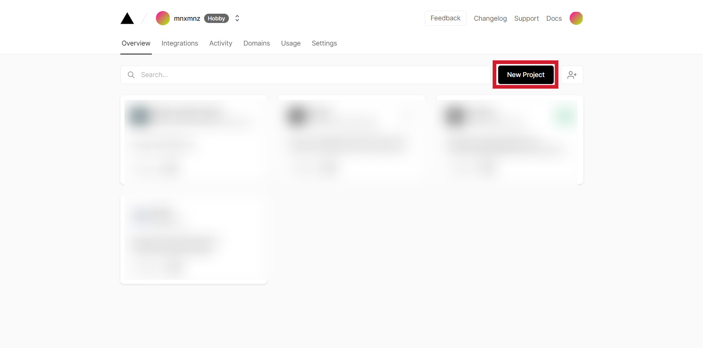

Dashboard 페이지 오른쪽 위에 있는 New Project 버튼을 클릭합니다.

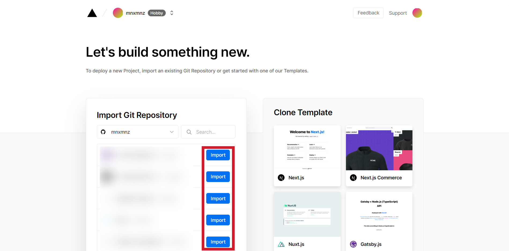

회원 가입한 GitHub 계정의 여러 Repository 중 배포하려는 Repository의 Import 버튼을 클릭합니다. 참고로 무료 계정인 Hobby 계정으로 가입하면 개인 계정의 Repository만 배포할 수 있습니다. 개인 계정이 아닌 다른 Organization에 포함된 Repository는 배포할 수 없습니다.

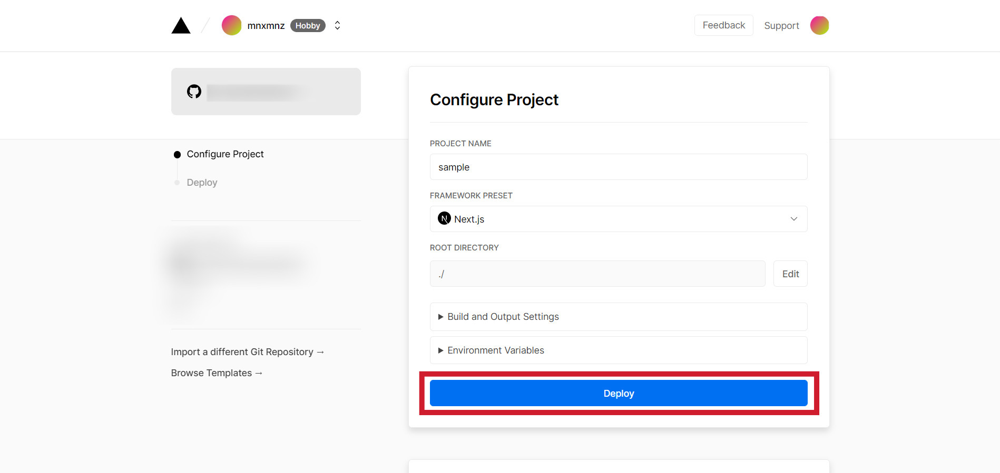

PROJECT NAME 항목에서 프로젝트 이름을 설정합니다. 여기서 설정한 프로젝트 이름은 배포 이후 Vercel에서 자동으로 생성해주는 URL의 `https://${PROJECT_NAME}.vercel.app/` 항목에 표시됩니다. FRAMEWORK PRESET 항목에서 프로젝트에 사용한 프레임워크를 선택할 수 있습니다. 환경 변수 등 필요한 추가 설정이 없다면 Deploy 버튼을 클릭해주세요.

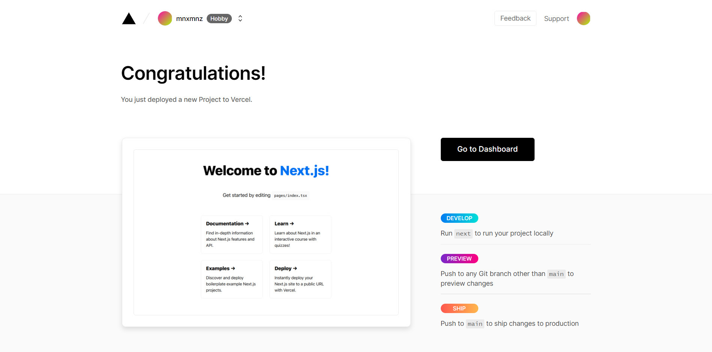

위와 같은 화면을 확인하면 성공적으로 프로젝트 배포를 마친 것입니다.

## 2. 환경 변수 설정하기

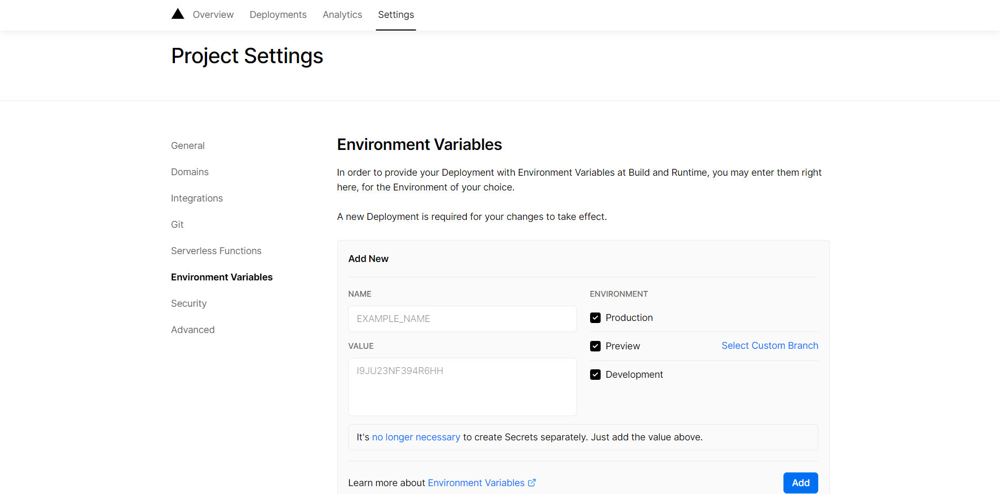

성공적으로 배포를 마친 후 Go to Dashboard 버튼을 클릭해서 Settings 페이지에 접속하면 다양한 추가 설정을 할 수 있습니다. **프로젝트에서 사용하는 환경 변수가 있다면 Environment Variables 항목에 꼭 작성해주세요.**

## 3. Production branch 설정하기

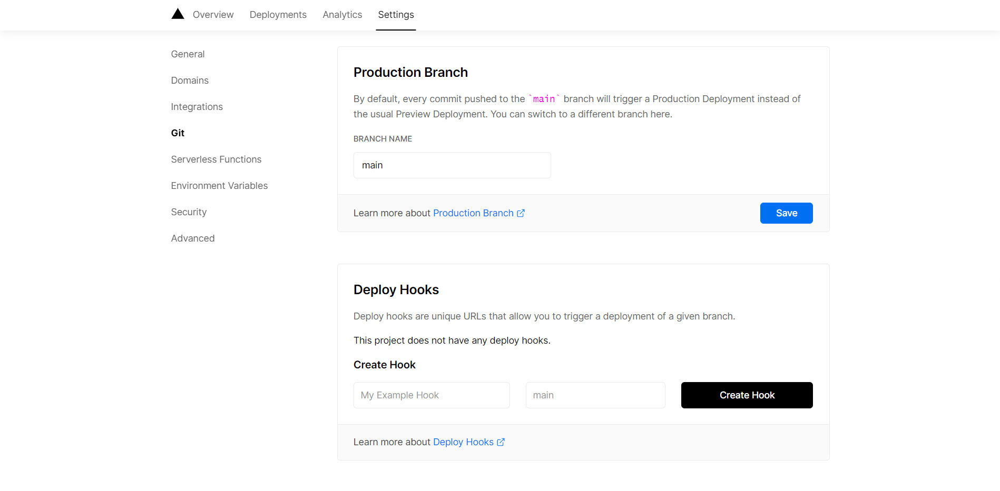

다음으로 Git 옵션을 확인하겠습니다. Git 옵션을 보면 **Production Branch**가 `main`으로 설정되어 있습니다. 여기서 설정한 브랜치가 바로 배포한 프로젝트 URL에서 보여지는 코드입니다. main이 아닌 다른 브랜치의 코드를 Production으로 배포하고 싶다면 해당 브랜치 이름으로 수정할 수 있습니다.

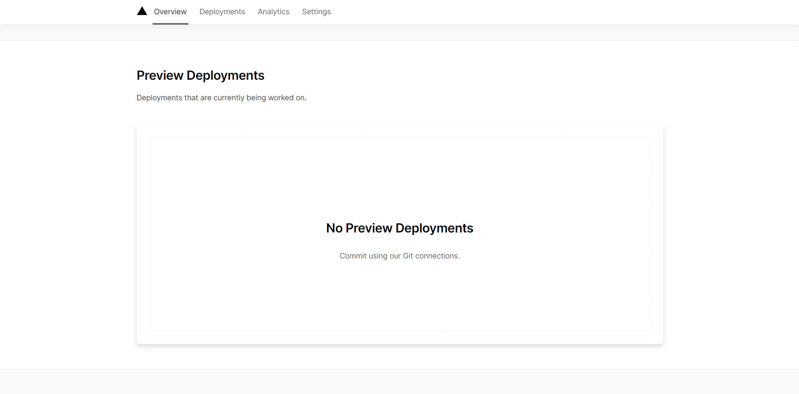

위에서 설정한 Production 브랜치 이외에 다른 브랜치에 `commit & push`하면 Preview URL이 생성됩니다. 즉, Production으로 설정한 브랜치가 아니더라도 Preview URL을 통해 배포 환경에서 코드가 보여지는 모습을 미리 확인해볼 수 있습니다. Preview URL은 Vercel에서 자동으로 생성합니다. (현재는 main 브랜치 이외에 다른 브랜치가 존재하지 않아 `No Preview Deployments`라고 적혀있습니다.)

## 4. 도메인 설정하기

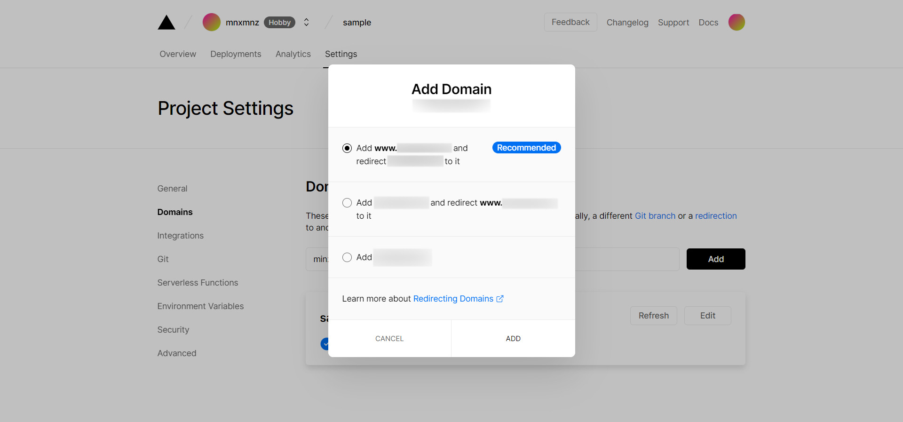

마지막으로 도메인 설정 방법에 대해 알아보겠습니다. Domain 옵션을 클릭하고 설정하고 싶은 도메인을 입력한 후 Add 버튼을 클릭해주세요. 여기서 설정하는 도메인은 미리 소지해둔 도메인이어야 합니다. 본 포스팅에서는 [가비아](https://www.gabia.com/)에서 구매한 도메인을 사용했습니다.

Add Domain 모달에서 세 가지 옵션을 확인할 수 있는데, 첫 번째 **Recommended 옵션**을 선택하시는 것을 추천합니다. 세 가지 옵션에 대한 설명은 다음과 같습니다.

1. `www.${DOMAIN}`을 기본 도메인으로 설정하고, `${DOMAIN}` URL로 접속하면 자동으로 `www.${DOMAIN}`으로 리다이렉트

2. `${DOMAIN}`을 기본 도메인으로 설정하고, `www.${DOMAIN}` URL로 접속하면 자동으로 `${DOMAIN}`으로 리다이렉트

3. `${DOMAIN}`을 기본 도메인으로 설정하고, 다른 URL로 리다이렉트 하지 않음 

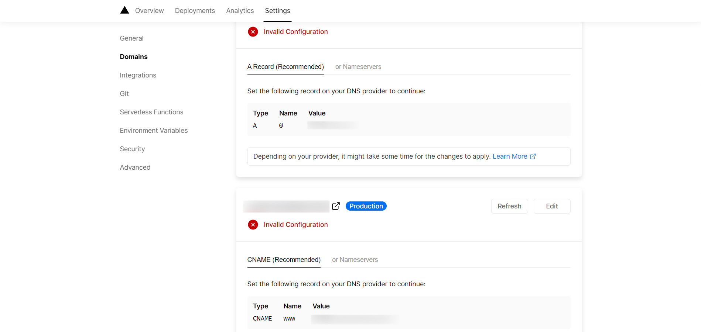

도메인을 추가하면 다음과 같이 A Record와 CNAME을 설정하라는 내용을 확인할 수 있습니다. 본 포스팅에서는 가비아에서 설정하는 방법에 대해 작성하겠습니다.

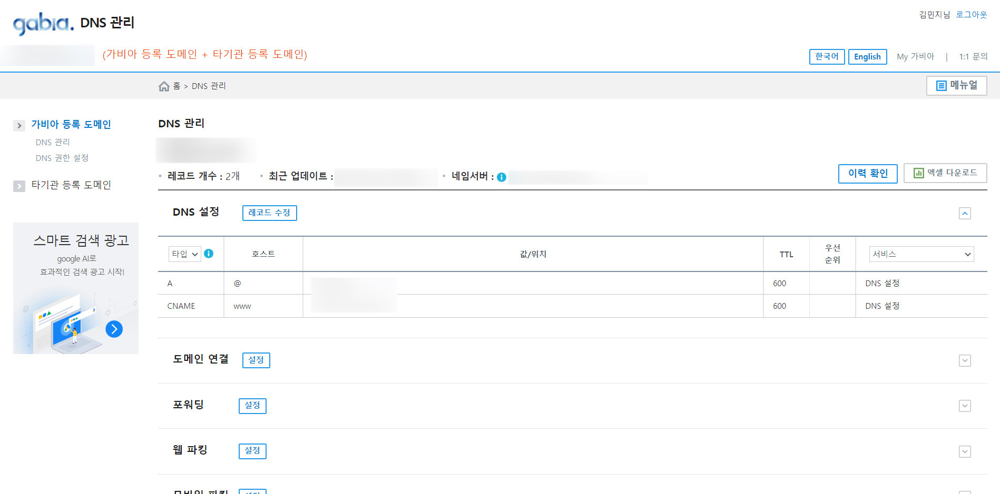

가비아 DNS 관리 창에 접속하면 다음과 같이 레코드 정보를 수정할 수 있습니다. 여기서 레코드 수정 버튼을 클릭해서 A Record와 CNAME 항목에 각각 Vercel DOMAIN 페이지의 Value에 적힌 값을 그대로 적어줍니다.

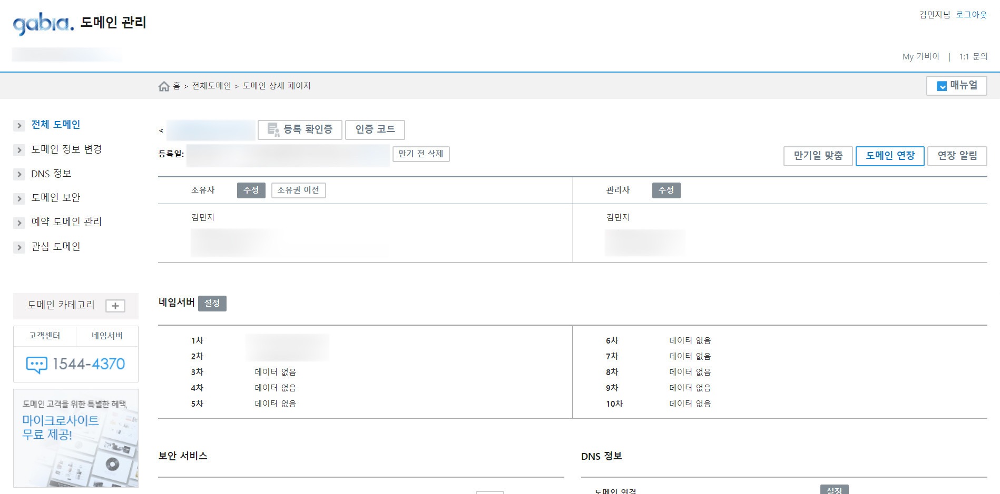

Vercel에서 A Record와 CNAME 설정을 권장하고 있지만, 다른 두 번째 방법은 네임 서버 설정입니다. 네임 서버도 같은 방법으로 Vercel DOMAIN 페이지의 Value에 적힌 값을 그대로 적어줍니다.

이렇게 설정하고 하루 정도의 시간이 지나면 설정한 도메인으로 접속할 수 있습니다.

## 마치며

Vercel에서 프로젝트를 배포하고 여러 추가 설정에 대해 알아봤습니다. Vercel은 무료 계정을 사용하면 하루 빌드 100개 제한이 있지만, 그래도 쉽고 간편하게 배포할 수 있어서 모두에게 추천하는 호스팅 서비스입니다.
