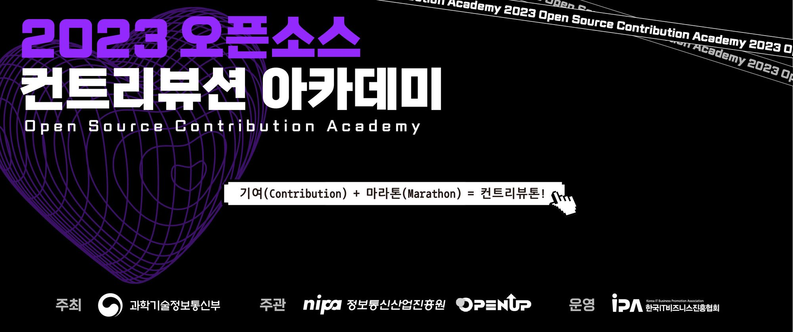
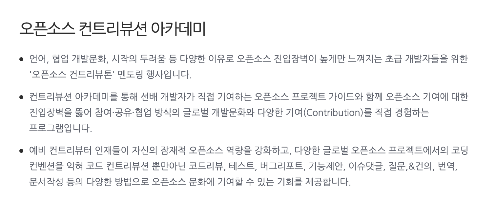
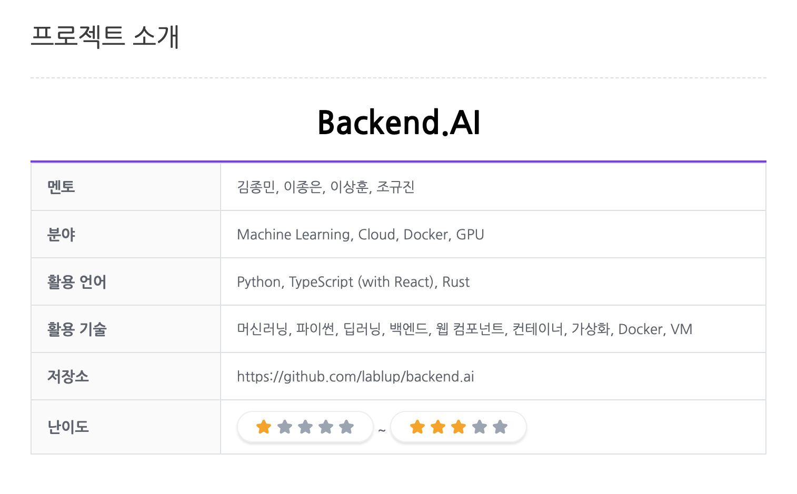
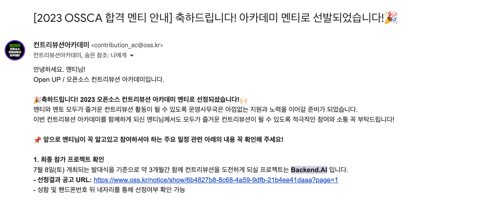
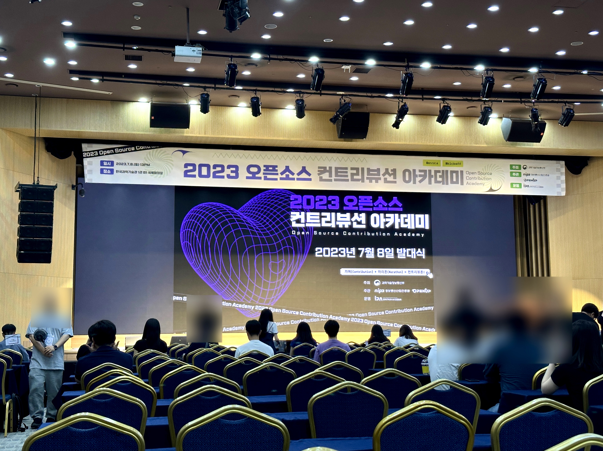
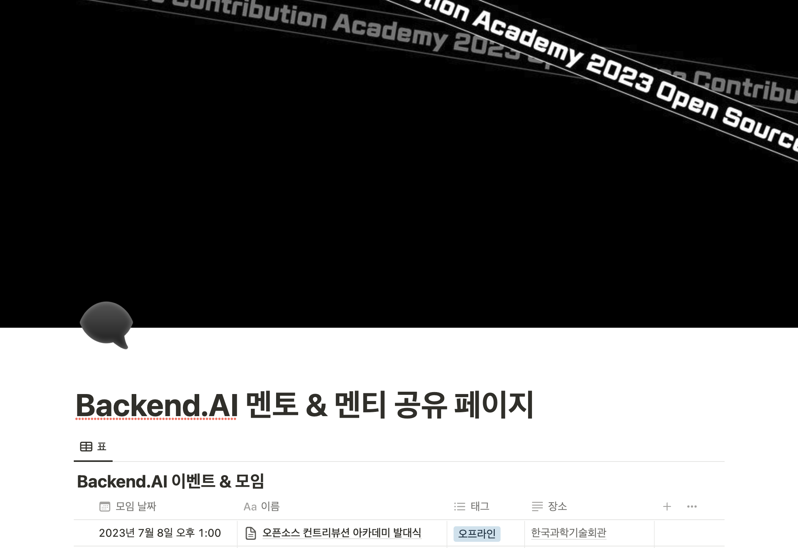

## 들어가며

<em>사진 출처: <a href="https://www.contribution.ac" target="_blank" rel="noreferrer noopener" aria-label="2023-ossca-cover">www.contribution.ac</a></em>

2023 오픈소스 컨트리뷰션 아카데미의 Backend.AI 프로젝트에 멘티로 참여하게 되었습니다. 오픈소스 컨트리뷰션 아카데미 소개와 발대식 참여 후기에 대해 작성했습니다.

## 0. 오픈소스 컨트리뷰션 아카데미란?

<em>사진 출처: <a href="https://www.oss.kr/contribution_academy" target="_blank" rel="noreferrer noopener" aria-label="2023-ossca-website">www.oss.kr</a></em>

오픈소스 컨트리뷰션 아카데미는 멘토와 함께 오픈소스 프로젝트에 기여하는 프로그램입니다. 평소 관심 있던 오픈소스 기여하는 경험을 할 수 있습니다. 오픈소스 기여에 대해 어려움을 느낀 분들이 많은 도움을 받을 수 있는 활동이라고 생각합니다. 올해는 7월 8일부터 10월 7일까지 13주 정도의 기간에 진행됩니다.

상세 내용은 [공식 웹사이트](https://www.contribution.ac)에서 확인하실 수 있습니다.

## 1. 지원하기

오픈소스 컨트리뷰션 아카데미 지원서의 항목은 다음과 같습니다.

- 기본적인 개인 정보
- 1지망 프로젝트에 대한 자기소개, 지원 동기, 개발 경험
- 2지망 프로젝트에 대한 자기소개, 지원 동기, 개발 경험

올해는 총 25개의 프로젝트가 참여했습니다. 프로젝트 목록은 [프로젝트 소개 페이지](https://www.oss.kr/ossca_23_projects)에서 확인하실 수 있습니다.

여러 프로젝트 중에서 Backend.AI 프로젝트에 1지망으로 지원했습니다.

<em>사진 출처: <a href="https://www.oss.kr/ossca_23_projects/show/4d5f97e5-1057-448d-91da-3bb1f6d5f838" target="_blank" rel="noreferrer noopener" aria-label="2023-ossca-backend-ai">www.oss.kr</a></em>

Backend.AI는 "Make AI Accessible"을 모토로 인공지능을 누구나 쉽고 빠르게 사용할 수 있게하는 오픈소스 프로젝트입니다. 상세 내용은 [프로젝트 상세 페이지](https://www.oss.kr/ossca_23_projects/show/4d5f97e5-1057-448d-91da-3bb1f6d5f838)에서 확인하실 수 있습니다.

지원할 프로젝트를 결정한 후에는 1지망과 2지망 프로젝트에 대하여 자기소개와 지원 동기를 작성했습니다. 간단한 자기소개와 함께 오픈소스에 관심을 두게 된 계기와 개인적으로 진행한 오픈소스 기여 과정에 대해 상세히 작성했습니다. 개발 경험을 작성하는 항목에만 글자 수 제한이 있었습니다. 200자 제한으로 인해 그동안의 경험을 충분히 표현할 수 없을 거 같다고 생각하여 URL로 이력서를 첨부했습니다. 다른 분들의 참여 후기에서 많은 도움을 받았습니다.

지원서를 작성하고 2주 정도 후에 합격 메일을 받았습니다 🎉 메일에는 오픈소스 컨트리뷰션 아카데미의 공식 디스코드 초대 링크와 발대식의 상세 일정이 포함되어 있었습니다.

## 2. 발대식

발대식은 한국과학기술회관에서 진행되었습니다. QR 코드를 통해 출석 체크를 진행한 후 이름표를 받았습니다. 행사장 뒤편에는 커피와 간단한 다과가 준비되어 있었습니다. 발대식에서는 오픈소스 컨트리뷰션 아카데미와 참여 프로젝트에 대한 소개와 상세 일정이 안내되었습니다. 또한 멘티로 참여했다가 멘토로 참여하게 된 분들의 이야기를 들을 수 있었습니다.

전체 발대식 이후에는 팀별로 발대식을 진행했습니다.

## 3. 팀별 발대식

팀별 발대식은 프로젝트 멘토, 멘티와 함께 진행됐습니다.

### 3-1. 자기소개

팀별 발대식은 멘토분들이 만들어 주신 노션 페이지를 기반으로 진행되었습니다. 프로젝트에 참여한 멘티분들의 자기소개 통해 서로 알아가는 시간을 가졌습니다.

### 3-2. 프로젝트 세팅

멘토분들께서 오픈소스 컨트리뷰션을 위한 개인 리눅스 개발 환경을 제공해 주셔서 노트북에 Backend.AI 개발 환경 세팅하는 시간을 가졌습니다. 모든 프로젝트를 시작할 때 항상 환경 설정이 가장 어렵다고 생각하는데, 어떤 질문에도 상세하게 알려주시는 멘토님들 덕분에 무사히 설치를 마칠 수 있었습니다.

## 마치며

발대식을 마친 이후에 공식 굿즈로 장패드와 노트북 스티커를 받았습니다.

Backend.AI 프로젝트의 분야는 `Machine Learning, Cloud, Docker, GPU`인데 이에 대한 사용 경험이 많지 않아 기여 과정에서 어려움을 겪을 거 같습니다. 그래도 멈춰있지 않고 함께 프로젝트에 참여하는 멘토, 멘티분들과 적극적으로 의사소통하며 함께 문제를 해결해 나갈 계획입니다.

앞으로 2023 오픈소스 컨트리뷰션 아카데미의 Backend.AI 프로젝트에 필요한 기여를 위해 노력하겠습니다 🧐
