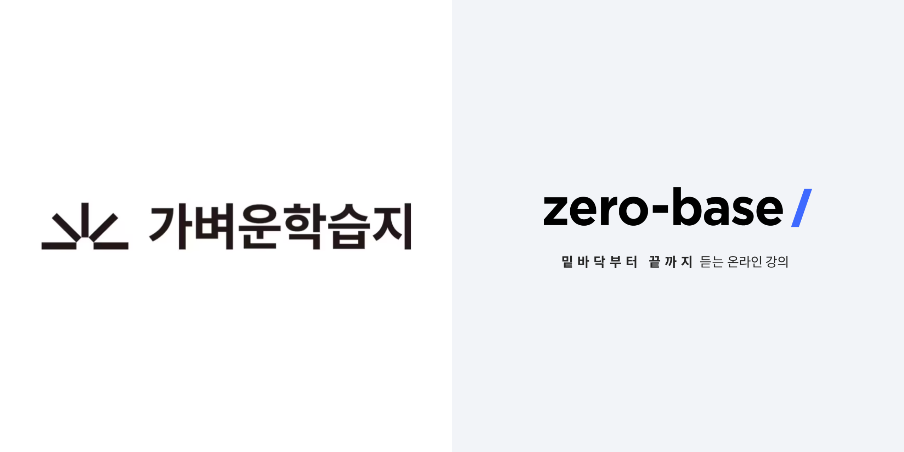
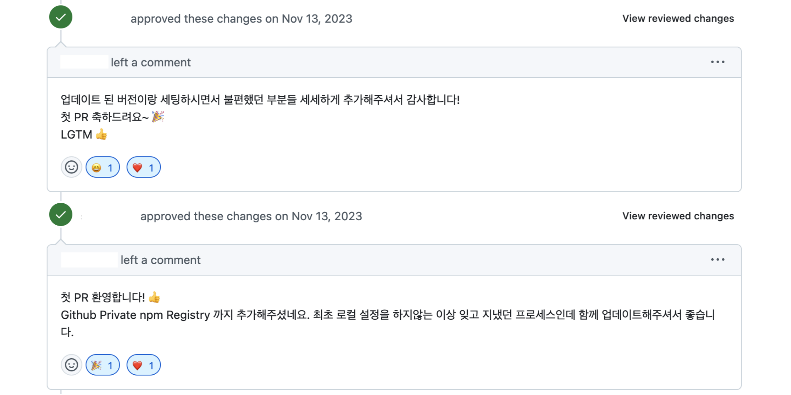
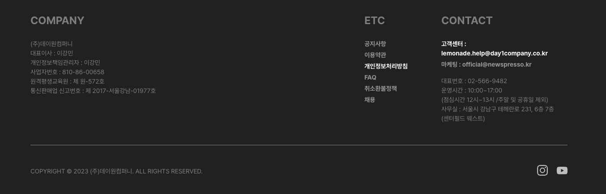
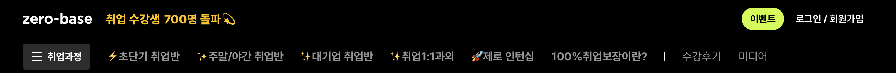
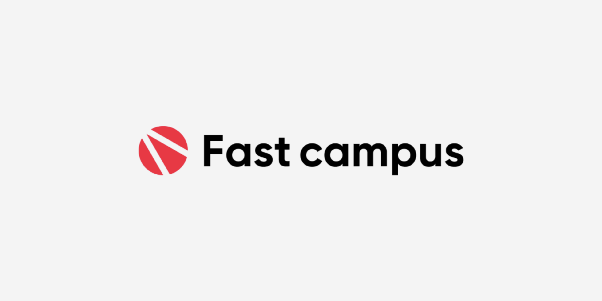
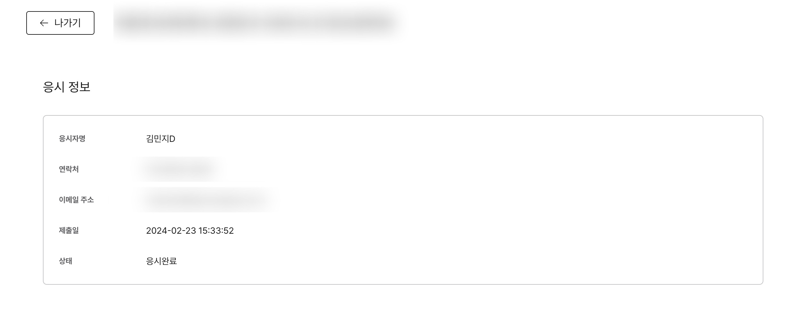
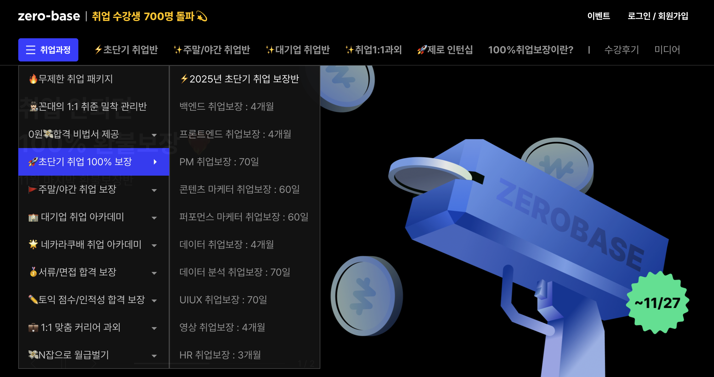
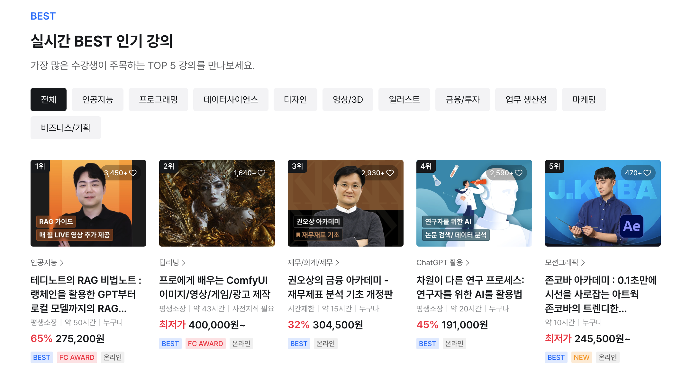
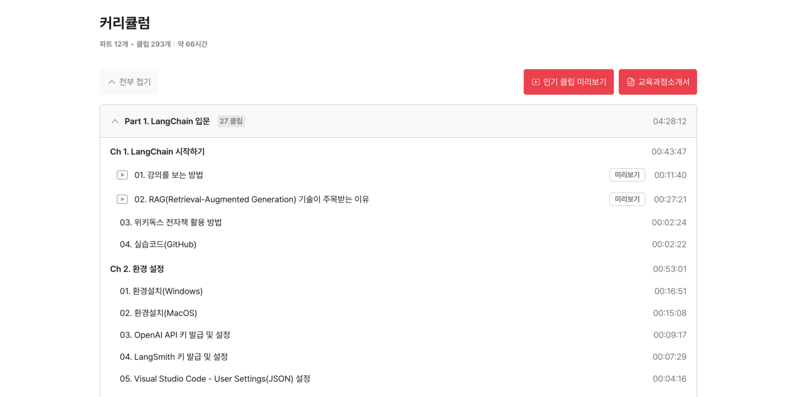
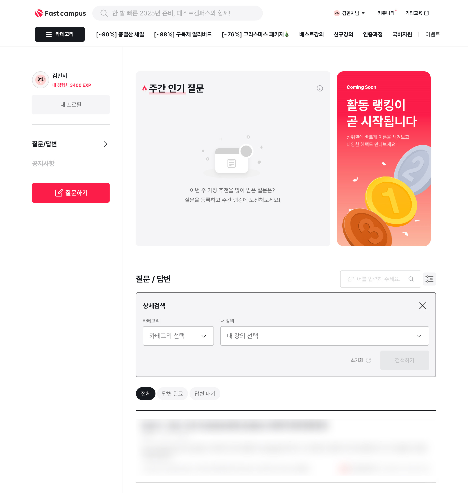

## 들어가며

프론트엔드 개발자로서 일 년 동안의 경험을 시간순으로 정리했어요. 작은 변경 작업과 큰 프로젝트 도입 업무를 진행하며 배운 점과 아쉬운 점을 담았어요.

## 1. 2023.11 ~ 2023.12

입사하고 두 달 동안 새로운 걸 많이 경험할 수 있었어요. 처음으로 접한 것들에 대해 정리했어요.

### 1-1. 첫 담당 서비스

<em>가벼운학습지와 제로베이스</em>

첫 팀에서는 총 세 개의 서비스를 운영하고 있었어요. 그중에서 [제로베이스](https://zero-base.co.kr) 와 [가벼운학습지](https://mylight.co.kr) 를 운영하는 파트에 배정됐어요. 가벼운학습지는 어학과 취미 영역에서 영상과 학습지 교재를 교육용 콘텐츠로 제공하고 제로베이스는 디지털 스킬 분야에서 제2의 온라인 대학 역할을 할 수 있는 취업 연계 부트캠프 서비스를 제공해요.

### 1-2. 첫 PR

<em>팀원 분들의 따뜻한 첫 PR 리뷰</em>

첫 PR 은 로컬 개발 환경을 세팅하며 README 파일을 수정한 거였어요.

### 1-3. 첫 운영 이슈

<em>가벼운학습지 하단 Footer</em>

운영 이슈는 홈페이지 하단의 이메일 텍스트를 수정하는 간단한 이슈부터 진행했어요. 점차 도메인 지식이 필요한 운영 이슈에 참여하며 조금씩 서비스에 익숙해질 수 있었어요.

### 1-4. 첫 워크플로우 수정

업무를 진행하면서 PR 을 생성할 때 assignees 를 직접 설정하는 과정이 어색하여 자꾸 놓쳐서 GitHub Action 을 사용해서 자동화 워크플로우를 추가했어요. 이때 업무 중 불편함을 느끼면 이를 어떻게 자동화해서 풀어나갈 수 있을지에 대한 관심이 커졌어요.

### 1-5. 첫 핫픽스

<em>제로베이스 상단 GNB</em>

성수기인 연말에는 마케팅 관련 급건 작업에 참여했어요. 당일 요구사항 파악 후 즉시 변경하여 배포하는 핫픽스를 경험했어요. 링크 변경과 같은 작은 수정 사항이어도 작업한 후 바로 배포하는 과정 자체가 긴장되었어요.

로고 변경과 같은 간단한 작업인데 특정 페이지에서만 로고가 보이지 않는 사이드 이펙트가 발생한 적도 있었어요. 당시에는 이를 미리 파악하지 못한 스스로에게 아쉬웠어요. 그래도 이때의 경험으로 코드의 사이드 이펙트를 더 꼼꼼히 검토하게 되어 좋은 경험이었다고 생각해요.

## 2. 2024.01 ~ 2024.02

기존 코드를 개선하는 클린업 작업과 새로운 프로젝트에 투입됐어요.

### 2-1. 쿼리 키 구조 개선

운영 이슈를 진행한 후에는 클린업 작업에 참여했어요. 클린업 작업은 팀 내에서 개선이 필요한 기술 부채 목록을 선정한 후 진행해요. [Tanstack Query](https://tanstack.com/query/latest) 의 쿼리 키를 1 depth 로 관리하여 데이터를 원활하게 무효화하기 어려운 이슈가 있었어요. 이를 [Query Key Factory](https://github.com/lukemorales/query-key-factory) 를 도입해서 계층화된 구조로 개선했어요. 이렇게 팀 내의 컨벤션이 변경되는 작업은 모두의 싱크를 맞추기 위해 문서화가 중요하다는 걸 느꼈어요. 문서를 최대한 상세하게 작성해서 공유했어요.

### 2-2. Zustand 마이그레이션

[Recoil](https://github.com/facebookexperimental/Recoil) 패키지가 deprecated 되면서 [Zustand](https://github.com/pmndrs/zustand) 로 마이그레이션을 진행했어요. 어떤 패키지로 마이그레이션을 할지 정하기 위해 여러 후보의 장단점을 비교했어요. 

### 2-3. Vue 기반 프로젝트 Next.js 기반으로 이관

<em>패스트캠퍼스</em>

같은 팀의 다른 파트에서 [패스트캠퍼스](https://fastcampus.co.kr/) 서비스를 운영하고 있었는데 한 달 동안 해당 파트 업무에 참여했어요. 입사 3개월 차에 새로운 서비스를 경험해 볼 수 있었어요. 패스트캠퍼스는 AI 와 Data Science 분야를 중심으로 직장인의 역량 향상을 위한 교육 콘텐츠를 제공해요.

당시 해당 파트에서는 [Vue](https://ko.vuejs.org) 기반 패스트캠퍼스를 Next.js 기반으로 이관하고 있었어요. 그중에서도 LMS 관련 기능 이관에 투입됐어요. Vue 프로젝트를 처음 접해서 새로운 문법이 어색했지만 그래도 무사히 작업을 마무리할 수 있었어요.

### 2-4. 캐시된 데이터 디버깅

<em>패스트캠퍼스 LMS 시험 결과 페이지</em>

처음으로 버그를 깊게 파고들어 원인을 파악하는 경험을 했어요. 시험을 응시한 후 시험 결과 페이지에 접속하면 모든 내용이 정상적으로 보이지만, 이후 시험 목록 페이지에서 시험 결과 페이지에 접근하면 특정 내용만 보이지 않는 이슈였어요. 시험 목록 페이지에서 일부 데이터만 가져온 후 캐시하고 시험 결과 페이지에서는 새로운 데이터를 호출하지 않고 이전에 캐시한 데이터만 바라봐서 발생한 이슈였어요. 이 경험으로 유사한 버그를 접하면 데이터 캐싱을 의심하여 빠르게 원인을 파악할 수 있게 되어 상당히 의미 있는 경험이었다고 생각해요.

### 2-5. Next.js 사내 스터디

매주 한 시간씩 팀 내에서 자체적으로 스터디를 진행했어요. 특정 주제를 정한 후 주차 별로 발표하는 방식이었어요. [Next.js Using App Router 문서](https://nextjs.org/docs/app) 읽기 스터디에 참여해서 담당 범위에 대해 발표했어요.

## 3. 2024.03 ~ 2024.05

패스트캠퍼스 이관 작업을 마친 후 다시 가벼운학습지와 제로베이스를 운영했어요.

### 3-1. e2e 테스트 작성

새로운 클린업 작업에 참여해서 [Playwright](https://playwright.dev) 로 e2e 테스트를 작성했어요. 다만 테스트 코드 작성 직후 조직 개편으로 인해 실제 운영 과정에서 테스트 코드를 더 발전시키지 못한 점은 아쉬움으로 남아있어요.

### 3-2. 카테고리 UI 개선

<em>제로베이스 카테고리 목록</em>

운영 이슈를 진행하며 제로베이스의 GNB 카테고리 메뉴를 기존 2 depth 에서 3 depth 로 확장하는 작업에 참여했어요. 그리고 GNB 영역에 메뉴가 많아져서 화면보다 길어졌을 때 사용자가 마우스로 드래그를 할 수 없어서 이러한 사용성을 개선하기 위해 가로 스크롤이 가능한 공통 hook 을 추가하여 적용했어요. 

### 3-3. MDN 사내 스터디

Next.js 스터디를 마친 후에는 [MDN HTTP 문서](https://developer.mozilla.org/ko/docs/Web/HTTP) 읽기 스터디를 진행했어요.

## 4. 2024.06 ~ 2024.07

조직 개편으로 인해 패스트캠퍼스 서비스만 담당하게 됐어요.

### 4-1. 메인 페이지 개편 및 강의 찜하기 기능 도입

<em>실시간 BEST 인기 강의 영역</em>

가벼운학습지와 제로베이스 서비스를 운영할 땐 비교적 짧은 기간에 끝낼 수 있는 작은 단위의 업무가 많았는데 패스트캠퍼스에서는 여러 달에 걸쳐 새로운 기능을 도입하는 업무 위주로 진행됐어요. 6월부터 12월까지 크게 세 개의 프로젝트에 참여했어요.

- [BX/UX 개편](https://fastcampus.co.kr) - 메인 페이지에 실시간 BEST 인기 강의와 같은 여러 자동화 섹션 생성 및 강의 찜하기 기능 도입
- [상세 페이지 개편](https://fastcampus.co.kr/data_online_teddy) - 상세 페이지를 메타 데이터 기반으로 생성하는 자동화 템플릿 도입
- [질의응답 게시판 고도화](https://fastcampus.co.kr/community) - 커뮤니티 도입

6월에는 BX/UX 개편 작업에 참여했어요. 새로운 기능을 개발할 때는 기획서와 피그마를 꼼꼼히 검토하여 놓치는 부분이 없도록 신경 썼어요.

### 4-2. 정신적으로 힘든 시기를 극복하는 방법

신규 기능을 도입하는 작업에 참여하여 업무량이 많은데 새로운 서비스의 도메인 지식을 익히는 것까지 함께 해야 하고 팀이 바뀌어서 새로운 팀에 적응도 해야 해서 일 년 중에서 가장 혼란스럽고 어렵고 힘들었어요. 이를 극복할 수 있는 여러 방법을 고민하다가 업무 우선순위의 중요성을 깨닫기 시작했어요. 여러 일이 몰려도 우선순위를 기준으로 하나씩 업무를 해결해 나가며 익숙해질 수 있었어요.

이때 힘들어하며 스스로 안정된 상태로 만드는 방법을 알게 된 것이 큰 수확이라 생각해요. 여러 생각을 글로 작성해 보는 게 도움이 되었어요. 그리고 철학 관련 서적을 읽으면서 생각을 정리해 보는 것도 도움이 되었어요. 앞으로도 이 방법을 계속 사용하려 해요.

그동안 어떤 일이 있어도 무너지지 않는 게 중요하다고 생각했는데 이제는 무너져도 다시 일어나는 게 중요하다고 생각해요.

### 4-3. 사내 패키지 개선 작업

사내에서 사용하는 패키지의 개선 작업에 참여해서 [ejs](https://ejs.co/) 문법도 경험해 볼 수 있었어요.

### 4-4. 스켈레톤 도입

새로운 섹션을 생성하면서 데이터 로딩 시간이 긴 섹션에 대해 스켈레톤 UI 를 도입했어요.

## 5. 2024.08 ~ 2024.10

### 5-1. 자동화 서비스 도입

<em>강의 상세페이지 커리큘럼</em>

다음 프로젝트로 백오피스에서 입력한 데이터를 기반으로 강의 상세 페이지의 UI 를 생성하는 작업에 참여했어요.

그동안은 백오피스 툴을 통해 상세 페이지의 영역을 하나씩 직접 생성해야 했어요. 오픈소스여서 [레포](https://github.com/day1co/fastcomposer) 에서 확인해 볼 수 있어요. 이러한 작업을 빠르게 할 수 있도록 진행한 프로젝트예요.

상세 페이지 중에서도 커리큘럼 작업을 메인으로 진행했어요. 백오피스에서 엑셀 파일을 올리면 이를 3 depth 구조의 아코디언 형태로 노출하는 작업이에요. 이 과정에서 백오피스 엑셀 데이터 검증 오류를 상세하게 작성하여 사용자가 어떤 데이터에서 오류가 발생하는지 쉽게 파악할 수 있도록 했어요.

### 5-2. 강의 미리보기 기능 도입

강의 영상 미리보기 기능을 도입하면서 관련 도메인 지식을 익힐 수 있었어요.

### 5-3. 공통 로직 hook 분리

캐러셀 영역에 대해 [Swiper](https://swiperjs.com) 패키지를 사용하고 있어서 리팩토링 작업을 통해 반복되는 공통 로직을 hook 으로 분리해서 코드 라인 수를 줄일 수 있었어요.

## 6. 2024.11 ~ 2024.12

### 6-1. 커뮤니티 오픈

<em>커뮤니티 기능 도입</em>

연말에는 [커뮤니티](https://fastcampus.co.kr/community) 를 오픈했어요. 강의에 대한 질문을 작성하면 강사/조교/회원에게 답변받을 수 있어요. 게시글이나 답변을 작성하면 경험치를 받고 매주 경험치 순으로 주간 활동 랭킹을 측정해요. 

커뮤니티가 일 년 동안 진행한 프로젝트 중 가장 일정이 촉박했어요. 그래도 큰 이슈 없이 무사히 배포를 마쳐서 다행이라고 생각해요. 이제 QA 및 안정화 작업과 2차, 3차 배포를 앞두고 있어요. 팀이 다 함께 주말에 근무할 정도로 업무량은 많았지만 그래도 가장 재미있는 작업이었어요.

### 6-2. 공통 로직

공통 로직과 관련된 업무를 진행하며 즐거움을 느낄 수 있었어요. 퍼널 UI 관련 hook 및 컴포넌트 만들기, 무한 스크롤 공통 hook 만들기, 목록 UI 공통 컴포넌트 만들기 등이 있었어요. 공통 로직을 개발하며 여러 케이스를 고려하는 과정이 즐거웠어요. 그 과정에서 다른 개발자의 사용 경험도 고려하는 게 좋았어요. 공통 로직을 잘못 사용했을 경우를 대비해서 타입 에러를 발생시키는 로직을 추가하며 오픈소스에서는 왜 타입스크립가 중요한지 알게 된 것도 좋았어요.

업무가 재미있으니 해야만 하는 일이라고 생각하지 않고 자발적으로 집에 와서도 더 고도화하거나 발전시키고 싶다는 생각이 계속 들었어요. 하기 싫은 일을 해야 해서 하는 게 아니라 정말 일이 재미있어서 하는 느낌을 받았어요.

### 6-3. 프론트엔드 관심사

그동안 프론트엔드의 여러 분야 중 특히 어떤 일을 하고 싶은지 스스로 잘 몰랐는데 정말 재미있어하고 좋아하고 잘할 수 있는 분야를 알게 된 거 자체가 큰 수확이라고 생각해요. 이제 어떤 문구로 스스로 소개할 수 있을지 정해볼 수 있을 거 같아요.

## 마치며

돌이켜보니 많은 일이 있었던 바쁜 일 년이었던 거 같아요. 그래도 의미없이 바쁜 게 아니라 그 안에서 충분히 힘들어하고 고민하며 성장해서 다행이라고 생각해요. 많은 분들에게 큰 도움을 받았는데 첫 일 년 동안 느낀 걸 잊지 않고 기억했다가 나중에 리더가 된다면 이를 다 돌려줄 수 있으면 좋겠다는 생각이 들었어요.

회사에 본받고 싶은 분들을 보며 나중에 팀을 이끌어 나갈 수 있는 좋은 리더가 되고 싶다고 생각했어요. 우선 지금처럼 주니어일 땐 기술 역량을 높이는 게 가장 중요할 거 같아 이에 집중하려 해요.

회사에 계신 분들만 봐도 다 본받고 싶은 점이 달라요. 내가 어떤 동료, 개발자가 되고 싶은지를 생각하고 나아가는 게 중요한 거 같아요. 정답은 없다고 생각해요.