## 들어가며

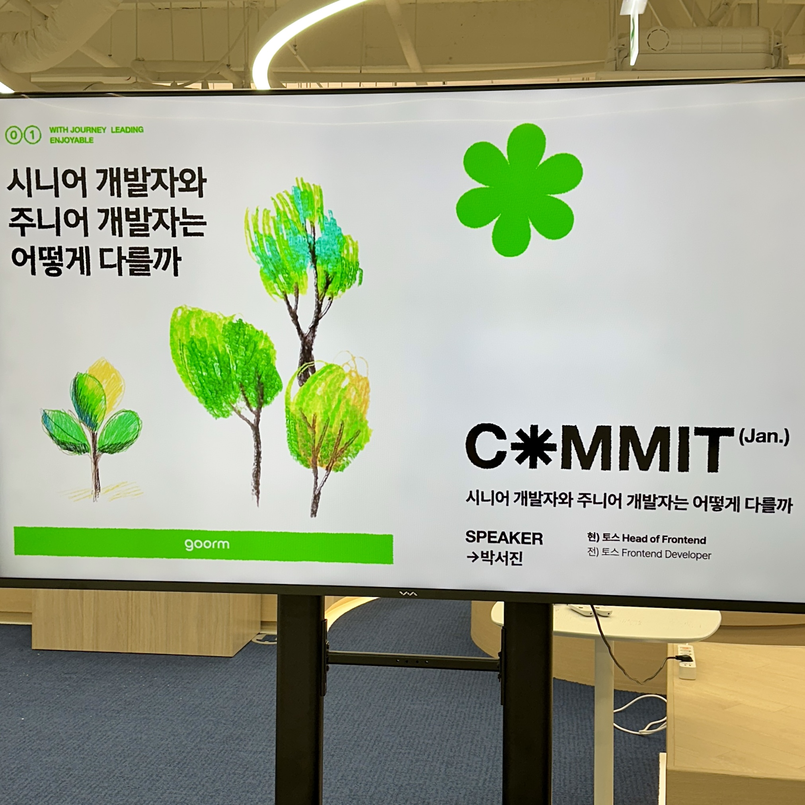

구름에서 주최하는 [COMMIT](https://tech.goorm.io/ko/2501_commit/) 세미나에 참석했어요. 세미나의 주요 내용을 정리하고 이를 들으며 느낀 점과 앞으로의 계획에 대해 정리했어요. 평소 궁금하고 고민하고 있던 주제여서 참석했어요. 

## 1. 하드 스킬

세미나는 크게 두 개의 목차인 하드 스킬과 소프트 스킬으로 나눠서 진행됐어요. 첫 번째 주제는 하드 스킬이었어요.

### 1-1. 멋있는 것을 하지 마라

포장지에 너무 집중하지 않고 포장지와 알맹이의 균형을 맞추는 것에 중요성에 대해 말씀해주셨어요. 

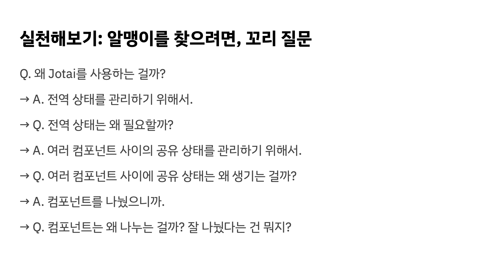

이전에 여러 개발 관련 대외 활동과 사이드 프로젝트에 참여하며 하드 스킬이 좋은 분들의 공통점을 찾으려 노력했던 적이 있어요. 그 때 느낀 점이 바로 꼬리 질문과 유사해요. 소위 말하는 "개발을 잘하는 사람"은 새로운 개념에 대해 당연하게 받아들이는 것이 적고 항상 근본적인 내용을 파고드는 것이 다른 점이라고 느꼈어요.

평소 스스로 꼬리 질문을 많이 하며 알맹이를 찾으려고 노력하는데 그럼에도 불구하고 위와 같은 개발을 잘하는 사람들에 비해 꼬리 질문이 얕게 끝날 때가 있다고 느껴요. 이러한 점은 앞으로도 꾸준히 꼬리 질문을 하려고 노력하면 아는 것이 더 많아지면서 시야가 넓어지고 꼬리 질문은 더 깊어질 것이라고 생각해요.

### 1-2. 멋있는 것을 많이 봐라

무엇인가를 잘하려면 압도적으로 좋은 것을 많이 봐야 하고 평범한 것을 단순히 보는 것으로는 새로운 인사이트가 생기기 어렵다는 말씀을 해주셨어요. 꾸준히 기술력이 높거나 복잡하거나 퀄리티가 높은 코드를 봐야 한다는 말씀을 해주셨어요.

사실 이렇게 문장을 놓고 보면 당연한 얘기일 수 있는데 그동안 놓치고 살았다는 것을 깨달았어요. 

주기적으로 책 스터디에 참여하는데 스터디에서 정말 유익한 인사이트를 공유해주시는 분들이 계셔서 앞으로 이런 분들처럼 다른 분들에게 소소한 인사이트라도 공유드릴 수 있도록 스터디에 적극적으로 참여를 해보려고 해요.

토스 [Frontend Fundamentals](https://frontend-fundamentals.com/code-quality) 문서 뿐만 아니라 [Discussion](https://github.com/toss/frontend-fundamentals/discussions) 내에도 유익한 내용이 많다고 느꼈어요. 투표로 올라온 주제를 보면 역시 고민하는 점은 비슷하다고 느끼다가도 아래의 댓글을 보면 하나의 주제에 대해서도 모든 사람의 의견은 각자 다른 것이 재미있었어요. A라는 주제에 대해서 어떤 사람은 1~10까지 검토하고 고려해서 개발한다면 어떤 사람은 1부터 100까지 검토하고 고려해서 말한다는 것을 느낄 수 있었어요. 제가 지향하는 바는 후자이고 이렇게 시야가 넓어서 많은 것을 고려하고 개발하는 사람을 지향해요.

### 1-3. 두뇌를 풀가동시키기

내가 할 수 없었던 것에 도전을 해야 하고 그 행위 자체를 신경쓰면 안 된다는 걸 말씀해주셨어요. 만일 공부를 한다는 그 행위 자체에 신경써서 아티클을 읽는다 그 자체에 포커스를 맞춘다면 아무리 오랜 시간을 들여도 지식을 당연하게 받아들이는 정도로는 성장할 수 없다는 걸 말씀해주셨어요.

복잡한 코드를 수정이 용이하도록 바꾸려면 어떻게 해야 할까? 같은 리팩토링 고민도 유용하다고 하셨어요.

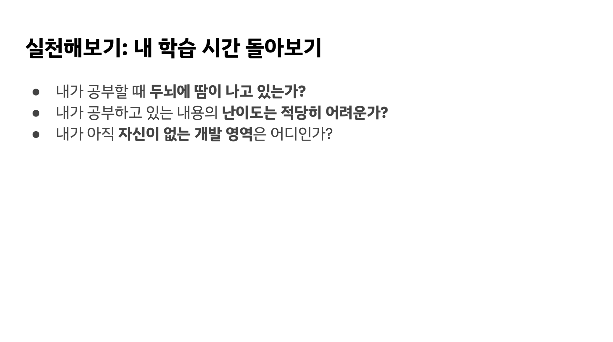

내가 아직 자신이 없는 개발 영역을 마주하는 것을 중요하게 느꼈어요. 사내에서 업무를 할 때 어느 정도로 두뇌에 땀이 나고 있는지를 생각하려 해요.

인사이트를 얻으면 실제 코드에 적용하는 점이 중요하다고 느껴요. 그렇지 않으면 지식은 휘발되지만 적용하면 경험이 되어 오래 남을 수 있기 때문이에요. 그리고 적용을 해보며 장단점을 느낄 수 있어 추후 다른 의사결정에 도움이 된다고 생각해요.

### 1-4. 적용하기

배움이란 행동의 변화라서 알고리즘을 이해하고 내부 동작에 대해서 이해하고 책의 내용을 아는 것이 아니라 실제 적용이 필요하다는 걸 말씀해주셨어요. 소프트웨어 설계 관점에서는 프로젝트 코드 리팩토링이고 디버깅 관점에서는 다음에 디버깅할 때 이것부터 해야겠다는 거 일 수 있어요. 말하기 방법에서는 이번에는 이렇게 이야기를 시작해야겠다고 생각하는 것입니다. 어떤 것을 아는 것을 넘어서 다음에 행동하는 것이 바뀌는 것이에요.

이러한 관점에서 봤을 때 나는 진짜 배움을 많이 했을까? 라는 의문이 스스로에게 들었어요.

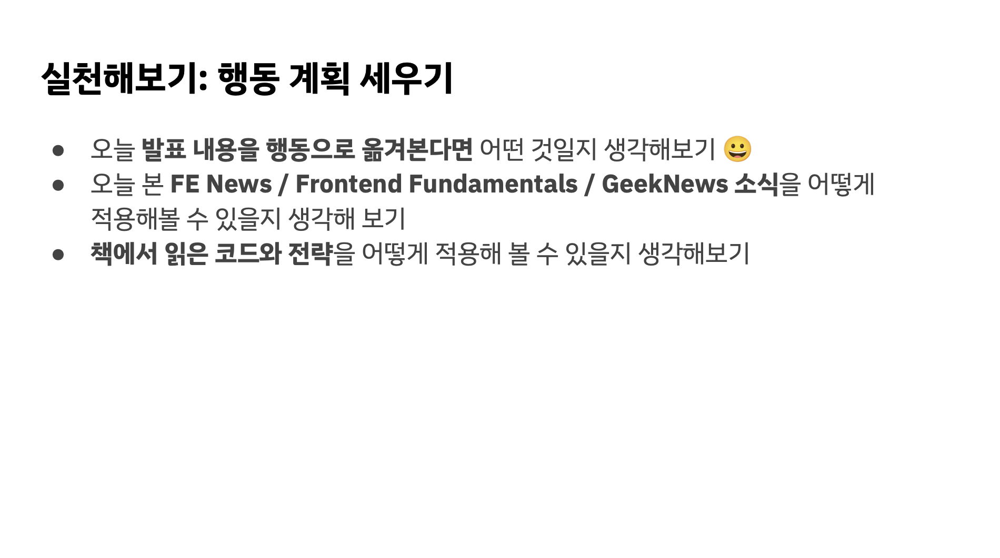

조금씩 실천에 옮기는 것이 어렵지만 거창한 계획을 세우지 않고 바로 행동에 옮기는 것이 가장 중요하다고 생각해요.

### 1-5. 중간정리

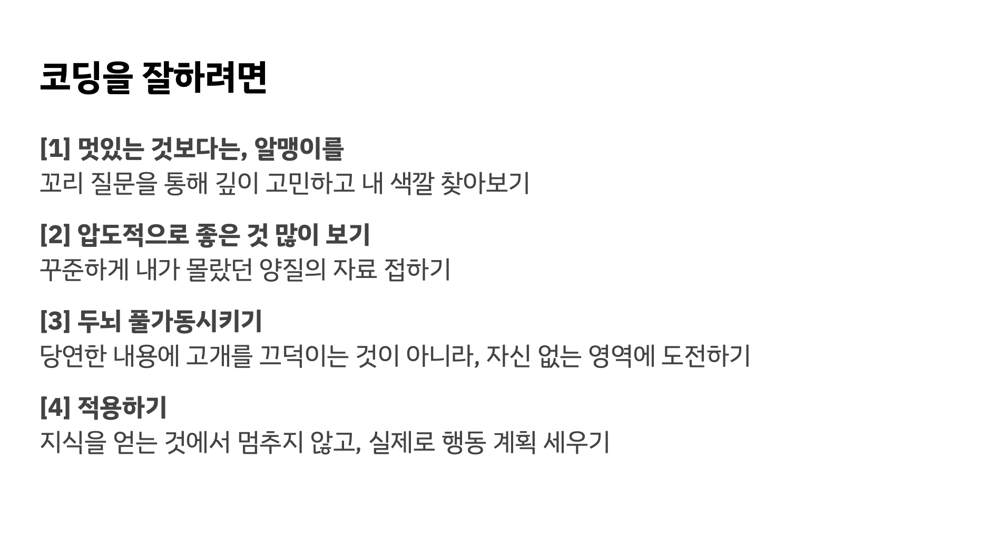

평소 고민과 관련된 핵심적인 내용을 액션 아이템과 함께 말씀해주셔서 더 와닿았어요.

## 2. 소프트 스킬

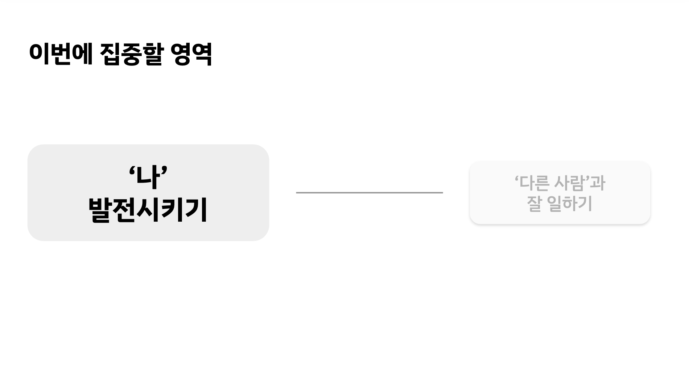

이번 세미나는 위의 두 가지 영역 중에서도 '나' 발전시키기와 관련된 내용으로 진행해주셨어요.

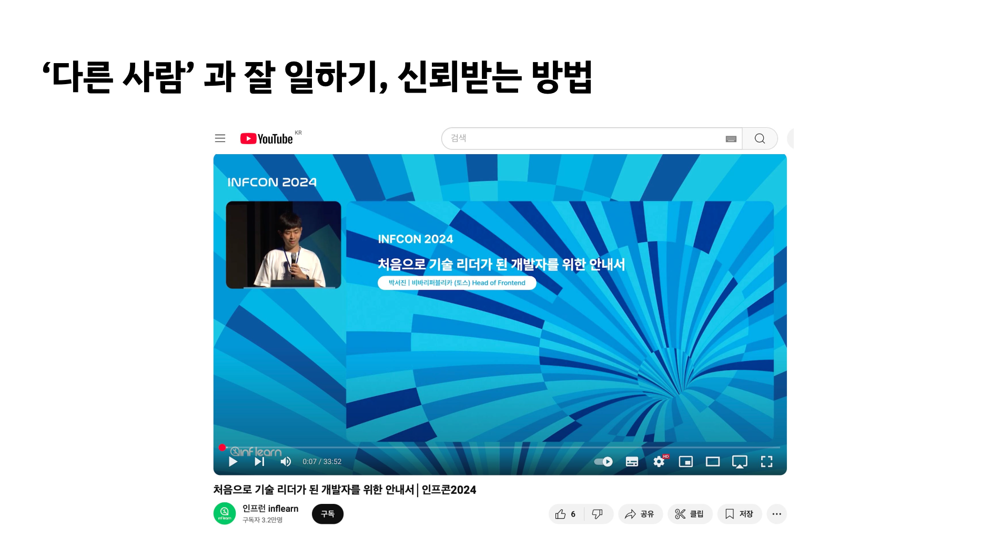

'다른 사람'과 잘 일하기, 신뢰받는 방법으로 [인프콘](https://youtu.be/6d479UE8It8?si=h1ZCQ8Ec-bovuF_E) 영상을 추천해주셨어요. 

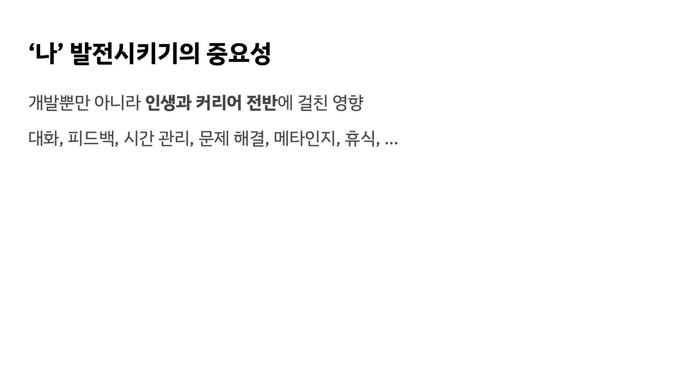

취업하고 위의 내용을 정말 많이 느꼈어요. 나를 잘 이해하는 것에서부터 출발하는 게 중요하다고 생각해요. 나에게 일이란 어떤 의미이고 나는 어떤 것을 좋아하는지 이해하면 그에 맞게 더 발전해나갈 수 있다고 생각해요. 사색과 철학의 중요성을 느끼고 있어요.

### 2-1. 변화에 열려 있기

서진님께서는 언제든 더 나아질 수 있다고 항상 생각한다고 하셔서 굉장히 와닿았어요. 무엇이든 개선할 수 있고 내가 그에 맞게 노력하겠다는 다짐은 일종의 원동력으로 작용한다고 생각해요.

우리는 모두 올림픽 선수가 되려고 하는 것이 아니고 올림픽 선수들은 모두 죽어라 노력하기 때문에 재능이 중요한 것이다. 실제 생활에서는 대부분 노력에서 차이가 생긴다. 우리는 웅변대회, 코딩 알고리즘 대회에 나가려는 것이 아니다. 이러한 말씀이 굉장히 울림이 있었어요.

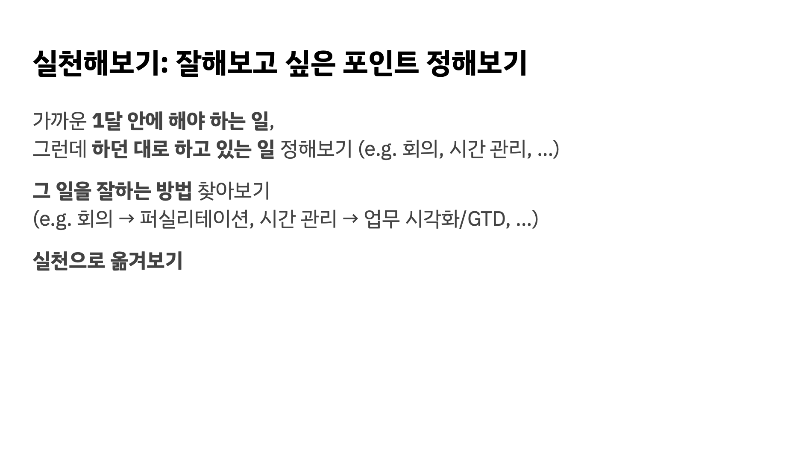

역시 뭐든 실천이 중요하고 어렵다고 생각해요.

### 2-2. 꾸준함

회사에서 업무를 시작한지 만 1년이 지나고 새로운 불안감이 생겼어요. 사실 1년까지는 회사 업무를 진행하는 그 자체만으로도 성장하는 것을 많이 느꼈는데 이제는 이를 반복하고 싶지 않다는 생각이 들었어요. 하드 스킬이나 소프트 스킬 모두 성장하고 싶고 이전에 한 실수를 반복하고 싶지 읺아요.

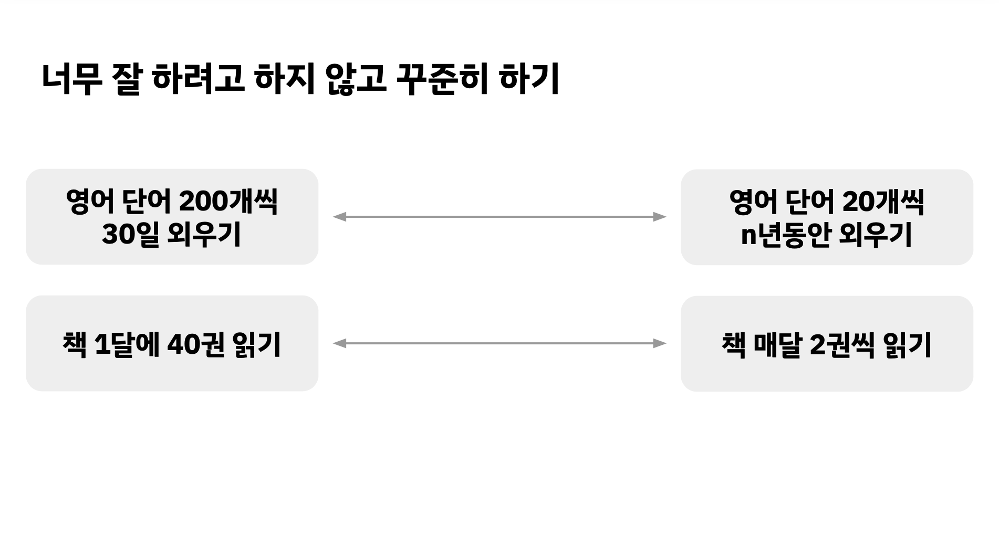

옛날부터 알고 있지만 실천하기 어려운 항목이라고 생각해요. 올해는 새해 목표를 세울 때 부터 큰 목표를 작게 나누기 위해 노력했어요. 요즘 작은 목표에 집중하고 있어요. 큰 꿈은 계속 꾸지만 계획은 작게 생성하는 것이 중요하다고 생각해요. 

그리고 한 달 단위로 피드백을 가지고 계획을 수정해 나가려 해요.

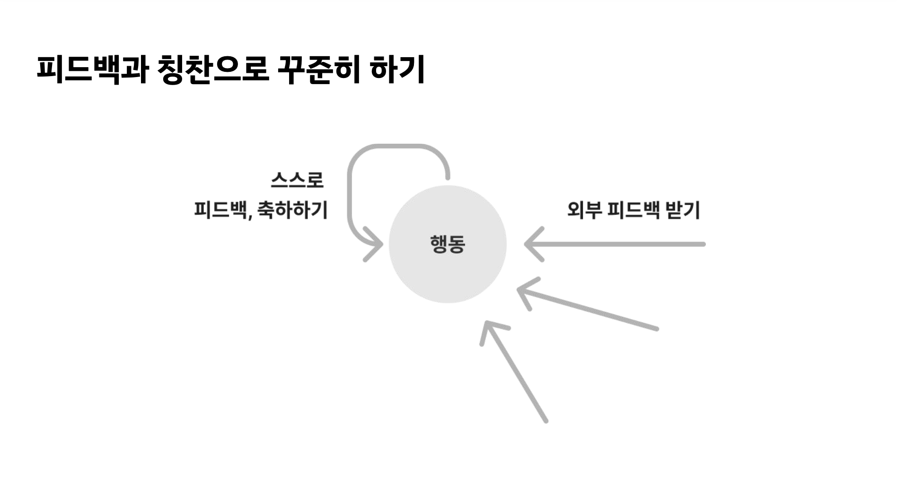

스스로 축하하는 것이 익숙하지 않은데 앞으로는 노력을 해보려고 해요.

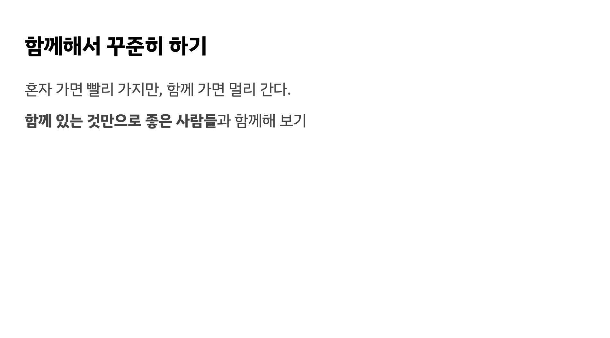

스터디는 개인 스터디보다 팀 스터디를 선호해요. 예를 들어 책 스터디는 같은 내용을 읽어도 모두 다르게 생각할 수 있어서 이러한 점을 공유하는 것이 재미있어요.

### 2-3. 중간정리

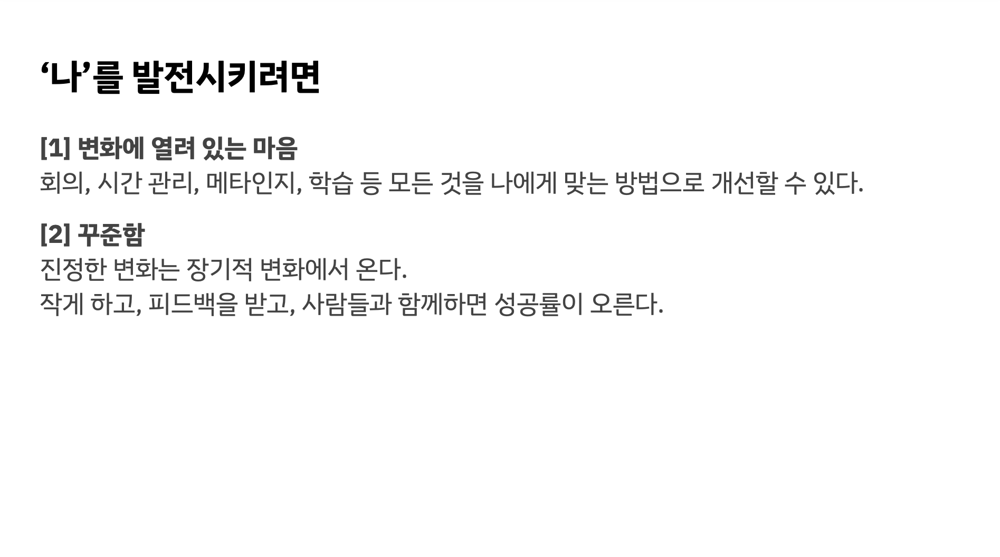

## 마치며

퇴근하고 판교에 방문한 후 세미나 이후 다시 집으로 돌아오는 과정에 많은 시간이 소요됐지만 전혀 아깝지 않은 세미나였어요. 온라인으로 참석했을 때와 대비하여 오프라인 참석자를 위한 QnA 시간도 유익하여 앞으로도 참석할 예정이에요.