## 들어가며

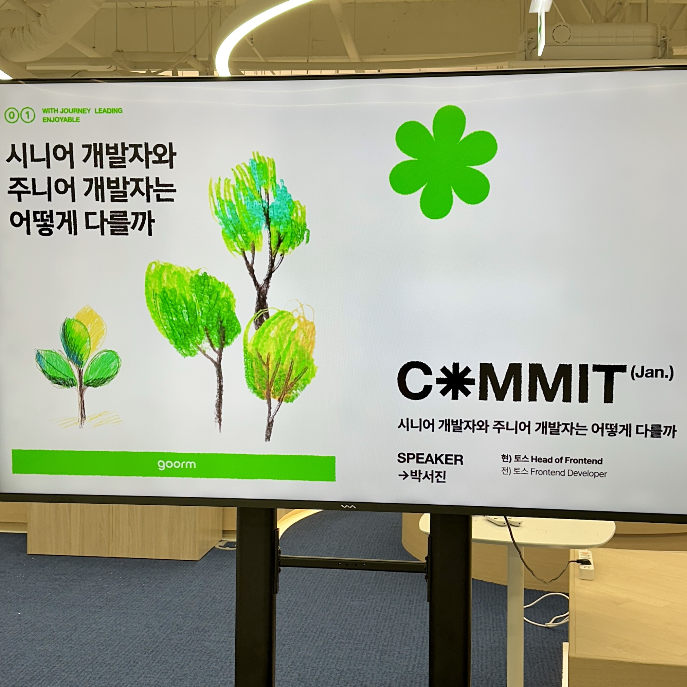

구름에서 주최하는 [COMMIT](https://tech.goorm.io/ko/2501_commit/) 세미나에 참석했습니다. 세미나의 주요 내용을 정리하고 이를 들으며 느낀 점과 앞으로의 계획에 대해 정리했습니다. 평소 궁금하고 고민하고 있던 주제여서 참석했습니다. 

## 1. 하드 스킬

크게 두 개의 목차인 하드 스킬과 소프트 스킬으로 나눠서 진행했습니다. 첫 번째 주제는 하드 스킬입니다.

### 1-1. 멋있는 것을 하지 마라

포장지에 너무 집중하지 않고, 포장지와 알맹이의 균형을 맞추는 것에 중요성을 말씀해주셨습니다. 

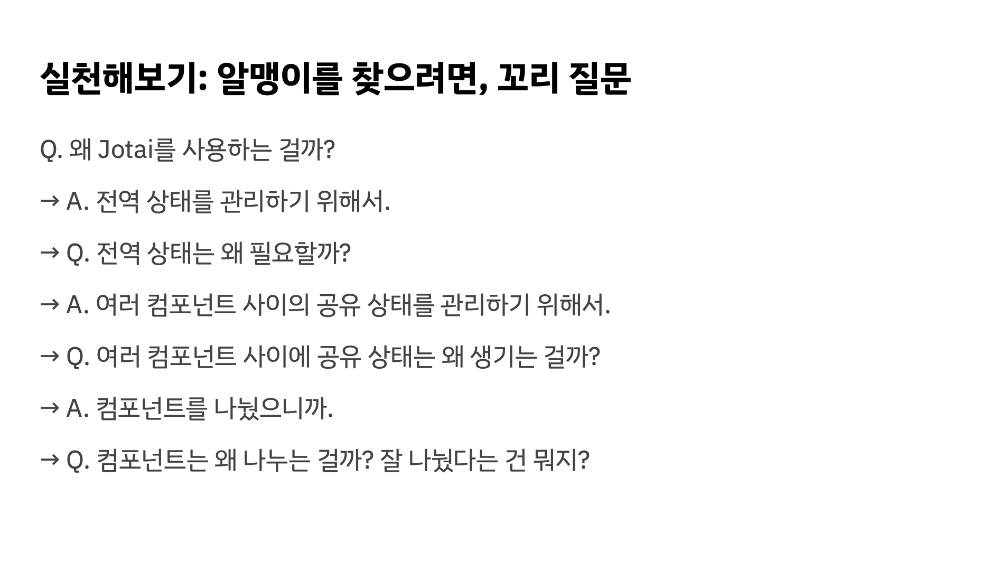

이전에 여러 개발 관련 대외 활동과 사이드 프로젝트에 참여하며 하드 스킬이 좋은 분들의 공통점을 찾으려 노력했던 적이 있습니다. 그 때 느낀 점이 바로 꼬리 질문과 유사합니다. 소위 말하는 "개발을 잘하는 사람"은 새로운 개념에 대해 당연하게 받아들이는 것이 적고, 항상 근본적인 내용을 파고드는 것이 다른 점이었습니다.

평소 스스로 꼬리 질문을 많이 하며 알맹이를 찾으려고 노력하는데, 그럼에도 불구하고 위와 같은 개발을 잘하는 사람들에 비해 꼬리 질문이 얕게 끝날 때가 있습니다. 이러한 점은 앞으로도 꾸준히 꼬리 질문을 하려고 노력하면, 아는 것이 더 많아지면서 시야가 넓어지고 꼬리 질문은 더 깊어질 것이라고 생각합니다.

### 1-2. 멋있는 것을 많이 봐라

무엇인가를 잘하려면, 압도적으로 좋은 것을 많이 봐야 한다. 평범한 것을 단순히 보는 것으로는 새로운 인사이트가 생기기 어렵다.

기술력이 높거나 복잡하거나 퀄리티가 높은 코드를 봐야 합니다.

사실 이렇게 문장을 놓고 보면 당연한 얘기인데 그동안 놓치고 살았다는 것을 깨달았습니다. 

주기적으로 책 스터디에 참여하지만 스터디에서 정말 유익한 인사이트를 공유해주시는 분들이 계셔서, 이런 분들처럼 다른 분들에게 소소한 인사이트라도 공유드릴 수 있도록 스터디에 적극적으로 참여를 해보려고 합니다.

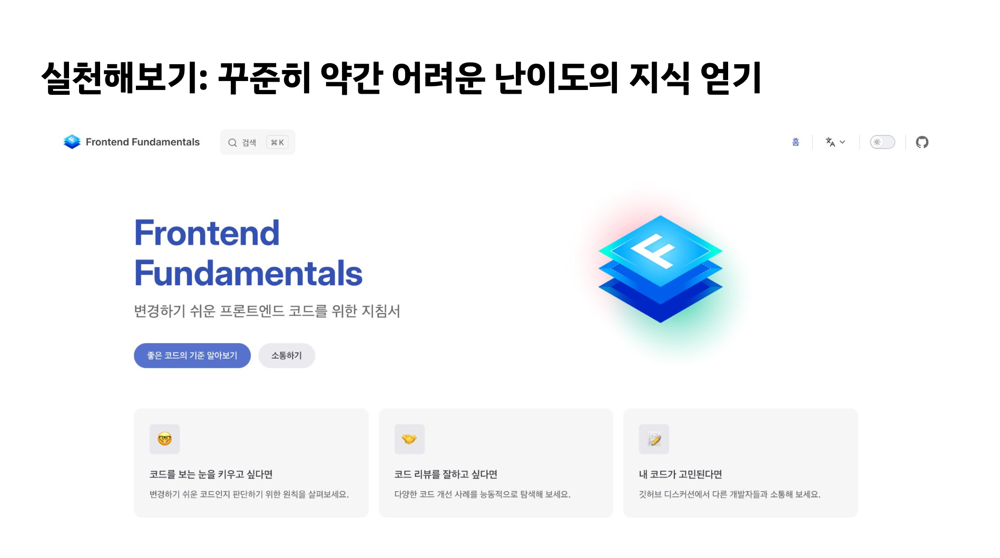

토스 프론트엔드 펀더멘탈은 문서 뿐만 아니라 Discussion 에도 유익한 내용이 많습니다. 투표로 올라온 주제를 보면 역시 고민하는 점은 비슷하다고 느끼다가도, 아래의 댓글을 보면 하나의 주제에 대해서도 모든 사람의 의견은 각자 다른 것이 재미있습니다. A라는 주제에 대해서 어떤 사람은 1~10까지 검토하고 고려해서 개발한다면, 어떤 사람은 1부터 100까지 검토하고 고려해서 말한다는 것을 느낄 수 있습니다. 제가 지향하는 바는 후자이고, 이렇게 시야가 넓어서 많은 것을 고려하고 개발하는 사람을 지향합니다.

### 1-3. 두뇌를 풀가동시키기

내가 할 수 없었던 것에 도전을 해야 합니다.

그 행위 자체를 신경쓰면 안 됩니다.

만일 공부를 한다는 그 행위 자체에 신경을 쓰면, 아티클을 읽는다 그 자체에 포커스를 맞춘다면, 아무리 오랜 시간을 들여도 지식을 당연하게 받아들이는 정도로는 성장할 수 없습니다.

복잡한 코드를 수정이 용이하도록 바꾸려면 어떻게 해야 할까? 같은 리팩토링 고민도 유용합니다.

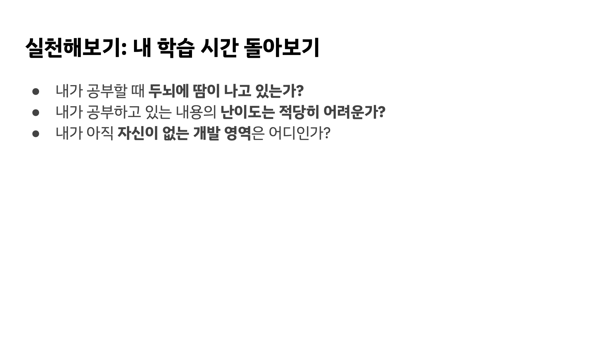

내가 아직 자신이 없는 개발 영역을 마주하는 것을 중요하게 느꼈습니다.

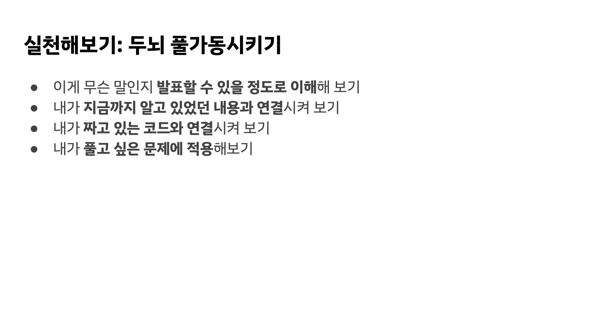

인사이트를 얻으면 실제 코드에 적용하는 점이 중요하다고 느낍니다. 그렇지 않으면 지식은 휘발되지만 적용하면 경험이 되어 오래 남을 수 있기 때문입니다. 그리고 적용을 해보며 장단점을 느낄 수 있어 추후 다른 의사결정에 도움이 됩니다.

### 1-4. 적용하기

배움이란 행동의 변화입니다.

알고리즘을 이해하고 내부 동작에 대해서 이해하고 책의 내용을 아는 것이 아니라 실제 적용이 필요합니다.

소프트웨어 설계 관점에서는 프로젝트 코드 리팩토링입니다.

디버깅 관점에서는 다음에 디버깅할 때 이것부터 해야겠다.

말하기 방법에서는 이번에는 이렇게 이야기를 시작해야겠다.

어떤 것을 아는 것을 넘어서, 다음에 행동하는 것이 바뀌는 것입니다.

이러한 관점에서 봤을 때 나는 진짜 배움을 많이 했을까? 의문이 생깁니다.

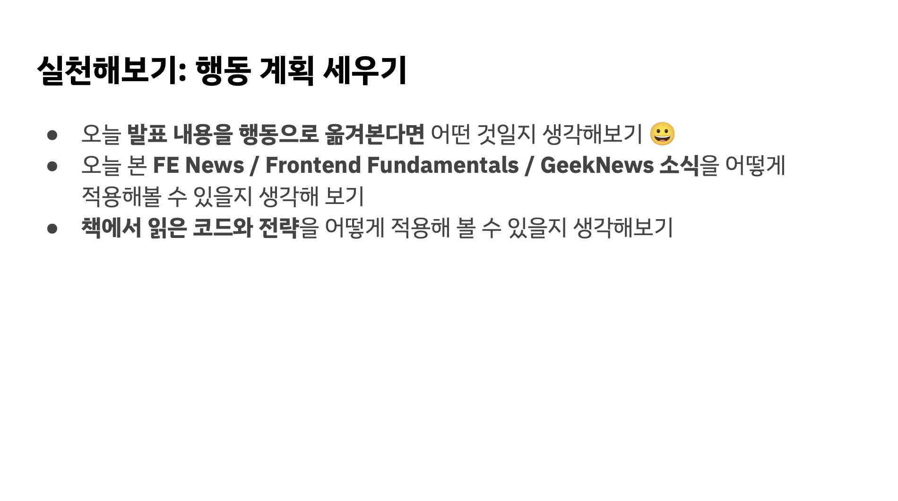

조금씩 실천에 옮기는 것이 어렵지만, 거창한 계획을 세우지 않고 바로 행동에 옮기는 것이 가장 중요하다고 생각합니다.

### 1-5. 중간정리

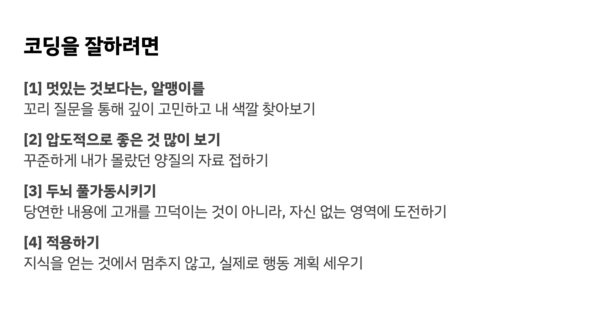

하드 스킬에 대한 정리

평소 고민과 관련된 핵심적인 내용을 액션 아이템과 함께 말씀해주셔서 더 와닿았습니다.

## 2. 소프트 스킬

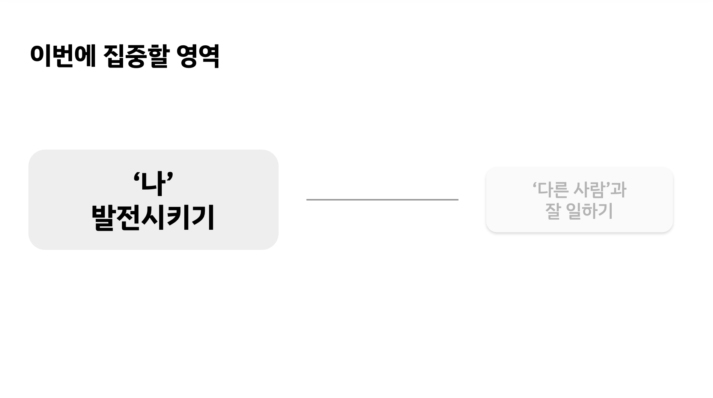

이번 발표는 두 가지 영역 중에서도 '나' 발전시키기와 관련된 내용이었습니다.

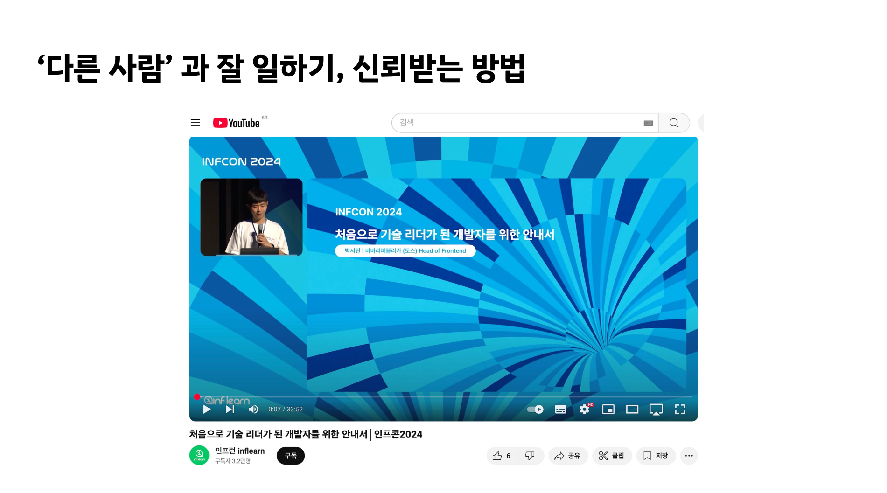

'다른 사람'과 잘 일하기, 신뢰받는 방법으로 추천해주신 영상을 첨부합니다. 

https://youtu.be/6d479UE8It8?si=h1ZCQ8Ec-bovuF_E

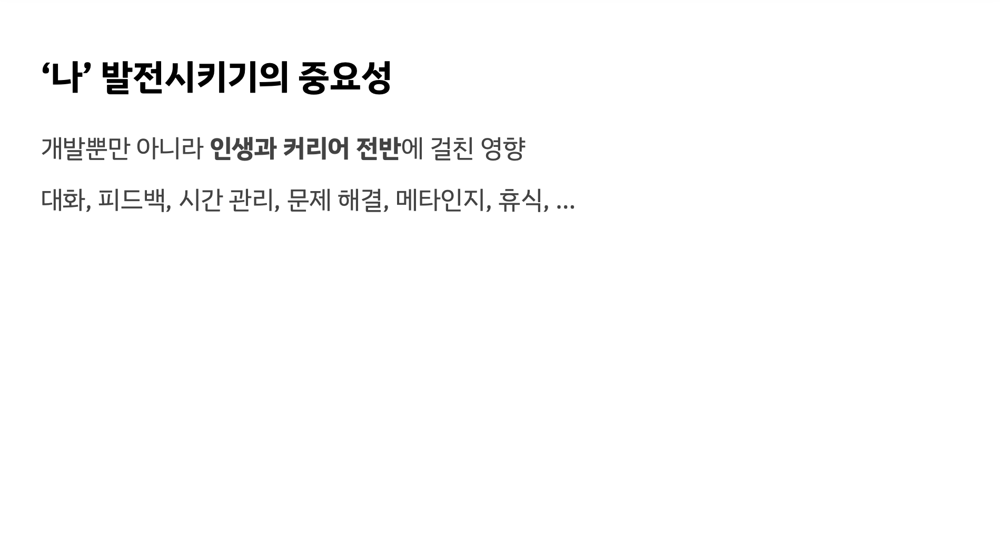

취업하고 이런 걸 정말 많이 느꼈습니다. 나를 잘 이해하는 것에서부터 출발하는 게 중요합니다. 나에게 일이란 어떤 의미인지, 어떤 것을 좋아하는지 이해하면 그에 맞게 더 발전해나갈 수 있습니다.

사색의 중요성과 철학의 중요성을 느끼고 있습니다.

### 2-1. 변화에 열려 있기

서진님께서는 언제든 더 나아질 수 있다고 항상 생각한다고 하셨는데, 굉장히 와닿았습니다.

무엇이든 개선할 수 있고, 내가 그에 맞게 노력하겠다는 다짐은 일종의 원동력으로 작용한다고 느낍니다.

올림픽 선수가 되려고 하는 것이 아니다.

올림픽 선수들은 모두 죽어라 노력하기 때문에 재능이 중요한 것이다.

실제 생활에서는 대부분 노력에서 차이가 생긴다.

우리는 웅변대회, 코딩 알고리즘 대회에 나가려는 것이 아니다.

"올림픽 선수가 되려고 하는 것이 아니다." 굉장히 울림이 있었습니다.

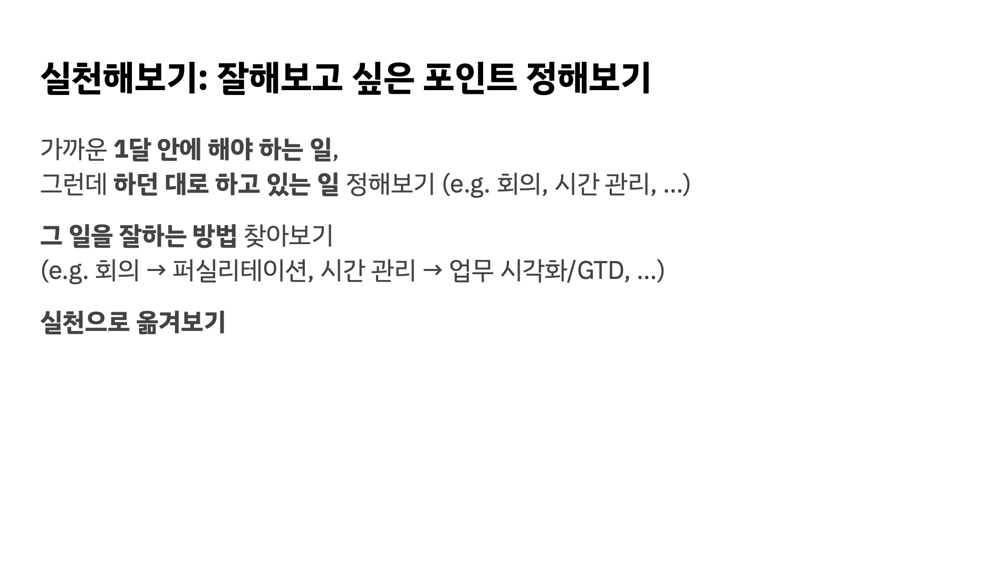

역시 뭐든 실천이 중요하고 어렵네요.

### 2-2. 꾸준함

회사에서 업무를 시작한지 만 1년이 지나고 새로운 불안감이 생겼습니다.

사실 1년까지는 회사 업무를 진행하는 그 자체만으로도 성장하는 것을 많이 느꼈는데, 이제는 이를 반복하고 싶지 않습니다.

하드 스킬이나 소프트 스킬 모두 성장하고 싶고, 이전에 한 실수를 반복하고 싶지 않습니다.

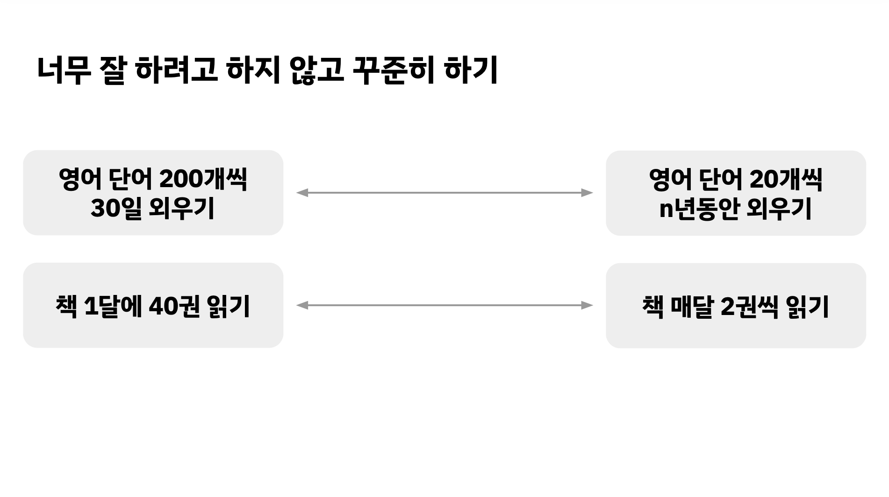

옛날부터 알고 있지만 실천하기 어려운 항목이라고 생각합니다. 올해는 새해 목표를 세울 때 부터 큰 목표를 작게 나누기 위해 노력했습니다. 요즘 작은 목표에 집중하고 있습니다. 큰 꿈은 계속 꾸지만, 계획은 작게 생성하는 것이 중요합니다. 

그리고 한 달 단위로 피드백을 가지고 계획을 수정해 나가려 합니다.

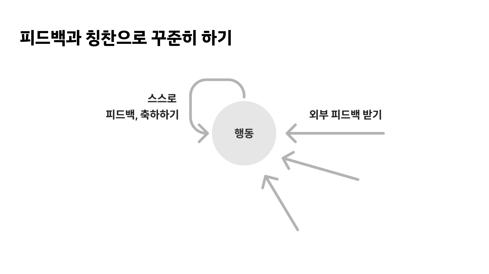

스스로 축하하는 것이 익숙하지 않은데 앞으로는 노력을 해보려고 합니다.

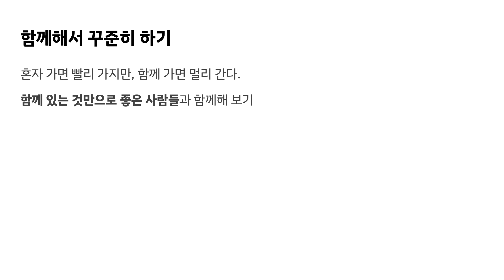

스터디는 개인 스터디보다 팀 스터디를 선호합니다. 예를 들어 책 스터디는 같은 내용을 읽어도 모두 다르게 생각할 수 있어서 이러한 점을 공유하는 것이 재미있습니다.

### 2-3. 중간정리

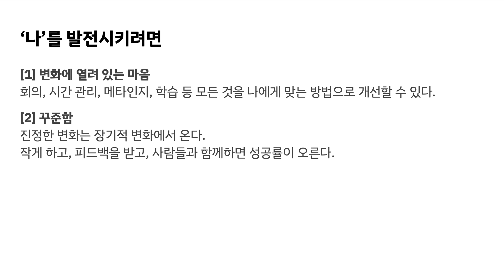

## 마치며

퇴근하고 판교에 방문한 후 세미나 이후 다시 집으로 돌아오는 과정에 많은 시간이 소요됐지만 전혀 아깝지 않은 세미나였습니다. 온라인으로 참석했을 때와 대비하여 오프라인 참석자를 위한 QnA 시간도 유익하여 앞으로도 참석할 예정입니다.