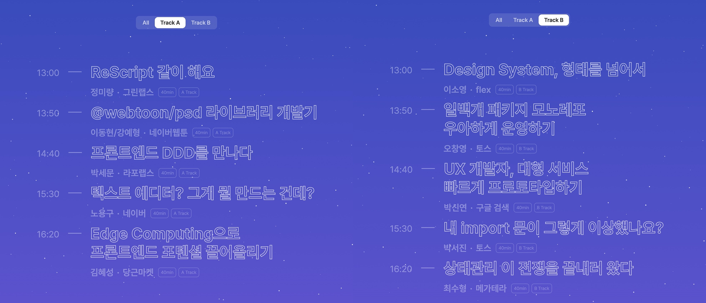
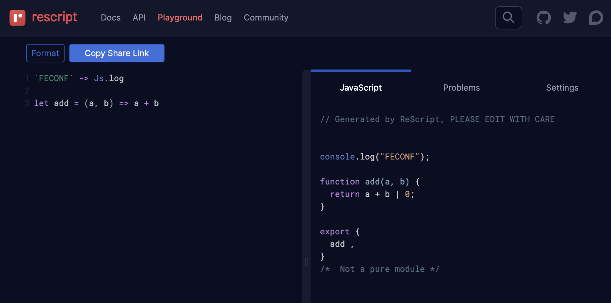
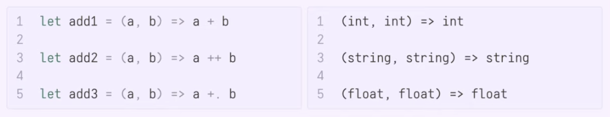
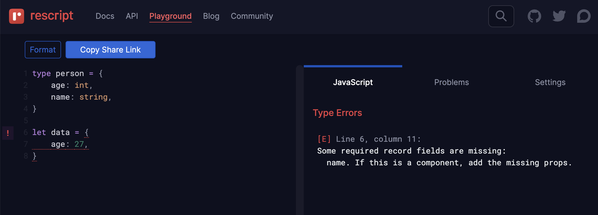
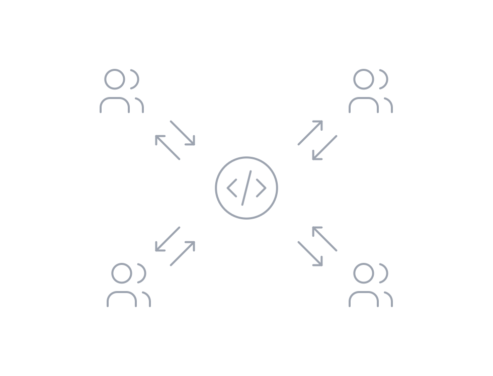
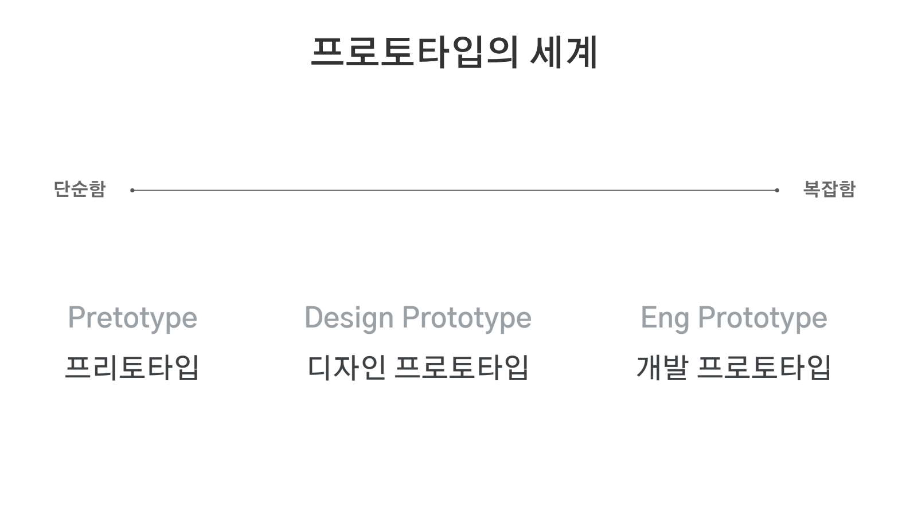
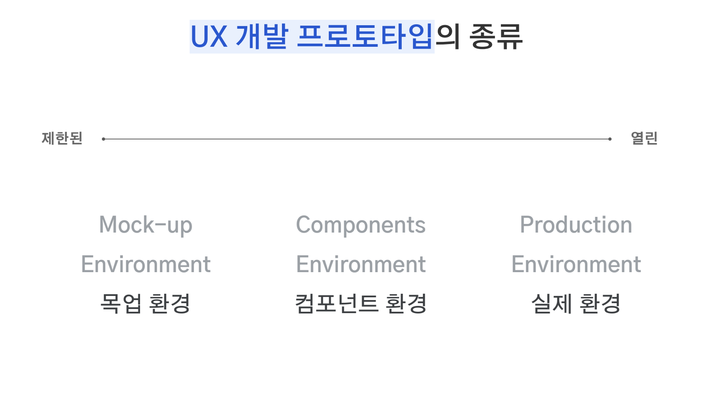

## 들어가며

프론트엔드 개발 컨퍼런스인 [FEConf 2022](https://2022.feconf.kr/) 참석 후기입니다. 운 좋게 티켓팅에 성공하여 평소 가보고 싶었던 컨퍼런스에 오프라인으로 참석할 수  있었습니다.

<em>사진 출처: <a href="https://2022.feconf.kr" target="_blank" rel="noreferrer noopener" aria-label="feconf">2022.feconf.kr</a></em>

FEConf 2022는 10월 8일 토요일에 잠실 롯데타워에서 진행되었습니다. 정해진 시간대마다 A트랙과 B트랙의 세션 중 하나를 선택해서 듣는 방식이었습니다. [FEConf Korea 유튜브](https://www.youtube.com/@feconfkorea/videos)에서 발표 내용을 확인하실 수 있습니다.

세션 내용의 일부를 간단하게 정리했습니다.

## 1. ReScript

첫 세션으로 ["ReScript 같이 해요"](https://youtu.be/208ZBisLuXw)를 들었습니다. 함수형 프로그래밍 언어에 관심이 있기도 하고 ReScript를 사용해 본 경험이 없어서 새로운 언어에 대해 알아가고 싶은 마음으로 해당 세션을 선택했습니다.

### 1-1. ReScript?

ReScript는 JavaScript로 컴파일되는 강력한 타입 언어입니다. JavaScript 개발자에게 친숙한 구문을 제공하며 모든 JavaScript 라이브러리를 ReScript와 함께 사용할 수 있습니다.

### 1-2. JavaScript vs ReScript

JavaScript와 ReScript의 차이점은 다음과 같습니다.

| 차이점 | 설명 |
| :---: | :---: |
| let만 있음 | const와 비슷한 불변 변수 선언 |
| 화살표 사용 | (->) 파이프 연산자 |
| return 없음 | 마지막 라인은 암묵적 반환 |
| import, export 없음 | 모든 모듈을 내보냄 |
| 타입 어노테이션 없이도 타입이 있음 | 타입 추론 시스템 |

### 1-3. ReScript 장점

타입 어노테이션 없이 모든 표현식의 타입을 힌들리-밀너 타입 추론으로 확인합니다.

<em>사진 출처: <a href="https://youtu.be/208ZBisLuXw" target="_blank" rel="noreferrer noopener" aria-label="ReScript">ReScript 같이 해요</a></em>

값의 형태가 맞는 레코드 타입 선언을 찾습니다. 예시를 통해 알아보겠습니다.

`int`타입인 `age`, `string`타입인 `name`을 필드로 갖는 `person`이라는 레코드 타입을 선언하고 `data`에 `age`필드만 작성하면 타입 에러가 발생합니다. `name`필드가 선언되지 않았다는 에러입니다. 즉, 어노테이션 없이도 `data`는 자동으로 `person`이라는 타입으로 추론이 된 것입니다.

타입 검사를 통과하면 런타임에 잘못 처리되는 값이 없다는 점이 보장됩니다.

## 2. 일백개 패키지 모노레포 우아하게 운영하기

다음 세션으로 ["일백개 패키지 모노레포 우아하게 운영하기"](https://youtu.be/Ix9gxqKOatY)를 들었습니다. 평소 토스의 Slash 컨퍼런스에 대한 좋은 경험이 있어서 해당 세션을 선택했습니다.

### 2-1. 모노레포란?

<em>사진 출처: <a href="https://monorepo.tools" target="_blank" rel="noreferrer noopener" aria-label="monorepo-polyrepo">monorepo.tools</a></em>

모노레포란 잘 정의된 관계를 가진, 여러 개의 독립적인 프로젝트들이 있는 하나의 레포지토리입니다.

### 2-2. 모노레포를 사용하는 이유

멀티레포는 다음과 같은 문제점을 갖고 있습니다.

- 새 프로젝트 생성 비용이 많이 듦
- 프로젝트 간 코드 공유가 어려움
- 같은 이슈를 수정하기 위해 각각의 레포지토리에 커밋이 필요함
- 히스토리를 관리하기 어려움
- 제각각인 툴링으로 개발자 경험이 일관적이지 않음

모노레포를 사용하면 이러한 멀티레포의 문제점을 해결할 수 있습니다.

- 새 프로젝트 생성 비용이 적음
- 프로젝트 간 코드 공유가 쉬움
- Atomic Commits
- 히스토리 관리가 쉬움
- 공통된 툴링으로 일관적인 개발자 경험을 제공함

### 2-3. 모노레포의 기능

모던 모노레포 툴에서는 다음과 같은 기능을 제공합니다.

#### 2-3-1. Local computation caching

<em>사진 출처: <a href="https://monorepo.tools" target="_blank" rel="noreferrer noopener" aria-label="local-computation-caching">monorepo.tools</a></em>

하나의 시스템에서 같은 것을 두 번 빌드하거나 테스트하지 않습니다.

#### 2-3-2. Local task orchestration

<em>사진 출처: <a href="https://monorepo.tools" target="_blank" rel="noreferrer noopener" aria-label="local-task-orchestration">monorepo.tools</a></em>

여러 작업을 병렬로 실행합니다.

#### 2-3-3. Distributed computation caching

<em>사진 출처: <a href="https://monorepo.tools" target="_blank" rel="noreferrer noopener" aria-label="distributed-computation-caching">monorepo.tools</a></em>

서로 다른 환경에서도 캐시를 공유합니다.

#### 2-3-4. Detecting affected projects / packages

<em>사진 출처: <a href="https://monorepo.tools" target="_blank" rel="noreferrer noopener" aria-label="detecting-affected-projects-packages">monorepo.tools</a></em>

변경 사항의 영향을 받을 수 있는 항목을 결정하여 영향을 받는 프로젝트만 빌드하거나 테스트합니다.

#### 2-3-5. Source code sharing

<em>사진 출처: <a href="https://monorepo.tools" target="_blank" rel="noreferrer noopener" aria-label="source-code-sharing">monorepo.tools</a></em>

개별 소스 코드를 쉽게 공유할 수 있습니다.

#### 2-3-6. Code generation

<em>사진 출처: <a href="https://monorepo.tools" target="_blank" rel="noreferrer noopener" aria-label="code-generation">monorepo.tools</a></em>

코드 생성을 위한 기본적인 지원을 합니다.

#### 2-3-7. Project constraints and visibility

<em>사진 출처: <a href="https://monorepo.tools" target="_blank" rel="noreferrer noopener" aria-label="project-constrains-and-visibility">monorepo.tools</a></em>

레포지토리 내에서 종속성 관계를 제한하는 규칙을 정의합니다. 일부 프로젝트를 팀 전용으로 표시하여 다른 프로젝트에 의존하지 않도록 설정할 수 있습니다. 사용된 기술(예: React 또는 Nest.js)을 기반으로 프로젝트를 표시하고 백엔드 프로젝트가 프론트엔드 프로젝트를 가져오지 않도록 설정할 수 있습니다.

## 3. UX 개발자, 대형 서비스 빠르게 프로토타입하기

다음으로 ["UX 개발자, 대형 서비스 빠르게 프로토타입하기"](https://youtu.be/GF_3kGzJpCA) 세션을 들었습니다. UX 개발자의 역할과 구글 검색과 같은 대형 서비스에 대한 궁금증이 들어서 해당 세션을 선택했습니다.

### 3-1. UX 개발자

<em>사진 출처: <a href="https://youtu.be/GF_3kGzJpCA" target="_blank" rel="noreferrer noopener" aria-label="ux-dev">UX 개발자, 대형 서비스 빠르게 프로토타입하기</a></em>

UX 개발자의 역할은 다음과 같습니다.

- 디자인과 사용성에 집중하는 개발자
- 개발자의 언어를 구사하는 사용자
- 더 나은 사용자 경험을 위한 실제 구현을 기술적으로 실현

### 3-2. 프로토타입

<em>사진 출처: <a href="https://youtu.be/GF_3kGzJpCA" target="_blank" rel="noreferrer noopener" aria-label="about-prototype">UX 개발자, 대형 서비스 빠르게 프로토타입하기</a></em>

프로토타입은 새로운 컴퓨터 시스템이나 소프트웨어의 설계 또는 성능, 구현 가능성, 운용 가능성을 평가하거나 요구 사항을 좀 더 잘 이해하고 결정하기 위하여 전체적인 기능을 간략한 형태로 구현한 시제품입니다.

개발자가 프로토타이핑하는 이유는 다음과 같습니다.

- 다른 부서와의 효과적인 의사소통
- 작고 빠른 실패
- 개발자가 서비스에 미칠 수 있는 영향 극대화

### 3-3. UX 개발 프로토타입

<em>사진 출처: <a href="https://youtu.be/GF_3kGzJpCA" target="_blank" rel="noreferrer noopener" aria-label="ux-prototype">UX 개발자, 대형 서비스 빠르게 프로토타입하기</a></em>

UX 개발 프로토타입의 목업 환경, 컴포넌트 환경, 실제 환경에 대해 알아보겠습니다.

#### 3-3-1. 목업 환경

목업 환경 프로토타입이 필요한 경우는 다음과 같습니다.

- 특정 부분이나 기능만 구현하여 테스트하는 경우(나머지는 이미지로 대체)
- 제한적인 UXR(User Research)에 사용
- 사용자에게 특정 행동만 허락한 경우(지시형)
- 특정 기능에 집중된 사용자 반응을 테스트하는 경우

#### 3-3-2. 컴포넌트 환경

컴포넌트 환경이 적절한 프로토타입은 다음과 같습니다.

- 데이터 반영이 필요한 경우
- 이미지로 대체 불가능한 상황(motion)
- 실제 제품에 사용되는 컴포넌트 또는 따로 제작된 더 단순한 프로토타입용 컴포넌트로 구성된 환경
- 비교적 실제와 같은 사용감이 필요할 때

그러나 컴포넌트 환경의 프로토타입도 여러 한계점이 있습니다.

- 디자인 시스템, 디자인 토큰 정의가 요구됨
- 재사용이 가능한 유연한 컴포넌트 개발의 어려움
- 제한된 환경으로 실제 같은 환경이 필요한 사용성을 테스트하기 어려움
- 실제 같은 환경을 만들기 위해 많은 양의 컴포넌트 개발이 요구됨
- 프로토타입을 만들기 위한 컴포넌트 개발에 인력이 집중된 나머지 실제 프로토타입 개발이 지연될 수 있음

#### 3-3-3. 실제의 환경

구글 크롬 익스텐션을 활용하면 프로토타입을 실제 환경에 빠르게 적용하여 테스트할 수 있습니다. 또한, 설치한 사용자를 대상으로 새로운 프로토타입을 공유하는 채널 역할도 할 수 있습니다. 익스텐션은 기술 자체가 획기적인 것은 아니지만 프로토타이핑에 이용했을 때 다른 방법과 차별되는 독특한 강점을 갖는 프로토타이핑 방식입니다.

실제 환경을 이용한 프로토타이핑은 여러 장점이 있습니다.

- 실제 환경을 이용하므로 환경을 구성하기 위한 개발이 필요하지 않음
- 크롬 익스텐션 배포를 이용하면 자동 배포가 가능함
- 실제 프로덕션 코드를 기반으로 추가, 삭제, 수정하므로 이후 수정 사항을 적용하기가 비교적 용이함

## 마치며

쉬는 시간을 통해 여러 회사의 부스에서 진행하는 이벤트에 참여해 굿즈도 많이 받을 수 있었습니다.

프론트엔드 개발과 관련해서 다양한 주제의 세션을 들으니, 프론트엔드의 세계는 정말 넓고 공부할 것이 많다는 것을 느낄 수 있었습니다. 참여한 세션의 모든 내용을 이해하기에는 어려움이 있었는데, 매년 컨퍼런스에 참가해서 작년보다 더 많은 내용을 이해할 수 있는 개발자로 성장하고 싶습니다.

컨퍼런스에서 발표하고 싶다는 목표가 생겼습니다. 발표를 희망하는 개발자는 많아도 실제로 발표하게 되는 개발자는 한정적이라 목표를 이루기 위해서는 큰 노력이 필요할 거 같다는 생각이 들었습니다. 컨퍼런스에 참여해서 세션을 통해 많은 것을 배운 거뿐만 아니라 동기부여도 받을 수 있었습니다.