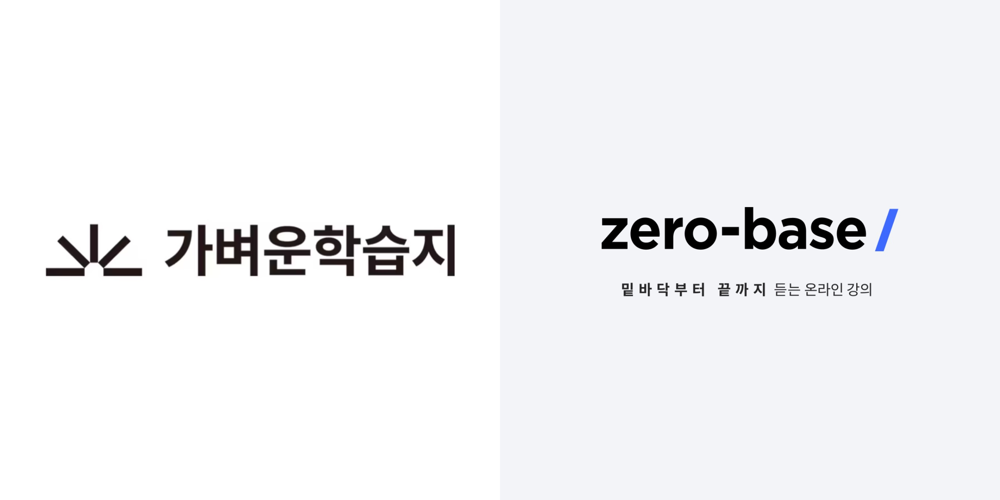
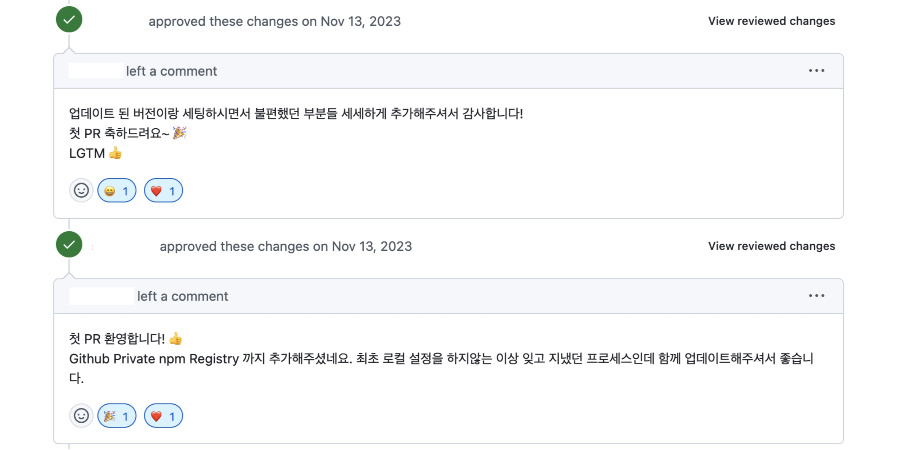
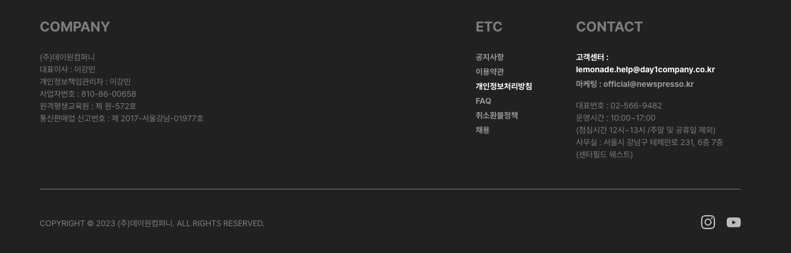
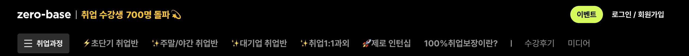
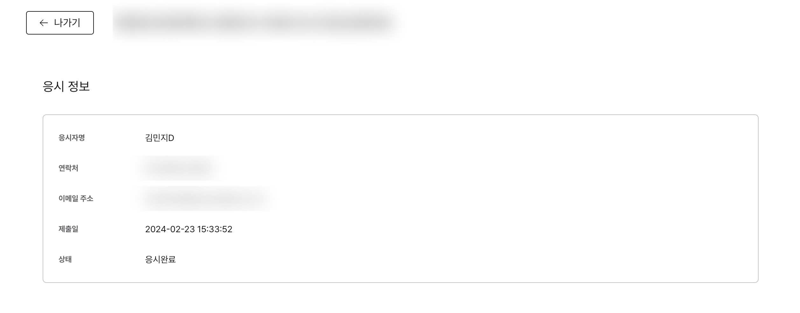
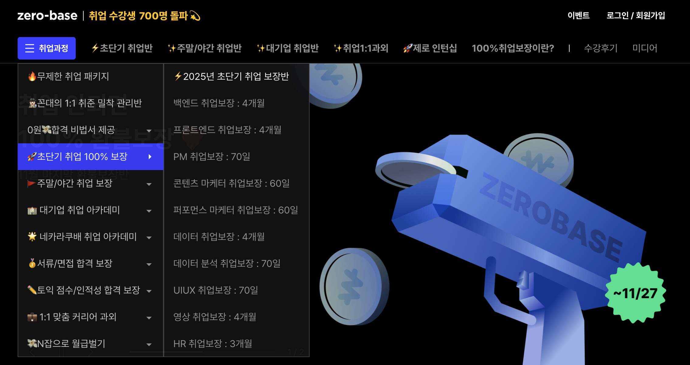
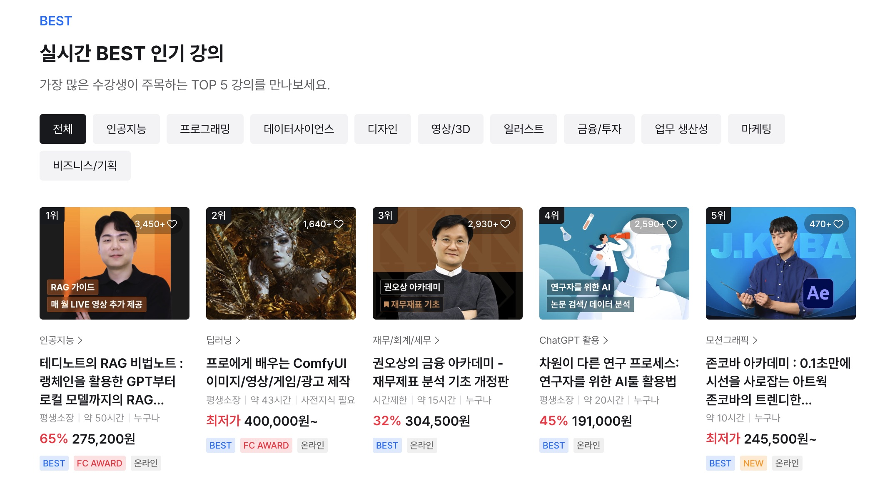
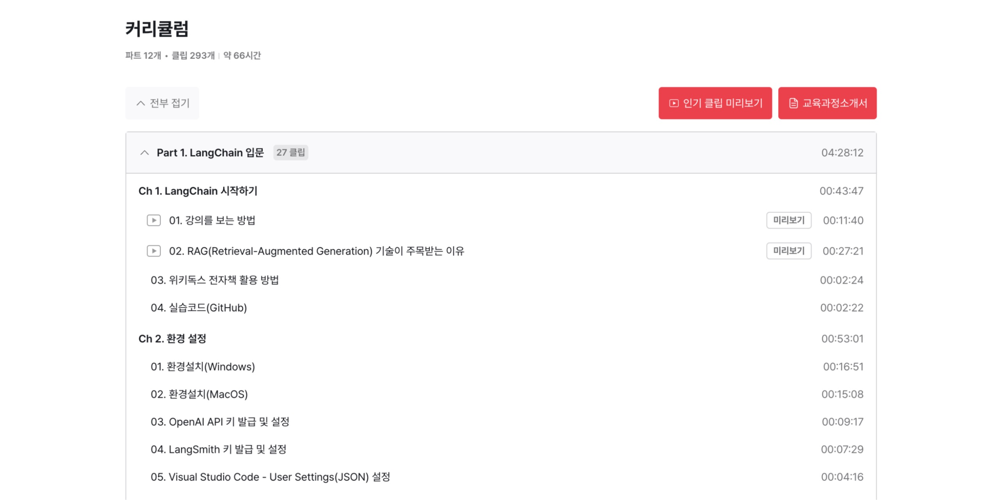
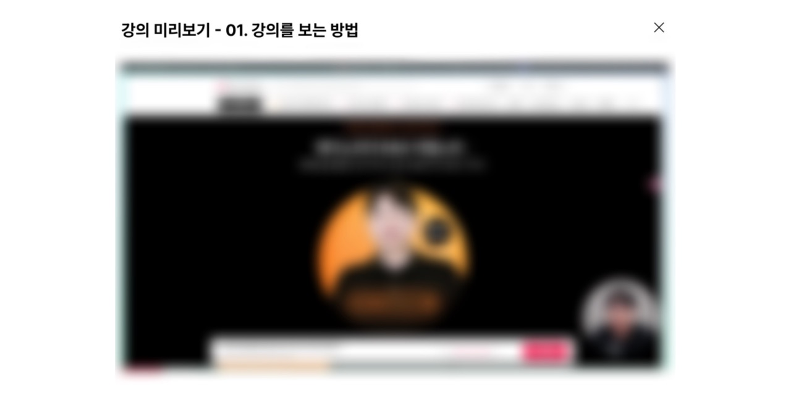
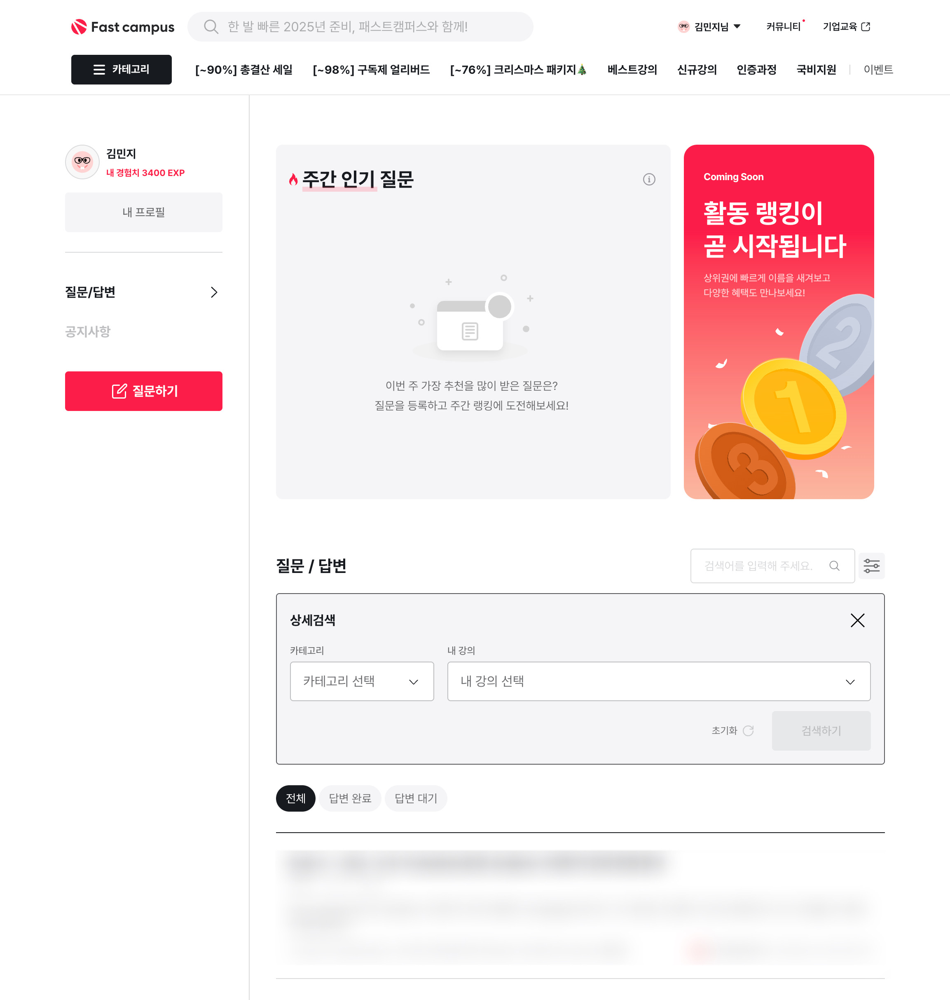

## 들어가며

프론트엔드 개발자로서 첫 일 년 동안의 경험을 시간순으로 정리했어요. 간단한 텍스트 수정 업무부터 새로운 기능을 도입하는 큰 프로젝트 업무까지 참여하며 배운 점과 아쉬운 점을 담았어요.

## 1. 2023.11 ~ 2023.12

### 1-1. 첫 담당 서비스

<em>가벼운학습지와 제로베이스</em>

첫 팀에서는 두 개의 파트에서 총 세 개의 서비스를 운영하고 있었어요. 그중에서 [제로베이스](https://zero-base.co.kr) 와 [가벼운학습지](https://mylight.co.kr) 두 개의 서비스를 운영하는 파트에 배정됐어요. 가벼운학습지는 어학과 취미 영역에서 영상과 학습지 교재를 교육용 콘텐츠로 제공하고 제로베이스는 디지털 스킬 분야에서 제2의 온라인 대학 역할을 할 수 있는 취업 연계 부트캠프 서비스를 제공해요.

### 1-2. 첫 PR

<em>첫 PR 리뷰</em>

첫 PR 은 로컬 환경에서 프로젝트를 세팅하며 README 파일을 수정한 거였어요. 간단한 수정 사항임에도 팀원분들께서 따뜻한 리뷰를 많이 남겨주셨어요.

### 1-3. 첫 운영 이슈

<em>가벼운학습지 Footer</em>

README 파일 수정 이후에는 조금씩 서비스 운영 이슈에 참여했어요. 처음에는 홈페이지 하단의 이메일 텍스트를 변경하는 간단한 이슈부터 진행했어요. 점차 도메인 지식이 필요한 운영 이슈를 담당하며 서비스에 익숙해질 수 있었어요.

### 1-4. 첫 워크플로우 수정

업무를 진행하면서 PR 을 생성할 때 assignees 를 직접 설정하는 과정이 어색하여 GitHub Action 을 사용한 자동화 워크플로우를 추가했어요. 이때 업무 중 불편함을 느끼면 이를 어떻게 자동화해서 풀어나갈 수 있을지에 대한 관심이 생겼어요.

### 1-5. 첫 핫픽스

<em>제로베이스 상단 GNB</em>

성수기인 연말에는 마케팅 관련 급건 작업에 참여했어요. 당일 요구사항 파악 후 즉시 변경하여 배포하는 핫픽스를 경험할 수 있었어요. 링크 변경과 같은 작은 수정 사항이어도 작업한 후 바로 프로덕션 환경에 배포하는 과정 자체가 긴장되었어요.

로고 변경과 같은 간단한 작업을 진행한 후에 특정 페이지에서만 로고가 보이지 않는 사이드 이펙트가 발생한 적도 있었어요. 당시에는 이를 미리 파악하지 못한 스스로에게 많이 아쉬웠어요. 그래도 이때의 경험으로 코드의 사이드 이펙트를 더 꼼꼼히 검토하게 되어 좋은 경험이었다고 생각해요.

## 2. 2024.01 ~ 2024.02

### 2-1. 쿼리 키 구조 개선

운영 이슈를 진행한 후에는 클린업 작업에 참여했어요. 클린업 작업은 팀 내에서 개선이 필요한 기술 부채 목록을 선정한 후 진행해요.

여러 클린업 작업 중 [Tanstack Query](https://tanstack.com/query/latest) 의 쿼리 키 구조를 개선하는 작업을 담당했어요. 기존에는 쿼리 키를 1 depth 로 관리하여 데이터를 원활하게 무효화하기 어려운 이슈가 있었어요.  이를 [Query Key Factory](https://github.com/lukemorales/query-key-factory) 를 도입해서 계층화된 구조로 개선했어요.

이렇게 팀 내의 컨벤션을 변경하는 작업은 서로가 이해한 사항을 확인하고 앞으로 컨벤션을 유지하기 위해 문서화가 중요하다는 걸 알 수 있었어요. 따라서 문서를 최대한 상세하게 작성해서 공유했어요.

### 2-2. Zustand 마이그레이션

[Recoil](https://github.com/facebookexperimental/Recoil) 패키지가 deprecated 되면서 [Zustand](https://github.com/pmndrs/zustand) 로 마이그레이션을 진행했어요. 어떤 패키지로 마이그레이션 할지 정하기 위해 팀 내에서 논의를 통해 여러 후보의 장단점을 비교했어요. 

주로 [Jotai](https://jotai.org) 와 Zustand 를 비교했어요. 우선 Jotai 를 적용하면 기존 Recoil 과 유사한 atom 기반 접근법을 그대로 사용할 수 있어서 마이그레이션 부담을 줄일 수 있다는 장점이 있었어요. 단점은 비교적 새로운 라이브러리여서 Zustand 보다 커뮤니티가 작은 점이었어요. Zustand 는 간단한 API 를 제공하고 미들웨어 생태계가 풍부하다는 장점이 있었어요. 단점은 기존 Recoil 의 atom 개념과는 다른 접근 방식이라는 점이었어요. 

그럼에도 Zustand 로 마이그레이션을 결정한 이유는 새로운 개념이지만 사용법이 간단하여 금방 익힐 수 있다고 판단했고 보일러 플레이트가 거의 없어서 마이그레이션에 대한 부담이 적기 때문이었어요. 이렇게 단점을 극복하고 Zustand 의 이미 활성화된 커뮤니티를 참고해서 여러 미들웨어를 적용하면서 효율적으로 개발하는 효과를 기대했어요.

### 2-3. Vue 기반 프로젝트 Next.js 기반으로 이관

<em>패스트캠퍼스</em>

같은 팀의 다른 파트에서 [패스트캠퍼스](https://fastcampus.co.kr/) 서비스를 운영하고 있었는데 한 달 동안 해당 파트 업무에 참여했어요. 패스트캠퍼스는 AI 와 Data Science 분야를 중심으로 직장인의 역량 향상을 위한 교육 콘텐츠를 제공해요.

당시 해당 파트에서는 [Vue](https://vuejs.org) 기반 패스트캠퍼스를 [Next.js](https://nextjs.org) 기반으로 이관하고 있었어요. 그중에서도 LMS 관련 기능 이관에 투입됐어요. Vue 프로젝트를 처음 접해서 새로운 문법이 어색했지만 그래도 React 와 다른 개발 방식을 체험해 볼 수 있는 좋은 경험이었어요.

패스트캠퍼스 관련 작업은 한 달만 참여한 후 다시 원래의 제로베이스와 가벼운학습지를 운영했어요.

### 2-4. 시험 결과 페이지 디버깅

<em>패스트캠퍼스 LMS 시험 결과 페이지</em>

처음으로 버그를 깊게 파고들어 원인을 파악하는 경험을 했어요. 시험을 응시한 후 시험 결과 페이지에 접속하면 모든 내용이 정상적으로 보이지만, 이후 시험 목록 페이지에서 시험 결과 페이지에 접근하면 특정 내용만 보이지 않는 이슈였어요.

시험 목록 페이지에서 일부 데이터만 가져온 후 캐시하면 시험 결과 페이지에서는 새로운 데이터를 호출하지 않고 이전에 캐시한 데이터만 바라봐서 발생한 이슈였어요. 이 경험으로 유사한 버그를 접하면 데이터 캐싱을 의심하여 빠르게 원인을 파악할 수 있게 되어 상당히 의미 있는 경험이었다고 생각해요.

### 2-5. Next.js App Router 스터디

매주 한 시간씩 팀 내에서 자체적으로 스터디를 진행했어요. [Next.js Using App Router 문서](https://nextjs.org/docs/app) 중 각자 특정 주제를 담당한 후 주차 별로 발표하는 방식이었어요. App Router 사용 방식을 익히면서 동시에 기존 기능을 개선해 볼 수 있는 새로운 기술은 어떤 게 있을지 함께 논의할 수 있어서 유익한 시간이었어요.

## 3. 2024.03 ~ 2024.05

### 3-1. e2e 테스트 작성

새로운 클린업 작업에 참여해서 [Playwright](https://playwright.dev) 로 e2e 테스트를 작성했어요. 처음 테스트 코드를 도입하는 만큼 팀원 모두가 컨벤션에 익숙해질 수 있도록 도메인별로 각자 특정 부분을 담당하여 적용했어요. 다만 테스트 코드 작성 직후 조직 개편으로 인해 실제 운영 과정에서 테스트 코드를 더 발전시키지 못한 점은 아쉬움으로 남아있어요.

### 3-2. 카테고리 UI 개선

<em>제로베이스 카테고리 목록</em>

운영 이슈를 진행하며 제로베이스의 GNB 카테고리 메뉴를 기존 2 depth 에서 3 depth 로 확장하는 작업에 참여했어요. 그리고 GNB 영역에 메뉴가 많아져서 화면보다 길어졌을 때 사용자가 마우스로 드래그를 할 수 없어서 이러한 사용성을 개선하기 위해 가로 스크롤이 가능한 공통 커스텀 훅을 추가하여 적용했어요. 

### 3-3. MDN HTTP 스터디

Next.js 스터디를 마친 후에는 [MDN HTTP 문서](https://developer.mozilla.org/ko/docs/Web/HTTP) 읽기 스터디를 진행했어요. 기존 스터디처럼 각자 특정 주제에 대해 발표하는 방식으로 진행했어요. 다른 점은 발표를 마친 후 퀴즈를 푸는 시간이 있는 점이었어요. 스터디 내용을 되짚어보며 네트워크에 대한 이해도를 높일 수 있었어요.

## 4. 2024.06 ~ 2024.07

### 4-1. 조직 개편

2024년도 6월부터는 조직 개편으로 인해 패스트캠퍼스만 담당하는 팀에 배정됐어요.

제로베이스와 가벼운학습지를 운영할 땐 비교적 짧은 기간에 끝낼 수 있는 작은 단위의 업무가 대부분이었어요. 반면 패스트캠퍼스에서는 주로 여러 달에 걸쳐 새로운 기능을 개발한 후 한 번에 배포했어요. 6월부터 12월까지 크게 세 개의 프로젝트에 참여했어요.

- [BX/UX 개편](https://fastcampus.co.kr) - 메인 페이지에 실시간 BEST 인기 강의와 같은 여러 자동화 섹션 생성 및 강의 찜하기 기능 도입
- [상세 페이지 개편](https://fastcampus.co.kr/data_online_teddy) - 상세 페이지를 메타 데이터 기반으로 생성하는 자동화 템플릿 도입
- [질의응답 게시판 고도화](https://fastcampus.co.kr/community) - 강의에 대한 질문과 후기로 멘토와 수강생이 함께 소통할 수 있는 커뮤니티 제공

### 4-2. 메인 페이지 개편 및 강의 찜하기 기능 도입

<em>실시간 BEST 인기 강의 영역</em>

6월에는 BX/UX 개편 작업에 참여했어요. 새로운 기능을 개발할 때는 기획서와 피그마를 꼼꼼히 검토하여 놓치는 부분이 없도록 신경 썼어요.

신규 기능 도입을 위해 빠르게 코드 베이스 파악이 필요했어요. 그리고 일주일에 한 명씩 운영 이슈를 확인하고 대응하는 당번을 지정했기 때문에 이전과 다른 도메인 지식도 빠르게 많이 익혀야 했어요. 모든 일을 다 잘 해내고 싶은 마음에 혼자서 새벽과 주말을 가리지 않고 일했는데 그럼에도 어려운 점이 많아서 일 년 중에서 가장 혼란스럽고 힘들었어요.

혼자서 계속 무리하는 건 오래 지속할 수 없는 건강하지 않은 방법이라는 걸 깨달은 후에는 팀과 그 외의 여러 사람에게 도움을 구했어요. 현재 상황을 공유하며 상담했는데 그 과정에서 업무 우선순위의 중요성을 알 수 있었어요. 여러 일이 몰려도 우선순위를 기준으로 하나씩 업무를 해결해 나가며 극복할 수 있었어요.

이때 스스로 안정된 상태로 만드는 방법을 알게 된 것 또한 큰 수확이라 생각해요. 여러 생각을 글로 작성하는 게 도움 됐어요. 그리고 철학 관련 서적을 읽으면서 생각을 정리해 보는 것도 좋았어요. 앞으로도 이 방법을 계속 사용하려 해요.

그동안 어떤 일이 있어도 무너지지 않는 게 중요하다고 생각했는데 이때를 기점으로 무너져도 다시 일어나는 게 중요하다고 생각해요.

### 4-3. 패키지 개선

상세 페이지 중 일부는 백오피스에서 특정 기능(ex. 캐러셀)을 선택하고 해당 영역에 입력할 정보를 작성하면 이를 사내 패키지를 거쳐서 렌더링하고 있어요. 이러한 사내 패키지에 새로운 기능을 추가하는 작업에 참여해서 [EJS](https://ejs.co) 문법도 경험해 볼 수 있었어요. JSX 문법과 달라서 처음에는 어색했지만 그래도 비교적 단순한 문법이어서 금방 익숙해질 수 있었어요.

### 4-4. 스켈레톤 UI 도입

<em>스켈레톤 UI</em>

메인 페이지를 개편하면서 실시간 BEST 인기 강의와 같은 여러 새로운 섹션에 스켈레톤 UI 를 도입했어요. 이외에도 로딩 시간이 긴 영역에 대해 스켈레톤 UI 를 적용하면서 CLS 지표도 함께 개선할 수 있었어요.

## 5. 2024.08 ~ 2024.10

### 5-1. 상세 페이지 UI 생성 자동화 기능 도입

<em>강의 상세페이지 커리큘럼</em>

다음 프로젝트로 백오피스에서 입력한 데이터를 기반으로 강의 상세 페이지의 UI 를 자동으로 생성하는 작업에 참여했어요. 그동안은 백오피스를 통해 상세 페이지의 영역을 하나씩 직접 생성해야 했어요. 이러한 작업을 빠르게 할 수 있도록 진행한 프로젝트예요.

상세 페이지 중에서도 커리큘럼 작업을 메인으로 진행했어요. 백오피스에서 엑셀 파일을 올리면 이를 3 depth 구조의 아코디언 형태로 노출하는 작업이에요. 이 과정에서 백오피스 엑셀 데이터 검증 오류를 상세하게 작성하여 사용자가 어떤 데이터에서 오류가 발생하는지 쉽게 파악할 수 있도록 했어요.

### 5-2. 강의 미리보기 도입

<em>강의 미리보기</em>

상세 페이지에서 강의를 구매하기 전에 일부를 먼저 확인할 수 있는 미리보기 기능도 도입했어요.

## 6. 2024.11 ~ 2024.12

### 6-1. 커뮤니티 기능 도입

<em>커뮤니티 기능 도입</em>

연말에는 [커뮤니티](https://fastcampus.co.kr/community) 기능을 오픈했어요. 강의에 대한 질문을 작성하면 강사/조교/회원에게 답변받을 수 있어요. 게시글이나 답변을 작성하면 경험치를 받고 매주 경험치 순으로 주간 활동 랭킹을 측정해요.

커뮤니티가 일 년 동안 진행한 프로젝트 중 가장 일정이 촉박했어요. 일정 때문에 힘든 점도 있었지만 그만큼 온전히 몰입하는 경험은 좋았어요. 팀이 다 함께 주말에 근무할 정도로 업무량은 많았지만 그래도 가장 재미있었고 큰 이슈 없이 무사히 배포해서 다행이라고 생각해요. 이제 이를 고도화하는 2차, 3차 배포를 앞두고 있어요. 

특히 공통 로직과 관련된 기능을 개발하면서 즐거움을 느낄 수 있었어요. 퍼널 UI 관련 커스텀 훅 및 컴포넌트 만들기, 무한 스크롤 커스텀 훅 만들기, 여러 목록 UI 에 적용할 수 있는 공통 컴포넌트 만들기 등이 있었어요. 공통 로직을 개발하며 여러 케이스와 다른 개발자의 사용 경험도 고려하는 과정이 즐거웠어요. 공통 로직을 잘못 사용했을 경우를 대비해서 타입 에러를 발생시키는 로직을 추가하면서 오픈소스에서 타입 오류의 중요성도 알 수 있었어요.

업무가 재미있어서 집에서도 더 고도화하고 발전시키기 위해 계속해서 고민했어요. 그동안 프론트엔드의 여러 분야 중에서도 특히 어떤 분야에서 더 흥미를 느끼고 있는지 스스로 잘 몰랐는데 이러한 분야를 알게 된 거 자체가 큰 수확이라고 생각해요.

## 마치며

돌이켜보니 많은 일이 있었던 바쁜 일 년이었던 거 같아요. 그래도 의미 없이 바쁜 게 아니라 그 안에서 충분히 힘들어하고 고민하며 성장해서 다행이라고 생각해요. 많은 분에게 큰 도움을 받았는데 첫 일 년 동안 느낀 걸 잊지 않고 기억했다가 나중에 리더가 된다면 이를 다 돌려줄 수 있으면 좋겠다는 생각이 들었어요.

회사에 본받고 싶은 분들을 보며 나중에 팀을 이끌어 나갈 수 있는 좋은 리더가 되고 싶다고 생각했어요. 우선 지금처럼 주니어일 땐 기술 역량을 높이는 게 가장 중요할 거 같아 이에 집중하려 해요.

회사에 계신 분들만 봐도 다 본받고 싶은 점이 달라요. 내가 어떤 동료, 개발자가 되고 싶은지를 생각하고 나아가는 게 중요한 거 같아요. 정답은 없다고 생각해요.