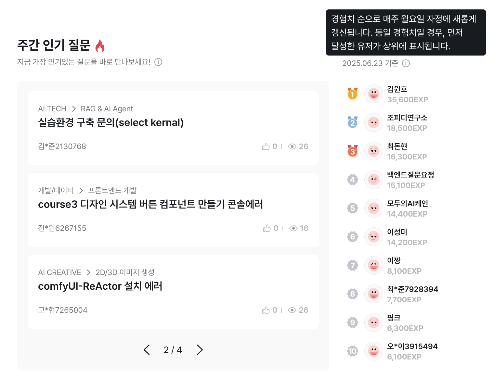
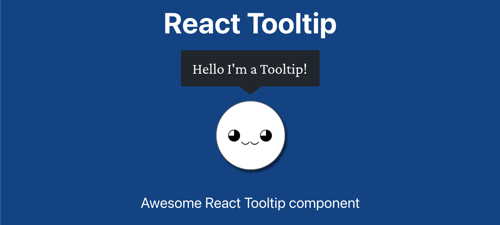
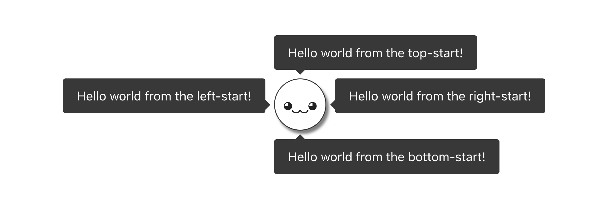
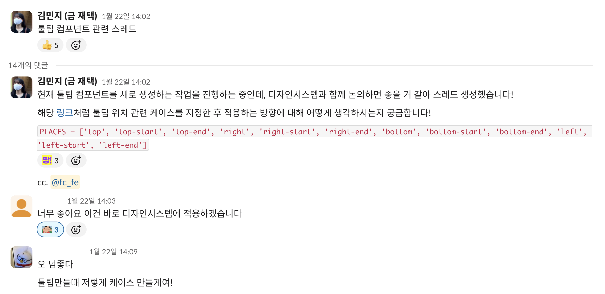
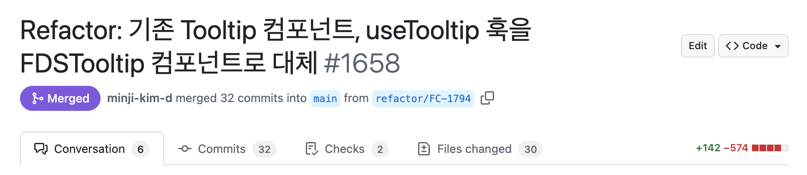

## 들어가며

툴팁 컴포넌트를 개선하면서 버그를 수정하고 개발자 경험도 개선한 경험에 대해 작성했어요.

## 1. 문제 인식



<em>주간 인기 질문 및 주간 활동 TOP 10 영역</em>

커뮤니티 기능은 새로 도입한 기능이라 세부 정책에 대해 소개하기 위해 툴팁 컴포넌트를 사용했어요. 이렇게 툴팁 컴포넌트를 사용하던 중 팀 내에서 불편함을 느꼈어요.

### 1-1. 기존 컴포넌트의 한계

기존 툴팁 컴포넌트를 적용하면서 포지션 값 설정 관련해서 불편함이 있었어요.

```tsx
const tooltipX = isMobileSize ? -131 : -115;
const tooltipY = isMobileSize ? 41 : 0;
```

우선 툴팁의 x축, y축 위치를 렌더링 된 결과를 직접 확인하며 설정해야 해요. 설정하는 과정에서 느낀 불편함도 있지만 뷰포트 크기가 작은 모바일에서 유연하게 대응할 수 없었어요. 모든 뷰포트 크기에 대응할 수 없어서 툴팁의 일부 영역이 화면 밖으로 나가서 잘리는 현상도 있었어요.

### 1-2. 개선 방향 정리

팀 내에서도 이러한 불편함을 인지하고 있어서 개선하고 싶은 방향을 함께 정리했어요. 우선 작은 뷰포트 크기에도 툴팁 영역이 잘리지 않도록 대응이 필요했고 툴팁 컴포넌트를 적용할 때 직접 위치를 확인하며 설정하는 개발자 경험도 함께 개선하는 것으로 정했어요.

## 2. 사전 검토 및 구현 방안

이렇게 개선 방향을 정하고 본격적인 작업을 진행하기 전에 우선 툴팁 컴포넌트는 어떻게 구현되어 있는지 실제 코드를 참고하고자 조사했어요.

### 2-1. 외부 라이브러리 조사



<em><a href="https://react-tooltip.com" target="_blank" rel="noreferrer noopener" aria-label="react-tooltip">React Tooltip</a></em>

여러 라이브러리 중 하나인 [React Tooltip](https://react-tooltip.com) 라이브러리 내부를 살펴봤어요. React Tooltip 라이브러리에서는 툴팁 컴포넌트의 포지션을 설정하기 위해 [Floating UI](https://floating-ui.com) 라이브러리를 사용하고 있었어요. Floating UI 라이브러리는 툴팁이나 드롭다운과 같은 떠 있는 UI 요소의 위치를 제어할 수 있게 도와줘요.

이렇게 살펴본 후 저는 총 세 가지의 툴팁 컴포넌트 구현 방법에 대해 정리했습니다.

1. 첫 번째는 처음 살펴본 React Tooltip 툴팁 라이브러리를 설치해서 사용하는 방법이고,
2. 두 번째는 그보다 저수준의 API 를 제공하는 Floating UI 라이브러릴를 활용하여 구현하는 방법이고,
3. 마지막으로 기존 툴팁 컴포넌트처럼 모든 로직을 직접 작성해서 구현하는 방법으로 정리했어요.

### 2-2. Floating UI 도입 결정


<em><a href="https://floating-ui.com" target="_blank" rel="noreferrer noopener" aria-label="floating-ui">Floating UI</a></em>

저는 두 번째 방법인 Floating UI 라이브러리를 활용하는 방법을 선택했어요. 우선 툴팁 라이브러리 사용하면 직접 세부 스타일을 커스텀하기 어려울 것이라고 생각했고, 라이브러리를 설치가 필요할 정도로 복잡도가 높은 UI 요소라고 생각하지 않았어요. 다만 기존처럼 모든 로직을 직접 작성한다면 Floating UI 라이브러리를 사용하는 것보다 유지보수 비용이 더 들어갈 것이라고 판단했어요.

Floating UI 라이브러리의 러닝 커브를 살펴봤을 때 어렵지 않게 도입할 수 있을 것이라고 생각했고 툴팁 컴포넌트 외에도 여러 UI 요소에서 활용도가 높을 것이라고 생각해서 도입했어요.

## 3. 툴팁 컴포넌트 구현

이제 툴팁 컴포넌트 실제 구현 과정에 대해 정리했어요.

### 3-1. 포지셔닝 정책 수립



<em>React Tooltip 라이브러리의 툴팁 포지셔닝 정책 예시</a></em>

리액트 툴팁 컴포넌트는 12개의 포지션을 미리 설정한 후 사용하고 있어요. 이러한 방식을 채택해서 툴팁 컴포넌트마다 개별적으로 포지션을 설정하지 않는 방향으로 기존 포지션 설정 방법을 개선하려 했어요.



<em>툴팁 포지셔닝 정책 논의</a></em>

툴팁 컴포넌트를 개선하는 시기에 팀 내에서 디자인 시스템을 도입하고 있어서 디자이너 분들에게 위의 방식을 제안드렸어요. 모두 긍정적으로 검토해주셔서 함께 정책을 수립하여 적용했어요.

### 3-2. Floating UI

Floating UI 라이브러리에서 제공하는 useFloating 훅과 autoUpdate, offset, flip, shift 미들웨어를 적용했어요. 각 역할을 다음과 같아요.

- useFloating: 타겟 요소와 툴팁 요소의 위치 계산
- autoUpdate: 스크롤이나 리사이즈 등으로 위치가 바뀔 때 툴팁 위치를 자동으로 다시 계산
- offset: 타겟 요소와 툴팁 사이의 간격 설정
- flip: 툴팁이 화면 밖으로 나갈 경우 반대 방향으로 자동으로 위치 변경
- shift: 툴팁이 화면 경계에 닿을 때 경계 안쪽으로 위치 조정

### 3-3. createPortal API 적용

툴팁 컴포넌트를 렌더링할 때 [createPortal API](https://ko.react.dev/reference/react-dom/createPortal) 를 적용했어요. 툴팁 컴포넌트의 위치를 상위 컴포넌트 내부에 종속하지 않도록 하고 `body` 내부에 생성한 최상위 계층의 `div` 엘리먼트로 옮기기 위해 사용했어요. 이렇게 물리적인 위치를 변경하는 이유는 부모 컴포넌트의 CSS 스타일 영향을 받지 않기 위해서예요. 

### 3-4. 웹 접근성 고려

`aria-*` 속성으로 웹 접근성을 고려했어요. `role` 속성으로 스크린 리더에게 해당 요소가 툴팁이라는 것을 알릴 수 있도록 설정했어요. `aria-describedby` 속성으로 툴팁의 내용이 어떤 요소를 설명하는지 연결했어요. `aria-hidden` 속성으로는 툴팁이 보이지 않을 때 스크린 리더가 해당 내용을 읽지 않도록 했어요.

### 3-5. 관리 포인트 최소화

React Tooltip 라이브러리에서는 툴팁 컴포넌트와 툴팁을 표시하는 대상을 연결하기 위해 아이디 값을 직접 지정해서 사용하고 있어요. 다만 이러한 방식은 엘리먼트에 아이디 값을 부여한 후 그 값을 상수로 관리해야 하는 관리 포인트가 늘어날 수 있는 단점이 있어요.

```tsx
<Tooltip content={TOOLTIP_CONTENTS.COMMUNITY.RANK_USER}>
  <IconInfo />
</Tooltip>
```

[Radix UI](https://www.radix-ui.com/) 라이브러리의 [툴팁 컴포넌트](https://www.radix-ui.com/primitives/docs/components/tooltip) 예시를 살펴보면 아이디 값을 기반으로 관리하지 않고 `children` 요소로 툴팁을 표시할 대상을 설정해요. 같은 방식을 도입해서 툴팁 표시 대상을 한정짓지 않는 유연함을 가지면서도 상수 관리 포인트를 줄일 수 있었어요.

### 3-6. 최종 구현 코드

최종적으로 구현한 툴팁 컴포넌트 코드는 다음과 같아요. 제 [Tooltip](https://github.com/mnxmnz/tooltip) 레포에서도 확인하실 수 있어요.

```tsx
function Tooltip({ children, content, placement = TOOLTIP_PLACEMENTS.BOTTOM }: TooltipProps) {
  const [isOpen, setIsOpen] = useState(false);

  const handleMouseEnter = () => setIsOpen(true);
  const handleMouseLeave = () => setIsOpen(false);

  const { refs, floatingStyles } = useFloating({
    placement,
    whileElementsMounted: autoUpdate,
    middleware: [
      offset({
        mainAxis: 4, // 툴팁과 타겟 요소 사이의 수직 간격 (px)
        crossAxis: 0, // 툴팁과 타겟 요소 사이의 수평 간격 (px)
      }),
      flip(), // 화면 경계를 벗어날 경우 반대 방향으로 배치
      shift({ padding: 8 }), // 화면 경계와의 최소 여백 (px)을 유지하며 위치 조정
    ],
  });

  return (
    <>
      <span
        ref={refs.setReference}
        onMouseEnter={handleMouseEnter}
        onMouseLeave={handleMouseLeave}
        className={styles.wrapper}
        aria-describedby="tooltip"
        role="tooltip"
        tabIndex={0}
      >
        {children}
      </span>
      <Portal containerId="tooltip-container">
        <div
          ref={refs.setFloating}
          style={floatingStyles}
          data-placement={placement}
          className={`${styles.tooltip} ${isOpen ? styles.show : ''}`}
          role="tooltip"
          id="tooltip"
          aria-hidden={!isOpen}
        >
          <div>{content}</div>
        </div>
      </Portal>
    </>
  );
}
```

## 4. 개선 효과



<em>새로운 툴팁 컴포넌트 적용 PR</a></em>

Floating UI 기능으로 이제 모바일에서도 자동으로 뷰포트 크기를 벗어나지 않도록 조절하여 툴팁이 잘리지 않고 노출할 수 있어요. 그리고 코드 복잡도가 감소하여 기존 코드를 대체했을 때 총 코드 500 라인 정도가 감소했습니다.

## 마치며

기존 컴포넌트가 가지고 있었던 버그와 개발자 경험을 함께 개선한 좋은 경험이라고 생각해요. 어려운 기술을 적용하지 않아도 팀 내의 생산성을 높였다는 관점에서 좋았어요. 이번에 생성한 컴포넌트를 사용하다 보면 새로운 불편함을 느낄 수 있고 예상치 못한 버그를 만난다면 개선해나가는 경험도 좋을 거 같아요.


최근 [항해 플러스 프론트엔드 5기](https://hanghae99.spartacodingclub.kr/plus/fe) 교육을 수강했어요. 매주 토요일마다 자율적으로 발표 신청을 받아서 누구든 자유 주제로 발표할 수 있어요. 이번에 작성한 툴팁 컴포넌트 개선을 주제로 온라인으로 30명 발표해서 이것 또한 좋은 경험이었다고 생각해요.