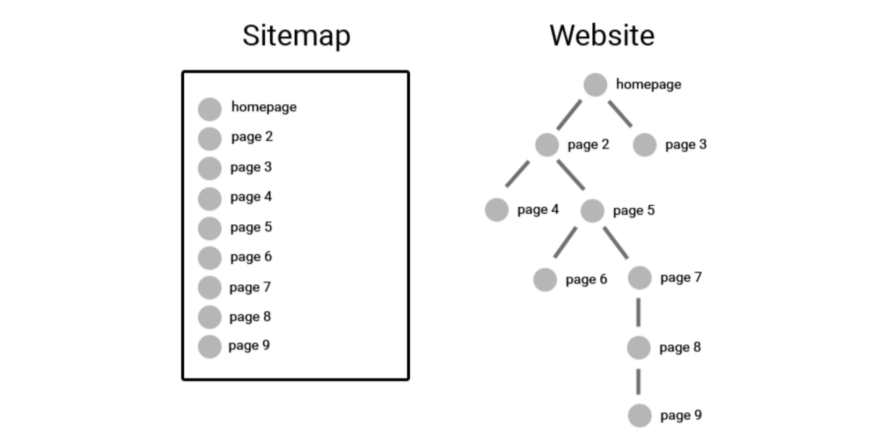
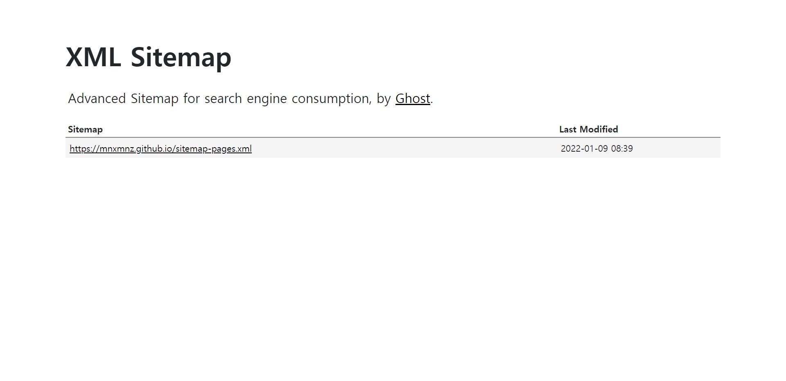
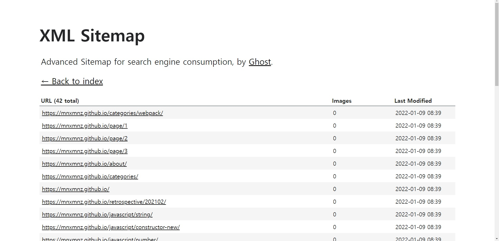
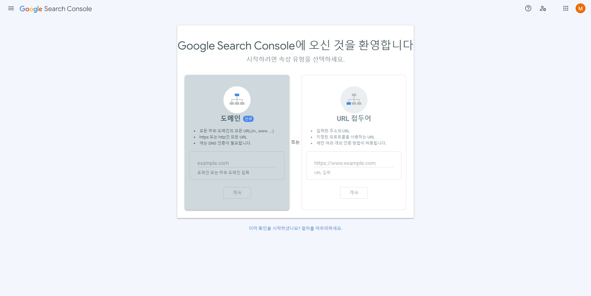
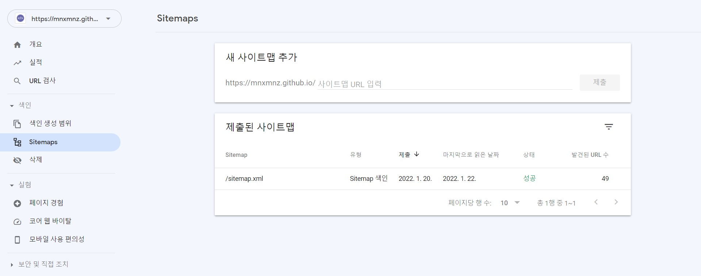

## 들어가며

Gatsby 블로그의 **Sitemap.xml, Robots.txt 를 생성**하고 **Google Search Console 에 등록하는 과정**입니다. Sitemap.xml, Robots.txt 을 생성하기 전에 먼저 개념에 대해 알아보겠습니다.

## 0. Google Search Console을 사용하기 위한 준비물 알아보기

### 0-1. Sitemap.xml



<em>사진 출처: <a href="https://shantunparmar.in/how-to-create-an-dynamic-sitemap-for-wordpress-sites-do-your-own-seo" target="_blank" rel="noreferrer noopener" aria-label="sitemap-vs-website">shantunparmar.in</a></em>

Google Search Console 에 블로그 URL 을 등록하기 위해서는 **sitemap** 이 필요합니다.

> **sitemap** 이란 사이트의 페이지와 그 관계에 관한 정보를 제공하는 파일입니다. Google 검색 엔진에서는 sitemap 을 이용하여 사이트 내에 존재하는 다른 페이지를 찾습니다. 사이트 내에서 사용자가 방문할 수 있는 페이지를 검색 엔진이 쉽게 크롤링할 수 있도록 Google Search Console 에 **sitemap** 을 제출합니다.

### 0-2. Robots.txt

그렇다면 **Robots.txt** 이란 무엇일까요?

**Robots.txt** 파일을 사용하면 크롤링을 허용하는 페이지와 허용하지 않는 페이지를 설정할 수 있습니다. Robots.txt 파일을 사용하여 서버에 Google 크롤러의 요청으로 인한 과부하를 방지하거나 사이트에서 중요하지 않은 페이지 또는 비슷한 페이지를 크롤링 범위에서 제외할 수 있습니다.

## 1. Sitemap.xml 생성하기

`gatsby` 에서는 플러그인을 통해 Sitemap.xml 을 생성할 수 있습니다.

```shell
npm i gatsby-plugin-sitemap
```

플러그인을 설치한 후 `gatsby-config.js` 에 추가 설정이 필요합니다.

```js
module.exports = {
  siteMetadata: {
    siteUrl: 'https://YOUR-URL.com/',
  },
  plugins: [
    ...
    'gatsby-plugin-sitemap',
    ...
  ],
};
```

다음과 같이 플러그인 설정을 하고 `gatsby build` 명령어를 실행하면 sitemap 폴더에 `sitemap-index.xml` 파일이 생성됩니다. 그러나 위와 같은 방법을 사용한 후, 구글에 블로그 포스트 제목을 정확하게 입력하여 검색해도 상위 5 페이지 내에서 확인할 수 없었습니다. 😥

따라서 SEO를 개선하기 위해 이번에는 `gatsby-plugin-advanced-sitemap` 사용 방법에 대해 알아보겠습니다.

우선 플러그인을 설치합니다.

```shell
npm i gatsby-plugin-advanced-sitemap
```

위에서 알아본 `gatsby-plugin-sitemap` 플러그인처럼 설치 후 `gatsby-config.js` 에 추가 설정합니다.

```js
module.exports = {
  siteMetadata: {
    siteUrl: 'https://YOUR-URL.com/',
  },
  plugins: [
    ...
    'gatsby-plugin-advanced-sitemap',
    ...
  ],
};
```

이렇게 `gatsby-plugin-advanced-sitemap` 플러그인 설정을 완료하고 `gatsby build` 명령어를 실행하면 새로운 `sitemap.xml` 파일이 생성됩니다. 블로그를 배포한 후 `https://YOUR-URL.com/sitemap.xml` 에 접속하면 advanced sitemap 을 확인하실 수 있습니다.





> `gatsby-config.js` 파일에서 `gatsby-plugin-sitemap` 또는 `gatsby-plugin-advanced-sitemap` 플러그인 둘 중 하나만 설정하는 것이 중요합니다. 만약 둘 다 설정하면 하나의 웹 사이트에 두 개의 sitemap 이 설정되는 오류가 발생합니다.

## 2. Robots.txt 파일 설정하기

위에서 생성한 `Sitemap.xml` 을 바탕으로 `Robots.txt` 파일을 설정하겠습니다.

`Robots.txt` 파일을 설정하기 위해 플러그인을 설치해주세요.

```shell
npm i gatsby-plugin-robots-txt
```

`gatsby-config.js` 파일 추가 설정은 다음과 같이 작성해주세요.

```js
module.exports = {
  siteMetadata: {
    siteUrl: 'https://YOUR-URL.com/',
  },
  plugins: [
    ...
    {
      resolve: 'gatsby-plugin-robots-txt',
      options: {
        host: 'https://YOUR-URL.com/',
        sitemap: 'https://YOUR-URL.com/sitemap.xml',
        policy: [{ userAgent: '*', allow: '/' }],
      },
    },
    ...
  ],
};
```

블로그 내의 모든 페이지에서 크롤링할 수 있도록 설정했습니다.

## 3. Google Search Console에 URL 등록하기

이제 마지막 단계인 **Google Search Console 에 URL 등록**입니다. [Google Search Console](https://search.google.com/search-console/about) 페이지에 접속해서 시작하기를 클릭합니다.



URL 을 입력하면 소유권을 확인하기 위한 창을 볼 수 있습니다. 소유권을 확인하는 방법 중 HTML 태그를 선택하면 사이트의 meta data 를 관리하는 Head 태그에 해당 정보를 추가해서 소유권을 인증할 수 있습니다.

해당 포스트에서는 `react-helmet` 을 사용해서 meta data 를 관리하고 있어서 다음과 같이 작성했습니다.

```ts
<Helmet
  meta={[
    ...
    {
      name: 'google-site-verification',
      content: 'your-google-verification-code',
    },
    ...
  ]}
/>
```

해당 정보를 작성하고 배포한 후 소유권 확인 버튼을 클릭해주시면 Google Search Console 상세 페이지로 이동하실 수 있습니다. 왼쪽 사이드바의 Sitemaps 페이지를 클릭하여 `https://YOUR-URL.com/sitemap.xml` 을 제출해주세요. 3일 정도의 시간이 지나면 상태 항목의 "성공" 메시지를 확인하실 수 있습니다.



만약 시간이 지나도 "성공" 메시지를 확인할 수 없다면 URL 검사 항목을 클릭해서 sitemap.xml 의 색인을 생성한 후 다시 sitemap.xml 을 제출하는 방법을 추천합니다.

## 마치며

블로그 포스팅을 구글 검색 결과 상위에 노출하기 위해 노력하는 과정을 작성해봤습니다. 블로그 포스팅에 좋은 내용을 작성하는 것이 가장 중요하다고 생각하기 때문에 앞으로 열심히 작성해보겠습니다.

> **참고 자료**
> 
> - [사이트맵이란 무엇인가요? | Google 검색 센터 | 문서 | Google Developers](https://developers.google.com/search/docs/advanced/sitemaps/overview)
> - [robots.txt 소개 및 가이드 | Google 검색 센터 | 문서 | Google Developers](https://developers.google.com/search/docs/advanced/robots/intro?hl=ko)
> - [Google Search Console에 Gatsby 블로그 등록하는 법 | Jane's PS Blog](https://janeljs.github.io/blog/google-search-console)
