> 다른 사이트에서 블로그를 운영할 때 작성한 글을 이전했습니다. 🙂

## 들어가며

Gatsby에 대해 처음 공부하면서 새롭게 알게 된 점을 정리했습니다. Gatsby란 무엇인지, 어떠한 장점이 있는지 **전반적인 개념**에 대해 알아본 후 튜토리얼을 통해 **Gatsby 개발을 시작하는 방법**에 대해 정리했습니다.

## 0. 먼저 JAM Stack에 대해 알아보기

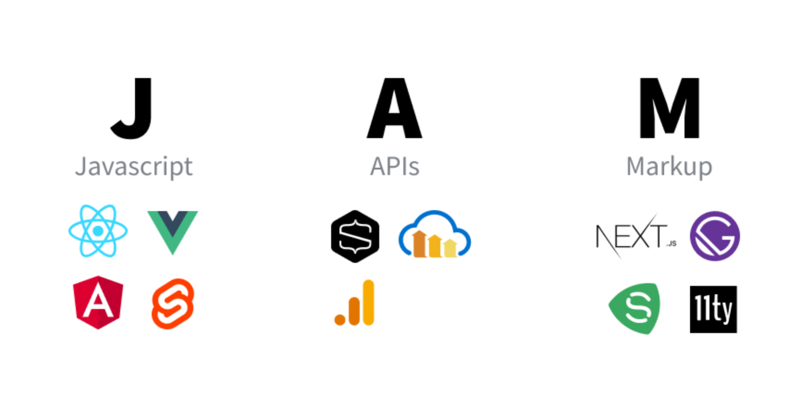

<em>사진 출처: <a href="https://velog.io/@kysung95/개발상식-JAM-스택이란" target="_blank" rel="noreferrer noopener" aria-label="jamstack">velog.io</a></em>

**Gatsby**는 **JAM Stack을 활용한 정적 사이트 생성기**입니다. Gatsby를 시작하기 전에 꼭 알아야 할 필수 개념인 JAM Stack에 대해 먼저 알아보겠습니다.

> JAM Stack(JavaScript, API, Markup Stack)은 JavaScript, API, HTML이나 CSS 등을 칭하는 Markup으로 이루어진 웹 구성 방법입니다.

JAM Stack 공식 홈페이지에서는 이렇게 설명하고 있습니다.

> Jamstack is an architecture designed to make the web faster, more secure, and easier to scale.
>
> JAM Stack 은 더 빠르고, 안전하며, 스케일링하기 쉬운 웹을 만들기 위해 디자인된 아키텍처입니다.

JAM Stack은 어떻게 이런 이점을 가질 수 있는지 홈페이지에 있는 설명을 통해 정리했습니다.

### 0-1. JAM Stack 동작 원리

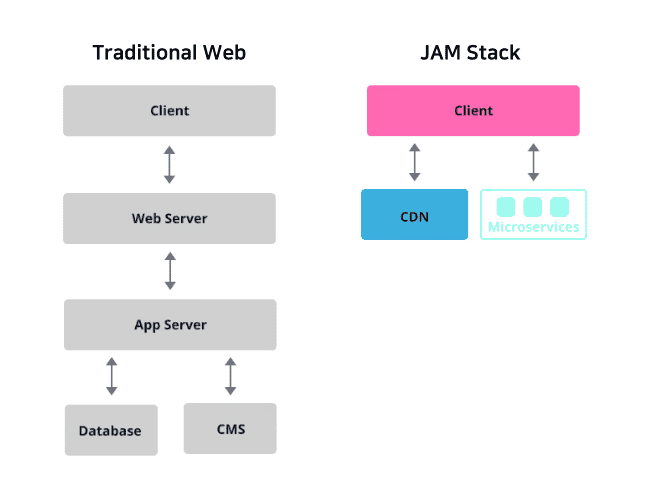

<em>사진 출처: <a href="https://jamstack.org" target="_blank" rel="noreferrer noopener" aria-label="traditional-web-jamstack">jamstack.org</a></em>

기존 웹 사이트의 방식은 대부분 서버의 데이터베이스 또는 CMS(Content Management System)에서 추출한 데이터를 프론트엔드에 뿌려주는 방식입니다. 사진에서 보이는 것과 같이 클라이언트에 데이터를 보여주기 위해서 많은 절차를 거쳐야만 해서 구조가 복잡합니다. 하지만 JAM Stack을 사용한 방식은 기존 웹 사이트의 방식과 다르게 절차가 간단합니다.

> 마크업 요소와 다양한 API를 통해 만든 정적 웹 사이트를 Pre-Render 한 것을 CDN(Content Delivery Network)을 통해 열람할 수 있습니다.

### 0-2. JAM Stack 장점

> 1. 기존 방식보다 더 빠르게 웹 사이트를 제공할 수 있습니다.

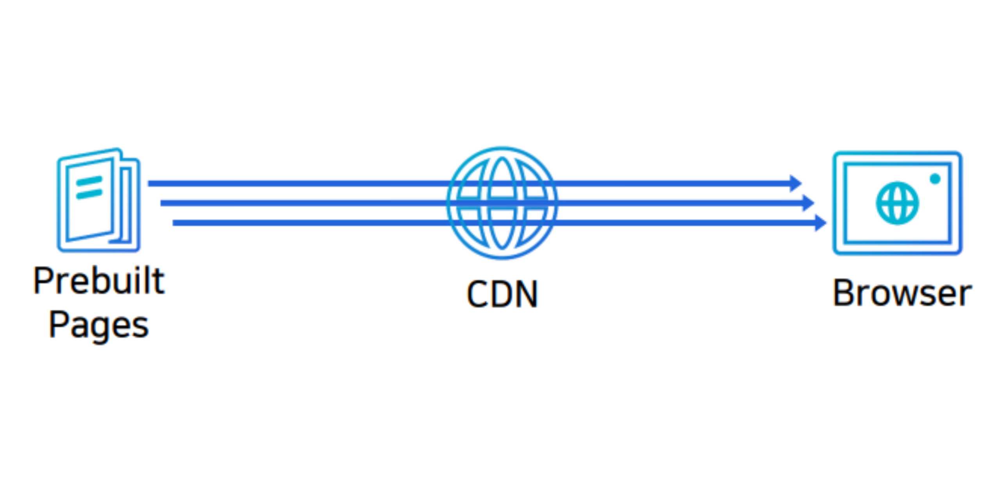

<em>사진 출처: <a href="https://www.bottlehs.com/etc/jamstack-이란" target="_blank" rel="noreferrer noopener" aria-label="jamstack-advantage">bottlehs.com</a></em>

JAM Stack은 렌더링할 화면들을 모두 Pre-Render 하여 제공해서 그만큼 사용자에게 화면을 보여주기 위해 준비하는 시간을 단축할 수 있습니다.

> 2. 안전한 웹 사이트를 제공할 수 있습니다.

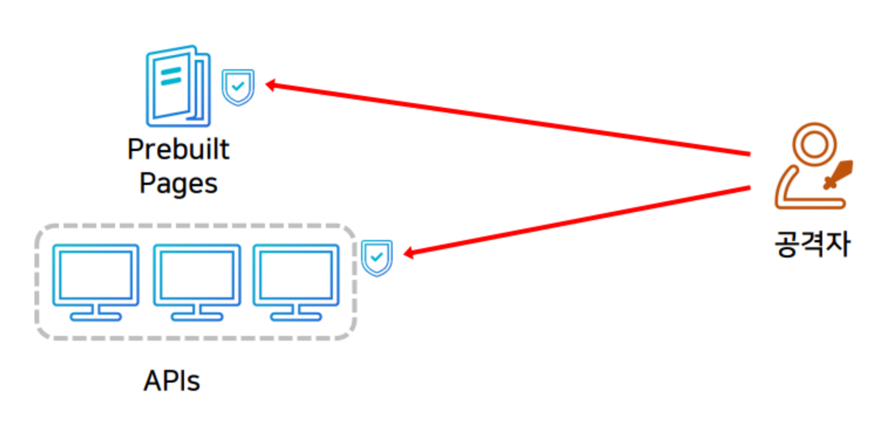

<em>사진 출처: <a href="https://www.bottlehs.com/etc/jamstack-이란" target="_blank" rel="noreferrer noopener" aria-label="jamstack-advantage">bottlehs.com</a></em>

JAM Stack은 API를 통해 정적 사이트를 생성합니다. 여기서 사용되는 API는 JAM Stack을 활용한 각 프레임워크에서의 마이크로 서비스로서, 사이트 생성을 위한 프로세스가 추상화되어 있으므로 그만큼 공격 노출 범위가 감소하게 됩니다.

> 3. 스케일링하기 쉬운 웹 사이트를 제공할 수 있습니다.

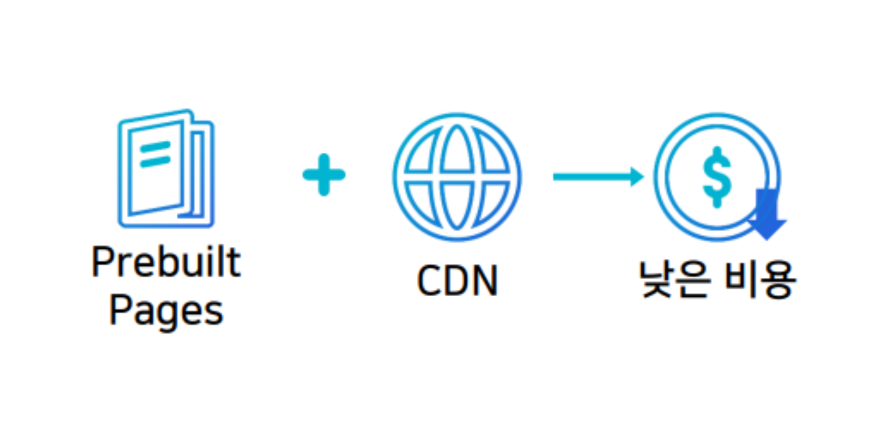

<em>사진 출처: <a href="https://www.bottlehs.com/etc/jamstack-이란" target="_blank" rel="noreferrer noopener" aria-label="jamstack-advantage">bottlehs.com</a></em>

정적 웹 사이트에서의 스케일링은 더 많은 지역에서 홈페이지를 제공할 수 있게 하는 의미인데, 미리 빌드 된 파일 제공을 담당하는 CDN 서버를 구축하면 비용을 줄일 수 있습니다.

## 1. 왜 Gatsby 인가요?

### 1-1. 정적 사이트 생성

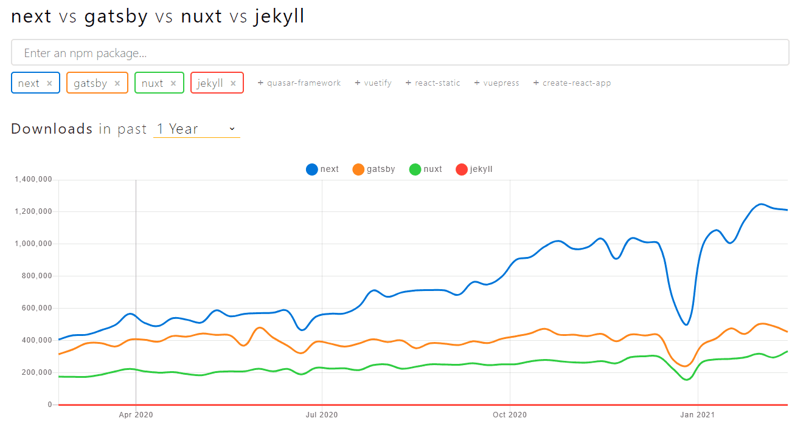

위 사진은 최근 1년간 대표적인 JAM Stack 기반 프레임워크 4가지의 다운로드 횟수를 나타낸 것입니다. Next.js 다운로드 수가 제일 많고, 다음으로 Gatsby 다운로드 수가 많은 것을 볼 수 있습니다.

> 그렇다면 더 인기가 많은 Next.js가 아닌 Gatsby를 사용하는 이유는 무엇일까요?

두 프레임워크의 사용 용도가 다르기 때문입니다. **Next.js**는 정적 사이트 생성의 기능도 있지만 주로 **서버 사이드 렌더링을 위해 사용**하는 프레임워크입니다. 즉, 서버와 통신을 하며 요청을 받을 때마다 동적으로 웹 사이트를 생성합니다.

> 하지만 Gatsby는 서버 없이, 오로지 정적 사이트 생성을 위해 사용하는 프레임워크입니다.

그래서 서비스 및 기업 소개 페이지, 블로그, 포트폴리오 등에 많이 사용됩니다.

### 1-2. 검색 엔진 최적화와 성능 모두 챙기기

JavaScript가 실행되면 빈 HTML 페이지 안에 마크업을 추가해주는 SPA(Single Page Application)와 다르게, 개발 후 빌드 과정에서 마크업이 생성됩니다. 페이지 내 모든 콘텐츠가 생성되어있기에 SEO(Search Engine Optimization)를 잘 챙길 수 있습니다.

> Gatsby는 단순히 정적 페이지를 만들어 주는 것으로 끝나는 것이 아니라, 필요에 따라 CSR(Client Side Rendering)과 SSR(Server Side Rendering), lazy loading을 적절히 섞어 사용할 수 있어 성능 면에서도 단순 정적 페이지보다 큰 장점이 있습니다.

## 2. Gatsby 개념 소개

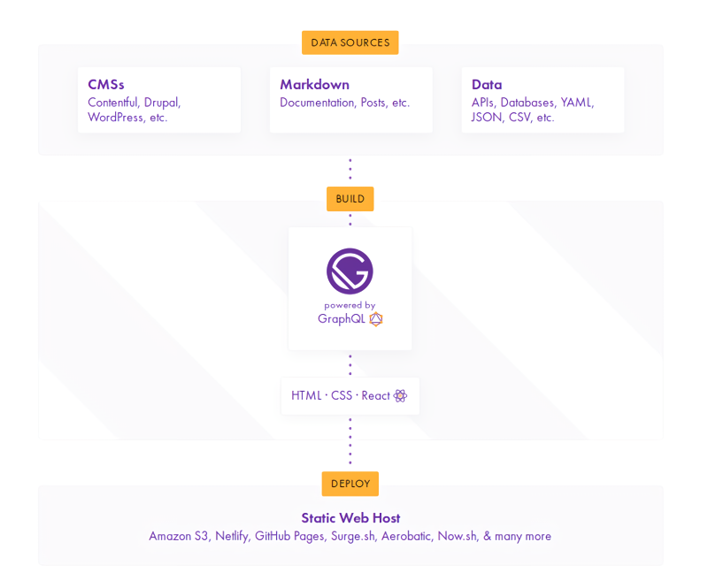

<em>사진 출처: <a href="https://dev.to/sakethkowtha/how-gatsby-works-580f" target="_blank" rel="noreferrer noopener" aria-label="gatsby-data-sources-build-deploy">dev.to</a></em>

> 위 그림에서 확인할 수 있는 Data Sources, Build, Deploy 세 개의 단계로 살펴보겠습니다.

### 2-1. Data Sources

블로그나 웹사이트를 만들려면 데이터가 필요합니다. 이 **데이터를 가져오는 곳**을 Gatsby에서는 **데이터 소스**라고 부릅니다.

> 여기서 데이터 소스는 위에 JAM Stack에서 살펴본 거처럼 Wordpress 같은 CMS 도구가 될 수도 있고 다른 정적 사이트 생성기처럼 Markdown 파일이 될 수도 있고 API 등을 통해서 다른 곳에서 가져올 수도 있습니다.

### 2-2. Build

Gatsby는 플러그인 시스템이 잘 되어 있어서 다양한 데이터 소스에서 데이터를 가져올 수 있습니다.

> Gatsby는 기본적으로 GraphQL을 사용해서 데이터 소스에서 데이터를 가져옵니다.

플러그인을 이용해서 RESTful API에서 데이터를 가져올 수도 있지만 GraphQL이 Gatsby에 포함되어 있어서 GraphQL을 사용하면 훨씬 쉽게 쓸 수 있고 원하는 데이터를 선택해서 가져올 수 있습니다.

> 웹 사이트는 React를 이용해서 만듭니다.

코드는 React를 이용해서 컴포넌트 작성하듯이 사용하지만, 공통 레이아웃을 관리하거나 페이지를 생성하거나 데이터 소스와 컴포넌트를 연결하는 기능을 Gatsby에서 제공하고 있어서 쉽게 만들 수 있습니다.

### 2-3. Deploy

> 이를 빌드하면 정적 사이트로 만들어 줍니다.

여기서 SPA가 아닌 정적 사이트로 만드는 부분이 중요합니다. CMS나 파일 등의 데이터 소스에서 GraphQL로 가져온 데이터를 빌드할 때 모두 가져와서 정적 파일의 데이터로 포함합니다.

> SPA라면 API로 가져오는 로직이 소스에 들어있고 사용자가 SPA 사이트를 실행할 때 API로 가져오게 되지만 Gatsby는 정적 사이트를 만들어주므로 빌드 시에 GraphQL로 데이터를 가져와서 빌드된 배포 파일에 포함합니다.

그러므로 사이트를 운영할 때 데이터 소스로 이용한 API 서버나 파일은 제공하지 않아도 됩니다. 이 부분이 다른 도구들과 Gatsby의 가장 큰 차이점입니다.

## 3. Gatsby 개발 시작하는 여러 방법 알아보기

### 3-1. CLI 기본 설정

> gatsby-cli 를 설치했습니다.

```shell
yarn global add gatsby-cli
```

`gatsby new`를 입력하면 다음과 같은 화면에서 추가 설정을 할 수 있습니다.

- 다양한 옵션을 직접 선택할 수 있습니다.

- 추가적인 설정을 사용하지 않고 기본 설정만 체크했습니다.

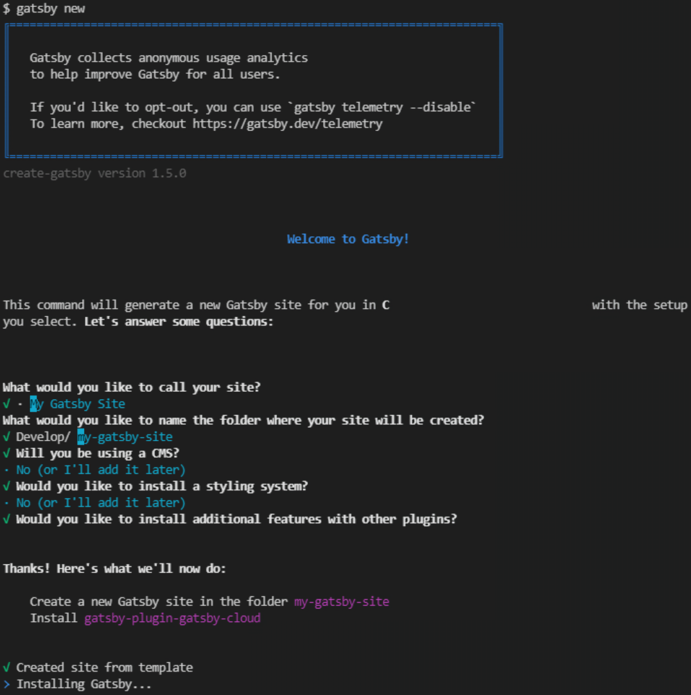

Installing Gatsby... 가 끝나면 위에서 설정한 프로젝트 이름으로 폴더가 생성됩니다. Gatsby 서버를 실행하면 기본 템플릿 화면을 확인할 수 있습니다.

```shell
cd "[site-name]"
```

```shell
yarn start
```

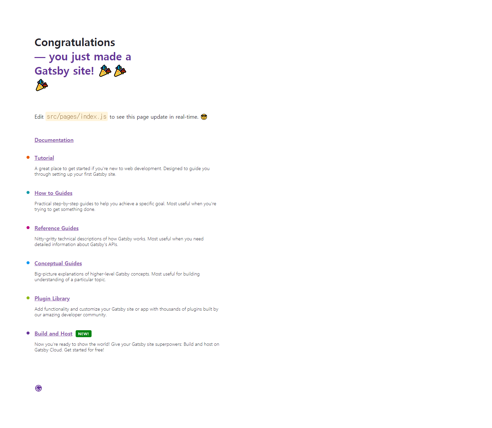

### 3-2. Default Starter 설정

> site name과 starter-url 옵션으로 starter에서 사이트를 생성할 수 있습니다.

```shell
gatsby new "[site-name]" "[starter-url]"
```

> site-name만 설정하고 starter-url은 아무것도 작성하지 않으면 자동으로 gatsby-starter-default가 설정됩니다.

```shell
npx gatsby-cli new "[site-name]"
```

```shell
cd "[site-name]"
```

```shell
yarn develop or gatsby develop
```

gatsby develop 명령어를 실행하면 프로젝트의 루트 디렉터리로 이동하여 개발 서버를 시작합니다.

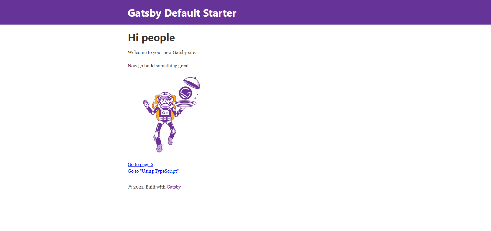

### 3-3. Blog starter 설정

> Blog starter를 사용하기 위해 starter-url 옵션에 https://github.com/gatsbyjs/gatsby-starter-blog 를 작성했습니다.

```shell
gatsby new "[site-name]" https://github.com/gatsbyjs/gatsby-starter-blog
```

```shell
cd "[site-name]"
```

```shell
yarn develop or gatsby develop
```

> Gatsby 서버를 실행하면 Blog 템플릿 화면을 확인할 수 있습니다.

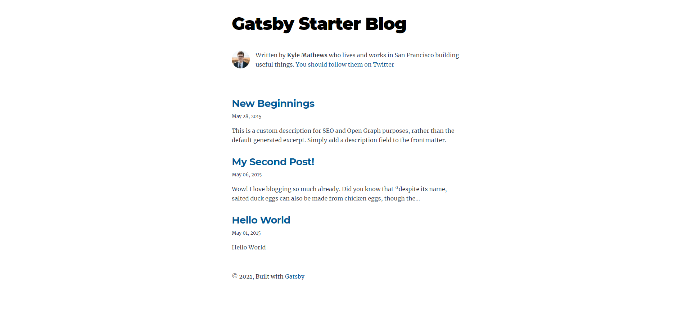

> http://localhost:8000/___graphql 에 접속하면 graphql 을 확인할 수 있습니다.

## 마치며

Gatsby의 개념과 프로젝트를 시작하는 방법에 대해 알아봤습니다. https://github.com/gatsbyjs/gatsby-starter-blog 이외에도 다양한 starter가 있어서 적절한 starter를 사용하면 편리하게 개발할 수 있을 거 같습니다 🤔

---

참고 자료 📩

- [Welcome to the Gatsby Way of Building | Gatsby](https://www.gatsbyjs.com/docs)
- [[무료] React 기반 Gatsby로 기술 블로그 개발하기 - 인프런 | 강의](https://www.inflearn.com/course/gatsby-기술블로그)
- [React밖에 모르는 당신에게. GatsbyJS한 잔, '채용~' | 뱅크샐러드](https://blog.banksalad.com/tech/build-a-website-with-gatsby)
- [정적 사이트 생성기 Gatsby :: Outsider's Dev Story ](https://blog.outsider.ne.kr/1426)