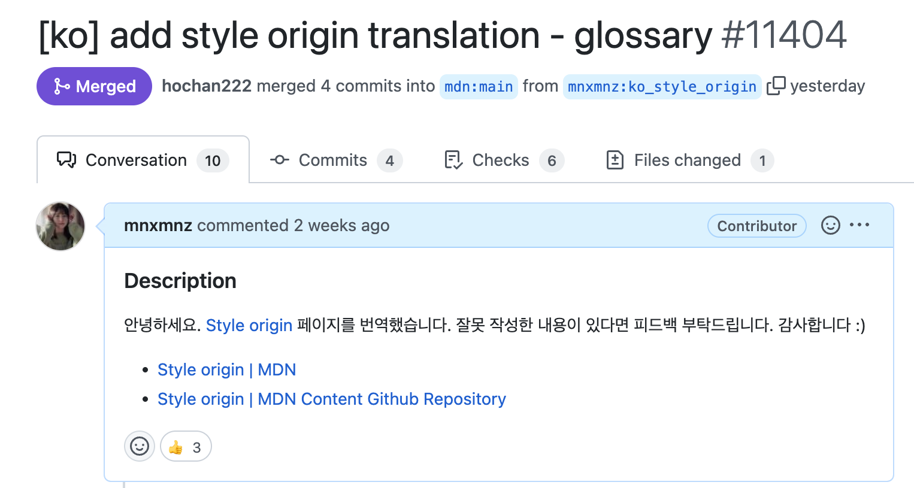
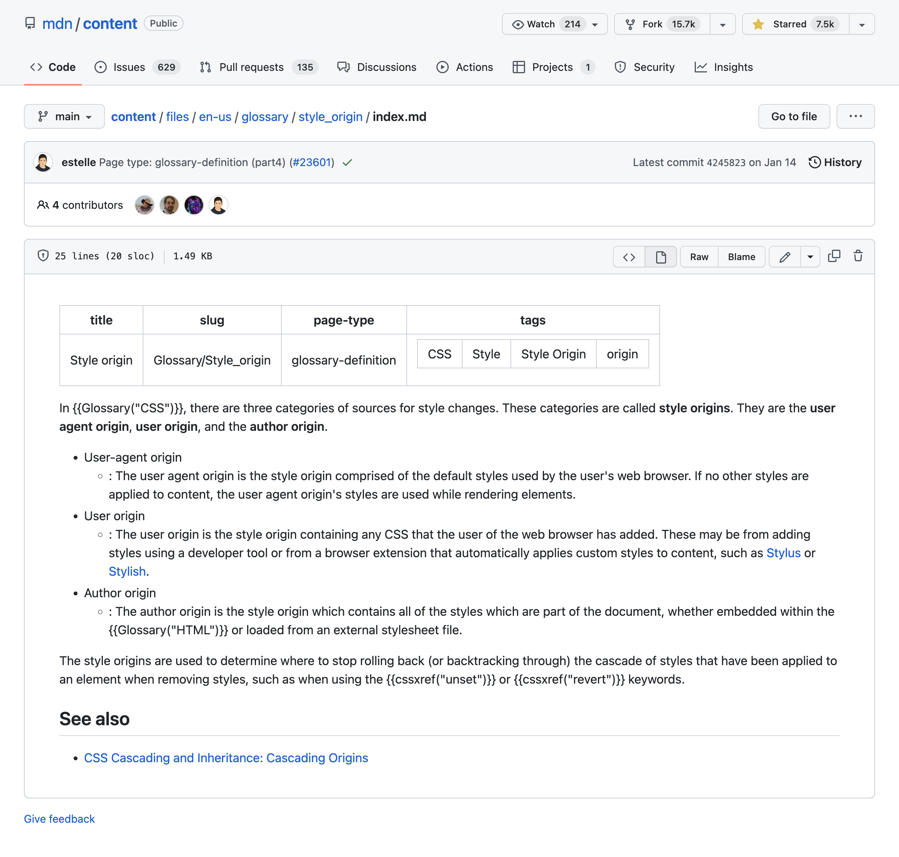
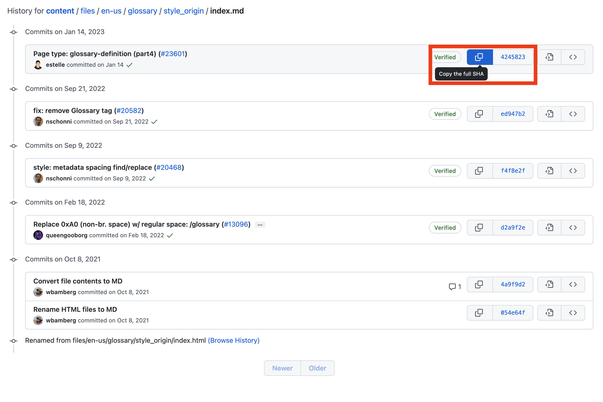
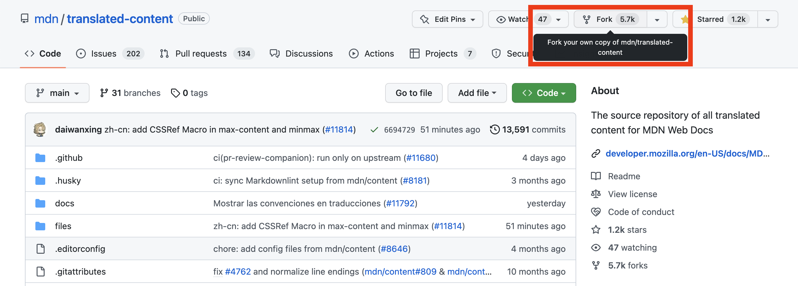
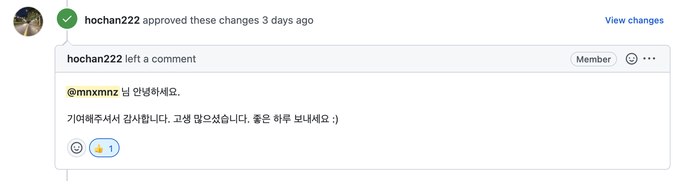

## 들어가며

CSS 상속을 공부하던 중 [MDN Style origin](https://developer.mozilla.org/en-US/docs/Glossary/Style_origin) 문서의 한국어 번역이 존재하지 않는 것을 확인하고 이를 한국어로 번역했습니다. 가이드 문서에 기여 방법이 자세히 설명되어 있지만, 처음이라 몇 가지 헷갈리는 부분이 있었습니다. 기여 과정을 정리해서 다음에는 더 효율적으로 번역하고 다른 분들에게도 도움이 되고자 번역 과정에 대해 작성했습니다.

## 1. 이슈와 PR 목록 확인하기

아직 한국어 번역 문서가 존재하지 않아도 이미 번역을 진행 중이거나 번역을 완료하고 merge 하기 전 리뷰 상태일 수 있습니다. 중복 작업을 방지하기 위해 [MDN translated-content](https://github.com/mdn/translated-content) 레포의 [한국어 번역과 관련된 이슈](https://github.com/mdn/translated-content/issues?q=is%3Aopen+is%3Aissue+label%3Al10n-ko)와 [한국어 번역과 관련된 PR](https://github.com/mdn/translated-content/pulls?q=is%3Aopen+is%3Apr+label%3Al10n-ko) 목록을 확인하는 과정이 필요합니다. 위 목록에서 번역하려는 문서와 관련된 사항이 없으면 번역이 필요한 페이지입니다.

## 2. 번역하기

번역할 문서를 결정했으므로 이제 번역에 필요한 자료에 대해 알아보겠습니다.

### 2-1. 원본 파일 찾기

[MDN content](https://github.com/mdn/content) 레포의 files 폴더에서 번역할 문서의 경로를 확인합니다. 경로는 번역할 문서의 MDN URL에서 확인하실 수 있습니다.

예를 들어, Style origin 문서의 URL은 `https://developer.mozilla.org/en-US/docs/Glossary/Style_origin` 입니다. 그러면 files 폴더 안에서 en-US > glossary > style_origin 순서로 탐색합니다. 해당 폴더에서 원본 index.md 파일을 확인할 수 있습니다.

### 2-2. 공식 가이드 문서

MDN에서는 번역할 때 참고할 수 있는 가이드 문서를 제공합니다. [MDN translated-content](https://github.com/mdn/translated-content) 레포의 docs/ko 폴더 README에서 [공식 가이드 문서](https://github.com/mdn/translated-content/tree/main/docs/ko)를 확인하실 수 있습니다.

정확한 번역을 위해 모든 문서를 확인했지만, 여러 문서 중에서도 특히 유용하게 사용한 몇 가지 문서에 대해 소개하겠습니다.

#### 2-2-1. 번역 안내서

[번역 안내서](https://github.com/mdn/translated-content/blob/main/docs/ko/guides/translation-guide.md)에는 MDN 문서를 번역할 때 알아야 할 전반적인 내용이 적혀있습니다. 문서 연결 경로, 안내 문구 등 많은 내용이 담겨있습니다.

#### 2-2-2. 용어 안내서

번역을 진행하다 보면 특정 용어나 단어에 대해서는 어떻게 번역하는 것이 옳을지 고민이 될 수 있습니다. 이런 상황에서 [용어 안내서](https://github.com/mdn/translated-content/blob/main/docs/ko/guides/glossary-guide.md)를 유용하게 사용할 수 있습니다.

Style origin 문서를 번역할 때 진행 중일 때도 참고하고 번역을 마친 이후에도 용어 안내서의 방침을 잘 따랐는지 검토하는 과정을 가졌습니다.

#### 2-2-3. 메타데이터 안내서

모든 문서의 상단에는 메타데이터가 존재합니다. 이 중 일부 메타데이터만 번역하므로 [메타데이터 안내서](https://github.com/mdn/translated-content/blob/main/docs/ko/guides/meta-data-guide.md)를 참고해서 번역하는 과정이 필요합니다.

최근에 [페이지 갱신 표시](https://github.com/mdn/translated-content/blob/main/docs/ko/guides/meta-data-guide.md) 항목이 추가됐습니다. en-US의 hash는 원본 index.md 파일의 커밋 히스토리에서 찾아볼 수 있습니다.

hash 좌측의 버튼을 클릭해서 클립보드에 복사할 수 있습니다.

## 3. 기여하기

번역을 마치고 MDN 문서에 기여하기 위한 준비 과정에 대해 알아보겠습니다.

### 3-1. 레포지토리 fork 하기

MDN의 [translated-content](https://github.com/mdn/translated-content) 레포를 fork 합니다. 

### 3-2. 한국어 문서가 아예 존재하지 않는 페이지를 번역한 경우

번역한 내용을 작성할 새로운 파일을 생성합니다. 새로운 파일을 생성하는 위치는 2-1번의 원본 파일을 찾은 경로와 동일합니다.

다시 Style origin 문서로 예를 들면 [translated-content](https://github.com/mdn/translated-content) 레포의 files 폴더 안에 ko > glossary > style_origin 폴더에서 index.md 파일을 생성합니다.

원본 파일의 이름이 index.md 이므로 이 형식을 그대로 따라서 index.md 파일을 생성합니다.

### 3-3. 한국어 문서가 존재하는 페이지를 번역한 경우

같은 방법으로 경로를 찾아서 이미 존재하는 파일의 문서를 수정합니다.

### 3-4. PR 등록하기

번역을 마치고 파일 생성까지 완료했으면 이제 [translated-content](https://github.com/mdn/translated-content) 레포에 PR을 등록합니다.

PR에서 approve를 받으면 기여에 필요한 모든 과정이 완료된 것입니다. 이제 MDN Web Docs에 배포된 한국어 번역 페이지를 확인하실 수 있습니다 🎉

## 마치며

1. 번역 작업을 시작하기 전, 이미 진행 중인 번역이나 PR 목록을 확인해서 중복 작업을 방지할 수 있습니다.
2. 번역에 필요한 자료로 원본 파일, 공식 가이드 문서(용어 안내서, 메타데이터 안내서)가 있습니다.
3. 번역을 마친 후 MDN의 translated-content 레포지토리를 fork하고 PR을 생성하여 기여할 수 있습니다.