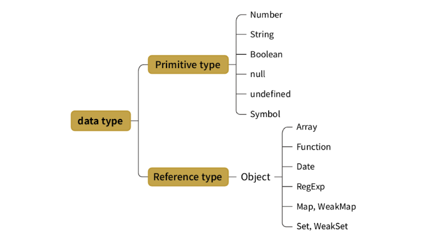
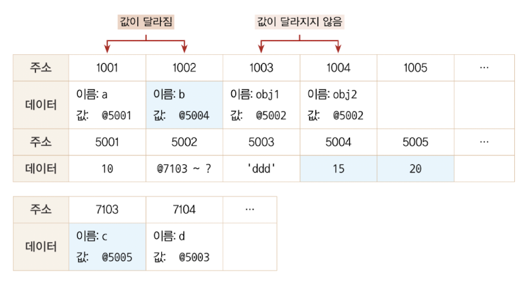

## 들어가며

자바스크립트의 얕은 복사와 깊은 복사에 대한 함수를 생성한 후 이를 활용해서 리액트의 성능 최적화와 관련있는 훅인 useRef, useMemo, useCallback, useDeepMemo 훅을 구현했습니다.

## 0. 자바스크립트의 얕은 복사와 깊은 복사

우선 자바스크립트에는 왜 얕은 복사와 깊은 복사가 있고, 이게 왜 필요한 걸까요?

> ~~**왜냐하면 개발자를 괴롭히기 위해서!**~~

자바스크립트의 데이터 타입에는 크게 두 가지가 있습니다.

기본형과 참조형입니다.

기본형은 숫자, 문자열, 불리언, null, undefined, Symbol 등이 있습니다.

참조형은 객체와 배열 등이 있습니다.

이러한 기본형과 참조형에는 어떤 차이점이 있을까요?

기본형이 값이 담긴 주솟값을 복제하지만 참조형은 값이 담긴 주솟값들로 이루어진 묶음을 가리키는 주솟값을 복제합니다.

어떤 데이터 타입이든 변수에 할당하기 위해서는 주솟값을 복사해야 하기 대문에 엄밀히 따지면 자바스크립트의 모든 데이터 타입은 참조형 데이터일 수 밖에 없습니다.

다만 기본형은 주솟값을 복사하는 과정이 한 번만 이뤄지고 참조형은 한 단계를 더 거치게 됩니다.

얕은 복사는 바로 아래 단계의 값만 복사하는 방법이고 깊은 복사는 내부의 모든 값을 전부 복사하는 방법입니다.

따라서 중첩된 객체에서 참조형 데이터가 저장된 프로퍼티를 복사할 때 그 주솟값만 복사합니다. 해당 프로퍼티에 대해 원본과 사본 모두 동일한 참조형 데이터의 주소를 가리키게 됩니다.

객체 

