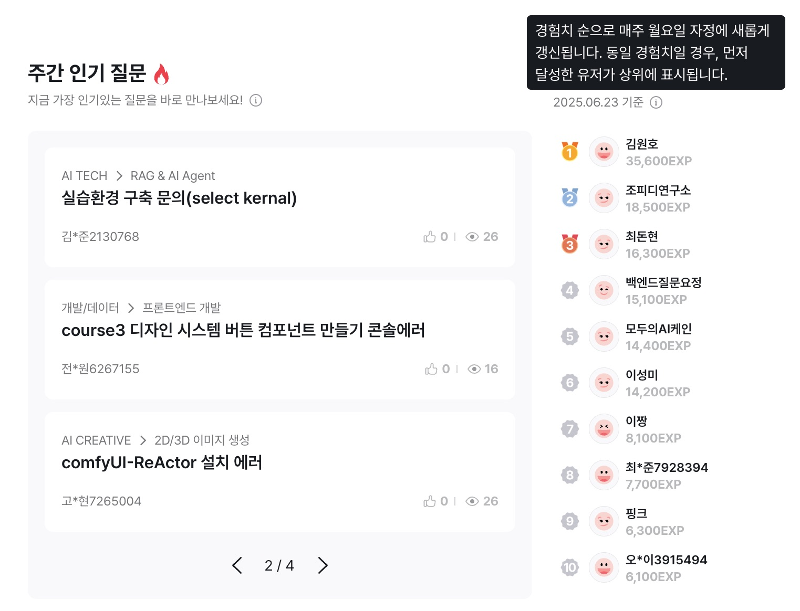
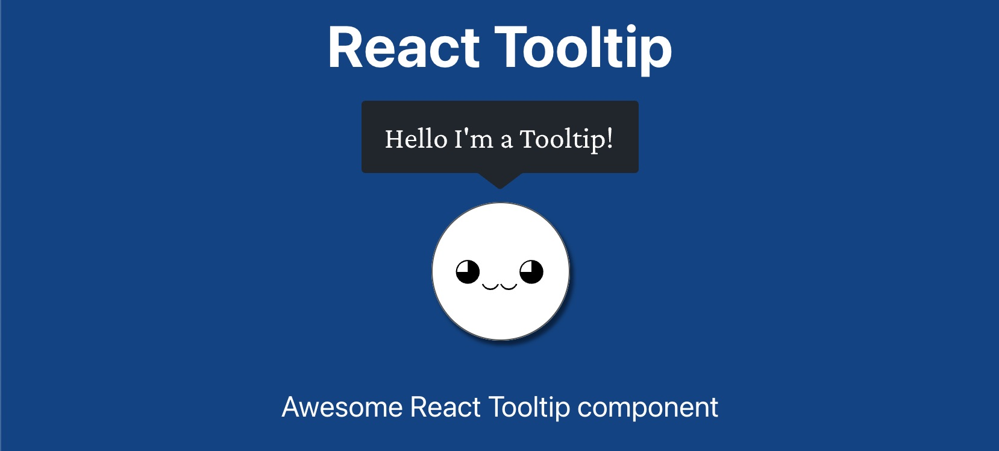
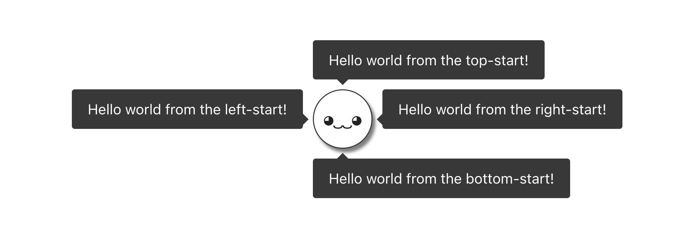
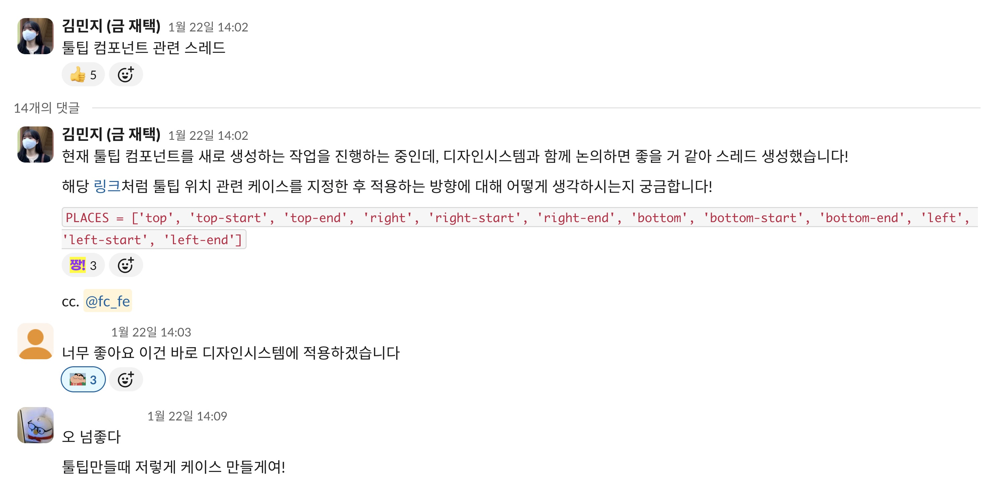
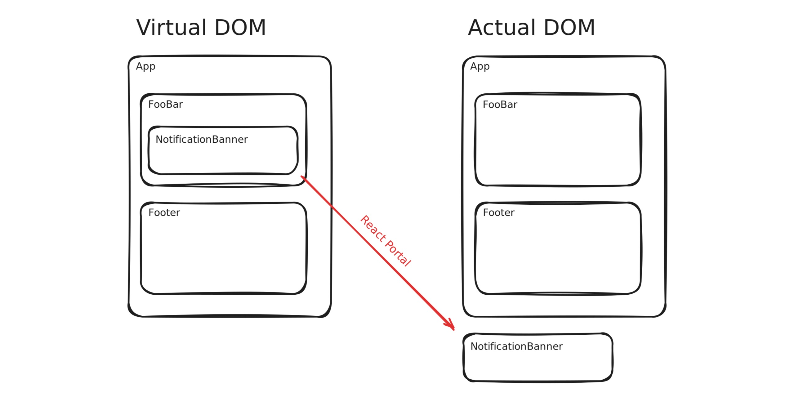
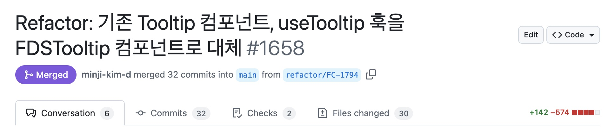
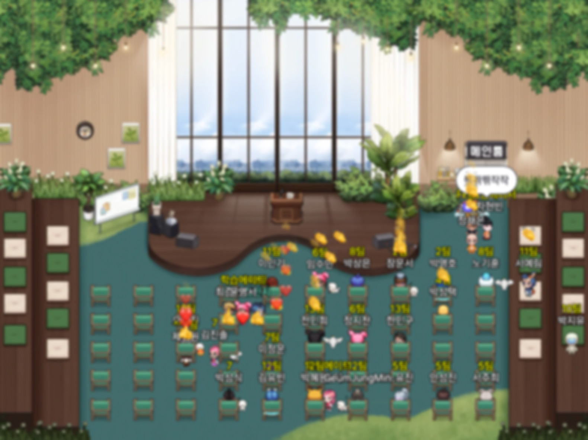

## 들어가며

툴팁 컴포넌트의 포지션 설정 방식을 변경하여 모바일 대응성을 높이고 개발자 경험도 개선한 사례에 대해 정리했어요.

## 1. 문제 인식



<em>주간 인기 질문 및 주간 활동 TOP 10 영역</em>

최근 수강생과 멘토 간의 질의응답을 활성화하기 위한 커뮤니티 기능을 배포했어요. 신규 기능이라 세부 정책을 소개하기 위해 여러 페이지에서 툴팁 컴포넌트를 사용했어요. 이렇게 툴팁 컴포넌트를 적용하던 중 팀 내에서 불편함을 느끼고 각자 어떤 불편함이 있었는지 함께 얘기했어요.

### 1-1. 기존 컴포넌트의 한계

공통적으로 포지션을 설정하는 과정에서 불편함이 있었어요.

```tsx
const tooltipX = isMobileSize ? -131 : -115;
const tooltipY = isMobileSize ? 41 : 0;
```

툴팁의 x축과 y축 위치를 절댓값으로 설정하면서 렌더링 된 결과를 브라우저에서 직접 확인한 후 다시 세부적인 조정이 필요했어요. 설정하는 과정에서 느낀 불편함도 있었지만 뷰포트 크기가 작은 모바일 기기에 유연하게 대응할 수 없었어요. 툴팁 컴포넌트의 일부 영역이 화면 밖으로 나가서 텍스트가 잘리는 현상이 발생하기도 했어요.

물론 기존 컴포넌트에서 이렇게 포지션을 설정하는 이유가 있었어요. 툴팁을 렌더링 하는 위치가 일정하지 않아서 각 페이지 별로 피그마 디자인을 확인한 후에 포지션 설정이 필요했어요.

### 1-2. 개선 방향 정리

개선 작업을 시작하기 전에 컴포넌트를 개선해서 얻고 싶은 점을 먼저 정리했어요. 우선 작은 크기의 뷰포트에서도 툴팁 영역이 잘리지 않도록 대응이 필요했고 툴팁 컴포넌트를 적용할 때 직접 위치를 확인하며 설정하는 개발자 경험도 함께 개선하고 싶었어요.

## 2. 사전 검토

개선 방향을 정하고 본격적인 작업을 진행하기 전에 기존 툴팁 라이브러리에서는 어떻게 구현하고 있는지 내부 로직을 참고하고자 조사했어요.

### 2-1. 외부 라이브러리 조사



<em><a href="https://react-tooltip.com" target="_blank" rel="noreferrer noopener" aria-label="react-tooltip">React Tooltip</a></em>

여러 라이브러리 중 하나인 [React Tooltip](https://react-tooltip.com) 라이브러리 내부를 살펴봤어요. React Tooltip 라이브러리에서는 툴팁 컴포넌트의 포지션을 설정하기 위해 [Floating UI](https://floating-ui.com) 라이브러리를 사용하고 있었어요. Floating UI 라이브러리는 툴팁이나 드롭다운과 같은 떠 있는 UI 요소의 위치를 제어할 수 있게 도와줘요.

이렇게 살펴본 후 툴팁 컴포넌트의 구현 방법을 총 세 가지로 정리했어요.

1. 첫 번째는 처음 살펴본 React Tooltip 툴팁 라이브러리를 설치하는 방법이고,
2. 두 번째는 그보다 저수준의 API 를 제공하는 Floating UI 라이브러리를 활용해서 구현하는 방법이고,
3. 세 번째는 기존 툴팁 컴포넌트처럼 모든 로직을 직접 작성해서 구현하는 방법이었어요.

### 2-2. Floating UI 도입 결정


<em><a href="https://floating-ui.com" target="_blank" rel="noreferrer noopener" aria-label="floating-ui">Floating UI</a></em>

두 번째 방법인 Floating UI 라이브러리를 활용하는 방법을 선택했어요. 툴팁 라이브러리는 필요 이상으로 많은 기능을 포함하고 있다고 생각했고 기존처럼 모든 로직을 직접 작성하기에는 모바일 기기의 모든 예외 케이스에 대응하기 어렵고 유지보수 비용이 크다고 생각했어요. 

Floating UI 라이브러리의 공식 문서를 살펴봤을 때 어렵지 않게 도입할 수 있을 것이라고 생각했고 툴팁 컴포넌트 외에도 여러 UI 요소에서 활용할 수 있을 거 같아서 도입했어요.

## 3. 툴팁 컴포넌트 구현 과정

툴팁 컴포넌트를 실제로 구현한 과정에 대해 정리했어요.

### 3-1. 포지셔닝 정책 수립



<em>React Tooltip 라이브러리의 툴팁 포지셔닝 정책 예시</a></em>

React Tooltip 라이브러리에서는 12개의 포지션을 미리 설정한 후 사용하고 있어요. 같은 방식을 채택해서 툴팁 컴포넌트마다 개별적으로 포지션을 설정하지 않는 방향으로 개선했어요.



<em>툴팁 포지셔닝 정책 논의</a></em>

디자이너 분들에게 툴팁 디자인 시스템에 위의 포지셔닝 정책을 도입하는 걸 제안했어요. 기존처럼 페이지 별로 툴팁 포지션을 설정하는 방식보다 고정적인 위치가 있는 걸 선호하셨고 모바일 기기에도 유연하게 대응할 수 있는 툴팁 컴포넌트를 원하셔서 개발자와 디자이너의 요구 사항을 모두 충족할 수 있었어요. 이외에도 모바일 기기에서는 2초만 노출하고 숨기는 것과 같은 세부적인 정책도 함께 수립했어요.

### 3-2. Floating UI 훅 및 미들웨어

Floating UI 라이브러리에서 제공하는 `useFloating`훅과 `autoUpdate`, `offset`, `flip`, `shift`미들웨어를 적용했어요.

- useFloating: 타겟 요소와 툴팁 요소의 위치 계산
- autoUpdate: 스크롤이나 리사이즈 등으로 위치가 바뀔 때 툴팁 위치를 자동으로 다시 계산
- offset: 타겟 요소와 툴팁 사이의 간격 설정
- flip: 툴팁이 화면 밖으로 나갈 경우 반대 방향으로 자동으로 위치 변경
- shift: 툴팁이 화면 경계에 닿을 때 경계 안쪽으로 위치 조정

### 3-3. createPortal API 적용



<em>사진 출처: <a href="https://techhub.iodigital.com/articles/what-are-react-portals" target="_blank" rel="noreferrer noopener" aria-label="react-portal">wtechhub.iodigital.com</a></em>

툴팁 컴포넌트를 렌더링할 때 [createPortal API](https://ko.react.dev/reference/react-dom/createPortal) 를 적용했어요. 툴팁 컴포넌트의 위치가 상위 컴포넌트 내부에 종속되지 않도록 하고 `body` 내부에 생성한 최상위 계층의 `div` 엘리먼트로 옮기기 위해 사용했어요. 이렇게 물리적인 위치를 변경하는 이유는 부모 컴포넌트의 CSS 영향을 받지 않기 위해서예요. 

### 3-4. 웹 접근성 고려

툴팁 라이브러리에서 제공하는 컴포넌트는 이미 여러 웹 접근성을 고려하고 있어서 추가 설정이 필요하지 않아요. 다만 현재처럼 Floating UI 라이브러리를 사용하는 경우에는 직접 웹 접근성을 고려한 설정을 추가해야 해요.

- `role`: 스크린 리더에게 해당 요소가 툴팁이라는 것을 알리도록 설정
- `aria-describedby`: 툴팁의 내용이 어떤 요소를 설명하는지 연결
- `aria-hidden`: 툴팁이 보이지 않을 때 스크린 리더가 해당 내용을 읽지 않도록 설정

### 3-5. 관리 포인트 최소화

```tsx
<a data-tooltip-id="my-tooltip" data-tooltip-content="Hello world!">
  ◕‿‿◕
</a>
<Tooltip id="my-tooltip" />
```

React Tooltip 라이브러리에서는 툴팁 컴포넌트와 툴팁을 표시하는 대상을 연결하기 위해 아이디 값을 직접 지정해서 사용하고 있어요. 다만 이러한 방식은 엘리먼트에 아이디 값을 부여한 후 그 값을 상수로 관리해야 하는 관리 포인트가 늘어나는 단점이 있어요.

```tsx
<Tooltip content={TOOLTIP_CONTENTS.COMMUNITY.RANK_USER}>
  <IconInfo />
</Tooltip>
```

[Radix UI](https://www.radix-ui.com/) 라이브러리의 [툴팁 컴포넌트](https://www.radix-ui.com/primitives/docs/components/tooltip) 예시를 살펴보면 아이디 값을 기반으로 관리하지 않고 `children` 요소로 툴팁을 표시할 대상을 설정해요. 같은 방식을 도입해서 툴팁 표시 대상을 한정짓지 않는 유연함을 가지면서도 관리 포인트를 줄일 수 있었어요.

## 4. 최종 코드

최종적으로 구현한 툴팁 컴포넌트 코드는 다음과 같아요. [Tooltip](https://github.com/mnxmnz/tooltip) 레포에서도 확인하실 수 있어요.

```tsx
function Tooltip({ children, content, placement = TOOLTIP_PLACEMENTS.BOTTOM }: TooltipProps) {
  const [isOpen, setIsOpen] = useState(false);

  const handleMouseEnter = () => setIsOpen(true);
  const handleMouseLeave = () => setIsOpen(false);

  const { refs, floatingStyles } = useFloating({
    placement,
    whileElementsMounted: autoUpdate,
    middleware: [
      offset({
        mainAxis: 4, // 툴팁과 타겟 요소 사이의 수직 간격 (px)
        crossAxis: 0, // 툴팁과 타겟 요소 사이의 수평 간격 (px)
      }),
      flip(), // 화면 경계를 벗어날 경우 반대 방향으로 배치
      shift({ padding: 8 }), // 화면 경계와의 최소 여백 (px)을 유지하며 위치 조정
    ],
  });

  return (
    <>
      <span
        ref={refs.setReference}
        onMouseEnter={handleMouseEnter}
        onMouseLeave={handleMouseLeave}
        className={styles.wrapper}
        aria-describedby="tooltip"
        role="tooltip"
        tabIndex={0}
      >
        {children}
      </span>
      <Portal containerId="tooltip-container">
        <div
          ref={refs.setFloating}
          style={floatingStyles}
          data-placement={placement}
          className={`${styles.tooltip} ${isOpen ? styles.show : ''}`}
          role="tooltip"
          id="tooltip"
          aria-hidden={!isOpen}
        >
          <div>{content}</div>
        </div>
      </Portal>
    </>
  );
}
```

## 5. 개선 효과



<em>새로운 툴팁 컴포넌트 적용 PR</a></em>

이제 뷰포트 크기가 작아져도 툴팁 내용이 잘리지 않도록 노출할 수 있어요. 그리고 코드 복잡도가 감소하여 기존 코드를 대체했을 때 총 코드 500 라인 정도를 감소할 수 있었어요.

## 마치며

기존 컴포넌트의 한계와 개발자 경험을 함께 개선한 좋은 사례라고 생각해요. 어려운 기술을 적용하지 않고도 생산성을 높여서 팀에게 도움이 될 수 있어서 좋았어요. 이번에 생성한 컴포넌트를 사용하다 보면 새로운 불편함을 느낄 수 있고 예상치 못한 버그를 만날 수도 있겠지만 그러한 사항을 개선해보는 경험도 좋을 거 같아요.



<em>항해 플러스 프론트엔드 5기 학습 공간</em>

최근 [항해 플러스 프론트엔드 5기](https://hanghae99.spartacodingclub.kr/plus/fe) 교육을 수강했어요. 매주 토요일마다 자율적으로 발표를 신청받아서 누구든 자유 주제로 발표할 수 있어요. 툴팁 컴포넌트 개선을 주제로 발표해서 이것 또한 좋은 경험이었다고 생각해요.