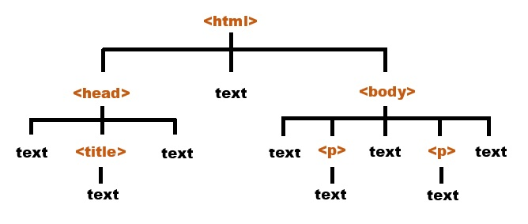
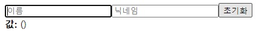
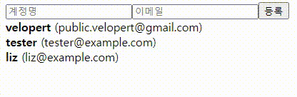
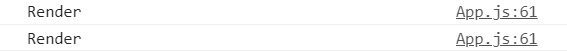

> 타 사이트에서 블로그를 운영할 때 작성한 글을 이전했습니다. 🙂

## 들어가며

React의 Hook 함수 중 하나인 useRef에 대해 정리했습니다. useRef의 개념과 대표적인 3가지 활용 방법을 예시 코드를 통해 살펴보겠습니다. 3가지 활용 방법은 다음과 같습니다.

1. 특정 DOM 선택하기

2. 컴포넌트 안의 변수 만들기

3. 리렌더링 방지하기

## 1. useRef가 무엇인가요?


<em>사진 출처: <a href="https://livebook.manning.com/book/react-hooks-in-action/chapter-6/v-3/35" target="_blank" rel="noreferrer noopener" aria-label="use-ref">livebook.manning.com</a></em>

> useRef는 `.current`프로퍼티로 전달된 인자(initialValue)로 초기화된 변경 가능한 `ref`객체를 반환합니다. 반환된 객체는 컴포넌트의 전 생애주기를 통해 유지될 것입니다. 본질적으로 useRef는 **`.current`프로퍼티에 변경 가능한 값을 담고 있는 상자**와 같습니다.

React 공식 문서에 적혀 있는 useRef 정의입니다. useRef 사용 예제를 통해 위 정의에 대해 자세히 알아보겠습니다.

## 2. useRef를 언제 사용하나요?

### 2-1. 특정 DOM 선택하기



<em>사진 출처: <a href="https://learnjavascriptfast.com/chapter-7-the-javascript-document-object-model/2/" target="_blank" rel="noreferrer noopener" aria-label="document-object-model">learnjavascriptfast.com</a></em>

JavaScript를 사용할 때는, 특정 DOM을 선택해야 하는 상황에 `getElementById`, `querySelector`같은 DOM Selector 함수를 사용해서 DOM을 선택합니다.

> 리액트에서는 DOM을 선택할 때 `ref`를 사용합니다. **함수형 컴포넌트**에서 ref를 사용할 때는 **useRef Hook 함수**를 사용하고 **클래스형 컴포넌트에서**는 **콜백 함수를 사용하거나 React.createRef 함수**를 사용합니다.

이 글에서는 함수형 컴포넌트의 useRef를 사용합니다.

### 2-2. 컴포넌트 안의 변수 만들기

컴포넌트 안에서 조회 및 수정할 수 있는 변수를 관리할 수 있습니다.

> useRef로 관리하는 변수는 값이 바뀐다고 해서 컴포넌트가 리렌더링되지 않습니다. 리액트 컴포넌트에서의 상태는 상태를 바꾸는 함수를 호출하고 다음 렌더링 이후 업데이트된 상태를 조회할 수 있지만, **useRef로 관리하는 변수는 설정 후 바로 조회**할 수 있습니다.

이 변수를 사용하여 `scroll`위치와 같은 값을 관리할 수 있습니다.

### 2-3. 리렌더링 방지하기

컴포넌트가 렌더링 된다는 것은 함수(컴포넌트)를 호출하여 실행되는 것을 말합니다. 함수가 실행될 때마다 내부에 선언되어 있던 표현식(변수나 또 다른 함수 등)도 매번 다시 선언되어 사용합니다. 컴포넌트는 자신의 **`state`가 변경**되거나, 부모에게서 받는 **`props`가 변경**되었을 때마다 리렌더링 됩니다.

> useRef로 관리하는 변수는 값이 바뀐다고 해서 컴포넌트가 리렌더링되지 않으므로 **리렌더링 방지**에 활용할 수 있습니다.

## 3. useRef로 DOM 선택하는 방법

> useRef()를 사용하여 `Ref`객체를 만들고, 이 객체를 선택하고 싶은 DOM에 `ref`값으로 설정합니다. 그러면, `Ref`객체의 `.current`값은 DOM을 가리키게 됩니다.

이 포스팅에서 다룰 예제에서는 `onReset`함수에서 `input`에 포커스를 하는 focus() DOM API를 호출했습니다. 초기화 버튼을 클릭했을 때 이름 `input`에 포커스가 잡히도록 useRef를 사용하여 기능을 구현했습니다.

### 3-1. 객체 생성하기

useRef를 통해 `nameInput`이라는 객체를 생성했습니다.

```js
const nameInput = useRef();
```

### 3-2. DOM API 사용

`current`가 DOM을 가리키고 있으므로 DOM API 중 하나인 `focus`를 사용했습니다.

```js
nameInput.current.focus();
```

### 3-3. DOM 설정을 통해 DOM에 직접 접근하기

`nameInput`객체를 선택하고 싶은 DOM 에 설정하여 직접 접근할 수 있습니다.

```js
<input
  name="name"
  placeholder="이름"
  onChange={onChange}
  value={name}
  ref={nameInput}
/>
```

### 3-4. 예제 전체 코드

### InputSample.js Code

```js
import React, { useState, useRef } from 'react';

function InputSample() {
  const [inputs, setInputs] = useState({
    name: '',
    nickname: '',
  });

  const nameInput = useRef();

  const { name, nickname } = inputs;

  const onChange = e => {
    const { value, name } = e.target;

    setInputs({
      ...inputs,
      [name]: value,
    });
  };

  const onReset = () => {
    setInputs({
      name: '',
      nickname: '',
    });

    nameInput.current.focus();
  };

  return (
    <div>
      <input
        name="name"
        placeholder="이름"
        onChange={onChange}
        value={name}
        ref={nameInput}
      />
      <input
        name="nickname"
        placeholder="닉네임"
        onChange={onChange}
        value={nickname}
      />
      <button onClick={onReset}>초기화</button>
      <div>
        <b>값: </b>
        {name} ({nickname})
      </div>
    </div>
  );
}

export default InputSample;
```

### App.js Code

```js
import React from 'react';
import InputSample from './InputSample';

function App() {
  return <InputSample />;
}

export default App;
```

### 3-5. 실행 결과

초기화 버튼을 클릭했을 때 이름 input에 포커스가 잡힙니다.



## 4. useRef로 컴포넌트 안의 변수 만드는 방법 

useRef()를 사용할 때 파라미터를 넣어주면, 이 값이 `.current`값의 기본값이 됩니다. 그리고 이 값을 수정할 때는 `.current`값을 수정하면 되고 조회할 때도 `.current`를 조회하면 됩니다.

### 4-1. useRef의 파라미터

현재 3개의 `id`가 있으므로 다음 `id`의 기본값을 4로 지정했습니다.

```js
const nextId = useRef(4);
```

### 4-2. 예제 전체 코드

### UserList.js Code

```js
import React from 'react';

function User({ user }) {
  return (
    <div>
      <b>{user.username}</b> <span>({user.email})</span>
    </div>
  );
}

function UserList({ users }) {
  return (
    <div>
      {users.map(user => (
        <User user={user} key={user.id} />
      ))}
    </div>
  );
}

export default UserList;
```

### App.js Code

```js
import React, { useRef, useState } from 'react';
import UserList from './UserList';

function App() {
  const [inputs, setInputs] = useState({
    username: '',
    email: '',
  });

  const { username, email } = inputs;

  const onChange = e => {
    const { name, value } = e.target;

    setInputs({
      ...inputs,
      [name]: value,
    });
  };

  const [users, setUsers] = useState([
    {
      id: 1,
      username: 'minzidev',
      email: 'minzidev@gmail.com',
    },
    {
      id: 2,
      username: 'tester',
      email: 'tester@example.com',
    },
    {
      id: 3,
      username: 'liz',
      email: 'liz@example.com',
    },
  ]);

  const nextId = useRef(4);

  const onCreate = () => {
    const user = {
      id: nextId.current,
      username,
      email,
    };

    console.log(user.id);

    setUsers(users.concat(user));

    setInputs({
      username: '',
      email: '',
    });

    nextId.current += 1;
  };

  return (
    <>
      <div>
        <input
          name="username"
          placeholder="계정명"
          onChange={onChange}
          value={username}
        />
        <input
          name="email"
          placeholder="이메일"
          onChange={onChange}
          value={email}
        />
        <button onClick={onCreate}>등록</button>
      </div>
      <UserList users={users} />
    </>
  );
}

export default App;
```

### 4-3. 실행 결과

`id`값으로 `nextId.current`를 사용합니다.



## 5. 리렌더링 방지하는 방법

위 예시 코드에는 `input`값이 변경될 때마다 리렌더링 된다는 단점이 있습니다.

> `onChange`구현 부분을 `ref`값으로 대체해서 단점을 해결할 수 있습니다. **`state`로 `event`의 `value`에 접근하지 않고 `refObject.current.value`를 사용**하는 방법입니다.

### 5-1. ref 속성 사용하기

`input`의 `onChange`를 `ref`속성으로 대체했습니다.

```js
<div>
  <input name="username" placeholder="계정명" ref={usernameRef} />
  <input name="email" placeholder="이메일" ref={emailRef} />
  <button onClick={onCreate}>등록</button>
</div>
```

### 5-2. 예제 전체 코드

### UserList.js Code

```js
import React from 'react';

function User({ user }) {
  return (
    <div>
      <b>{user.username}</b> <span>({user.email})</span>
    </div>
  );
}

function UserList({ users }) {
  return (
    <div>
      {users.map(user => (
        <User user={user} key={user.id} />
      ))}
    </div>
  );
}

export default UserList;
```

### App.js Code

```js
import React, { useRef, useState } from 'react';
import UserList from './UserList';
import InputSample from './InputSample';

function App() {
  const [inputs, setInputs] = useState({
    username: '',
    email: '',
  });

  const [users, setUsers] = useState([
    {
      id: 1,
      username: 'minzidev',
      email: 'minzidev@gmail.com',
    },
    {
      id: 2,
      username: 'tester',
      email: 'tester@example.com',
    },
    {
      id: 3,
      username: 'liz',
      email: 'liz@example.com',
    },
  ]);

  const nextId = useRef(4);
  const usernameRef = useRef('');
  const emailRef = useRef('');

  const onCreate = () => {
    const user = {
      id: nextId.current,
      username: usernameRef.current.value,
      email: emailRef.current.value,
    };

    setUsers(users.concat(user));

    setInputs({
      username: '',
      email: '',
    });

    nextId.current += 1;
  };

  console.log('Render');

  return (
    <>
      <div>
        <input name="username" placeholder="계정명" ref={usernameRef} />
        <input name="email" placeholder="이메일" ref={emailRef} />
        <button onClick={onCreate}>등록</button>
      </div>
      <UserList users={users} />
      <InputSample />
    </>
  );
}

export default App;
```

### 5-3. 실행 결과

처음 컴포넌트를 불러왔을 때, 등록 버튼을 눌렀을 때 2번만 렌더링 되는 것을 확인할 수 있습니다.



## 마치며

useRef 개념에 대해 알아본 후 대표적인 3가지 활용 방법을 예제와 함께 정리했습니다.

1. 특정 DOM 선택하기

2. 변수 생성하기

3. 리렌더링 방지하기

---

참고 자료 📩

- [Hooks API Reference – React](https://ko.reactjs.org/docs/hooks-reference.html##useref)
- [10. useRef 로 특정 DOM 선택하기 · GitBook](https://react.vlpt.us/basic/10-useRef.html)
- [12. useRef 로 useRef 로 컴포넌트 안의 변수 만들기 · GitBook](https://react.vlpt.us/basic/12-variable-with-useRef.html)
- [13. 배열에 항목 추가하기 · GitBook](https://react.vlpt.us/basic/13-array-insert.html)
