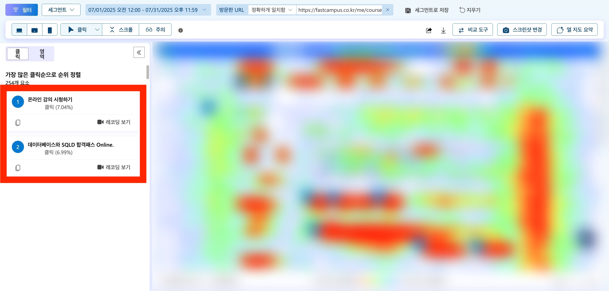

## 들어가며

간단한 수정 사항으로 비효율적인 페이지 이동을 개선하고 이를 히트맵 기반으로 분석한 결과를 소개해요.

## 1. 마이페이지 데이터 분석

이번 글에서 소개할 경험은 **마이페이지 개선 사례**에요. 마이페이지의 데이터를 분석하기 전에 우선 기존 마이페이지 구조에 대해 정리했어요.

### 1-1. 마이페이지 구조

<em>마이페이지 강의 목록</em>

현재 재직 중인 회사에서는 온라인 강의를 판매하는 B2C 서비스를 운영하고 있어요. 강의를 구매한 후 마이페이지에서 **온라인 강의 시청하기 버튼**을 클릭하면 **강의장으로 이동해서 학습**할 수 있어요. **제목**을 클릭하면 **교육과정 소개서 PDF 미리보기 링크**로 이동해요.

사용자는 이러한 마이페이지를 어떻게 활용하고 있을지 데이터 기반으로 행동 패턴을 분석하기 위해 히트맵을 확인했어요.

### 1-2. 히트맵이란?

<em>사진 출처: <a href="https://www.smartlook.com/heatmaps-guide" target="_blank" rel="noreferrer noopener" aria-label="heatmap-example">smartlook.com</a></em>

히트맵이란 **페이지에서 가장 많은 활동이 발생하는 위치를 확인할 수 있는 지표**에요. 빨간색과 주황색 영역은 클릭이나 탭과 같은 사용자 상호 작용이 많이 발생하는 장소에요. 반대로 파란색과 녹색 영역은 상호작용이 적은 장소에요. 이를 통해 사용자가 오래 머무르는 섹션을 더 많이 활용하고 그렇지 않은 섹션을 개선할 수 있어요.

### 1-3. 히트맵으로 발견한 문제점

<em>마이페이지 히트맵</em>

한 달간의 마이페이지 히트맵은 위와 같아요. 자세한 데이터를 공개하기 어려워서 클릭 비율을 기준으로 분석했어요.

온라인 강의 시청하기 버튼이 7%로 가장 많은 상호 작용이 일어나고 있어요. 다음으로는 강의 제목이 3%를 차지하고 있어요. 마이페이지에서는 강의 제목과 온라인 강의 시청하기 버튼이 가장 주요 영역이라는 걸 알 수 있었어요.

추가로 레코딩을 통해 강의 제목을 클릭한 사용자의 이동 경로를 분석했어요. 대다수의 사용자가 교육과정 소개서 PDF 미리보기 링크에서 다시 마이페이지로 돌아와서 온라인 강의 시청하기 버튼을 클릭해 강의장으로 이동하고 있었어요. 이를 통해 **강의 제목을 클릭했을 때 결과가 사용자의 예측과 다른 결과여서 사용성에 문제가 발생하고 있다는 것**을 알 수 있었어요.

## 2. 가설 설립

히트맵 데이터를 기반으로 가설을 설립했어요. **"강의 제목을 클릭한 사용자는 강의장으로 이동하길 기대한다."** 이러한 가설이 맞다면 제목을 클릭했을 때 강의장에 접근하도록 수정하면 다시 마이페이지로 돌아오는 사용자가 줄어들어야 했어요.

## 3. 개선 방향 설정

이번 개선을 통해 사용자에게 **예측할 수 있는 UX**를 제공하는 걸 목표로 했어요.

### 3-1. 예측할 수 있는 UX란?

<em>사진 출처: <a href="https://www.nngroup.com/articles/ten-usability-heuristics" target="_blank" rel="noreferrer noopener" aria-label="ten-usability-heuristics">nngroup.com</a></em>

예측할 수 있는 사용자 경험이란 UX 디자인 원칙 중 하나인 **일관성**과 **표준 준수**에 기반한 내용이에요.

콘텐츠의 제목을 클릭하면 해당 콘텐츠의 상세 페이지로 이동하는 것은 표준 패턴이에요. 현재 운영 중인 서비스에서도 강의 제목을 클릭하면 강의장으로 이동할 것이라는 사용자의 기대가 자연스럽게 형성되어 있다고 생각했어요. 이러한 기대를 충족하지 못하기 때문에 레코딩에서 비효율적인 패턴이 나타났다고 생각해요.

### 3-2. 마이페이지 수정

<em>새로 추가한 교육과정 소개서 확인하기 버튼</em>

가설을 검증하기 위해 교육과정 소개서 확인하기 버튼을 새로 생성하고 강의 제목을 클릭하면 강의장으로 이동하도록 했어요. 이렇게 수정한 이유는 최소한의 변경 사항으로 가설을 검증하기 위함이에요.

마이페이지 UI 는 지난 몇 년 동안 유지했기 때문에 갑작스러운 큰 변화로 기존 사용자에게 불편함을 느끼지 않게 하는 것이 중요하다고 생각했어요. 온라인 강의 시청하기 버튼을 제거하면 이미 강의장 이동 방식을 학습한 사용자에게는 새로운 불편함이 생길 수 있어서 그대로 유지했어요.

## 4. 결과 분석

<em>수정 후 마이페이지 히트맵</em>

수정한 후에 한 달 간의 히트맵을 다시 확인했어요. 교육과정 소개서 확인하기 버튼 이외에 추가적인 차이점은 없었어요.

개선 후 **온라인 강의 시청하기 버튼을 클릭한 비율이 7%를 차지**하고 **강의 제목을 클릭한 비율 또한 7%로 유사**해졌어요. 다시 레코딩을 확인한 결과 강의 제목을 통해 강의장에 진입하는 비율이 증가하고 마이페이지에 재방문하는 패턴이 사라진 것을 알 수 있었어요. 

온라인 강의 시청하기 버튼이 여전히 7%를 유지하는 건 여러 사유를 추측해볼 수 있어요. 우선 제목을 클릭한 후 다시 온라인 강의 시청하기 버튼을 클릭하는 중복 클릭 비율이 줄어들었기 때문에 상대적으로 제목 클릭 비율이 늘어날 수 있을 거 같아요.

또는 몇 년 동안 계속해서 해당 버튼을 클릭하는 경우에만 강의장으로 이동할 수 있었기 때문에 학습된 결과일 수 있다고 생각해요. 아직 학습된 데이터가 없는 새로 유입된 사용자가 강의 제목을 클릭할 확률이 높기 때문이에요.

다만 히트맵을 기반으로 단순 클릭률만 비교했으므로 이 외에도 추가적인 데이터 분석으로 검증이 필요하다고 생각해요.

## 마치며

온라인 강의를 제공하는 서비스인 만큼 사용자가 구매한 강의 목록을 확인할 수 있는 마이페이지의 중요도가 높다고 판단해서 데이터를 기반으로 개선 작업을 진행했어요. 사소한 수정 사항이지만 사용자에게 예측할 수 있는 UX를 제공해서 서비스에 대한 신뢰도를 높일 수 있었어요. 앞으로도 기존에 당연하게 여겼던 사항을 검토해서 더 좋은 경험을 제공하기 위해 고민하려 해요.

> **참고 자료**
> 
> - [What Are Heatmaps? 101 Guide | Amplitude](https://amplitude.com/explore/analytics/heatmaps)
> - [10 Usability Heuristics for User Interface Design - NN/G](https://www.nngroup.com/articles/ten-usability-heuristics)
